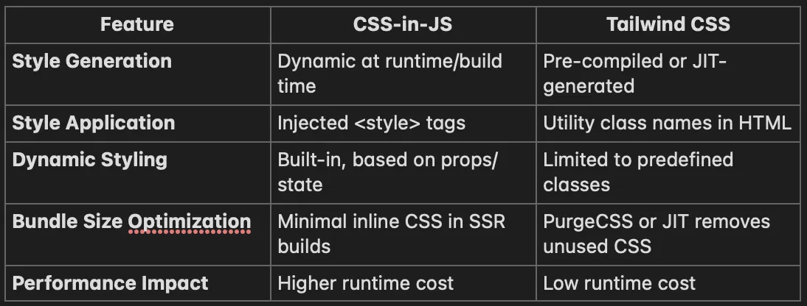

多个css文件时，会存在css重名问题~
#  CSS-in-JS vs less、scss
## less
less 是一种动态样式语言，它扩展了 CSS 语言，增加了变量、Mixin、函数等特性，使 CSS 更易维护和扩展。
less 是一种 css 预处理器，它可以在 css 代码编写前，对 css 代码进行预处理，生成最终的 css 代码。
less 可以通过 npm 安装，然后在项目中引入使用。

```
npm install less --save-dev
```

## CSS-in-JS
CSS-in-JS 是指将 CSS 代码嵌入到 JavaScript 代码中，通过 JavaScript 动态生成 CSS 样式。
简单来说,传统的前端方案推崇"关注点分离"原则，HTML、CSS、JavaScript 应该各司其职，进行分离。但是，

而在react项目中，更提倡组件化方案，自然形成了将HTML、CSS、JavaScript集中编写管理的方式
多个.css 文件时，会存在“重命名”问题，常见的几种解决方式
```
const Widget = () => {
  <div style={{
      color: 'white',
      fontSize: '12px'
  }} onClick={() => doSometing()}>
    text  
  </div>
}
```
但是这种写法的弊端在于，react中的style仅仅是简单的Object，不支持复杂的嵌套、选择器等特性，使用起来很不方便。 因此，便出现了大量的三方库来进行拓展，这些库统称为css-in-js。它们一般都支持样式嵌套、选择器、主题配置等特性

> 有人专门统计了现有的css-in-js三方库，轮子不要太多： css in js [三方库](http://michelebertoli.github.io/css-in-js/)一览 。比较流行的主要有: styled-components, emotion, glamorous。

### emotion的用法示例
```
import { css, jsx } from '@emotion/core'

const color = 'white'

render(
  <div
    css={css`
      padding: 32px;
      background-color: hotpink;
      font-size: 24px;
      border-radius: 4px;
      &:hover {
        background-color: ${color};
      }
    `}
  >
    Hover to change color.
  </div>
)
```

参考：https://dev.to/srmagura/why-were-breaking-up-wiht-css-in-js-4g9b




### 优点
#### 1.局部作用于样式(Locally-scoped styles)

在编写纯 CSS 时，很容易不经意间让样式的应用范围超出预期。例如，假设你正在制作一个列表视图，其中每一行都需要有一定的内边距和边框。你可能会编写如下的 CSS 代码：

```
css.row {
  padding: 0.5rem;
  border: 1px solid #ddd;
}
```

几个月后，你早已完全忘记了这个列表视图，此时你又创建了另一个带有行元素的组件。很自然地，你会给这些元素设置 className="row"。这时，新组件的行就会出现难看的边框，而你却完全不知道原因！虽然这类问题可以通过使用更长的类名或更具体的选择器来解决，但作为开发者，你仍需自己确保不会出现类名冲突。
而 CSS-in-JS 从根本上解决了这个问题，因为它默认让样式具有局部作用域。如果你用 CSS-in-JS 来编写列表视图的行，代码可能如下：
```
jsx<div css={{ padding: '0.5rem', border: '1px solid #ddd' }}>...</div>
```
这样一来，内边距和边框就绝对不会意外地应用到不相关的元素上。
> 注意：CSS module 同样可以提供局部作用域样式。

#### 2. Colocation （同地放置 /colocation 原则）

如果使用普通 CSS，你可能会把所有的.css 文件放在 src/styles 目录下，而所有的 React 组件则放在 src/components 目录中。随着应用程序规模的扩大，很快就难以分辨每个组件使用了哪些样式。很多时候，CSS 中会出现死代码，因为没有简单的方法能判断哪些样式不再被使用。

一种更好的代码组织方法是，将与单个组件相关的所有内容都放在同一个地方
> 注意：CSS module 也允许你将样式与组件同地放置，尽管不是在同一个文件中

#### 3. You can use JavaScript variables in styles
你可以使用 js 变量在样式里
```

// colors.ts
export const colors = {
  primary: '#0d6efd',
  border: '#ddd',
  /* ... */
};

// MyComponent.tsx
function MyComponent({ fontSize }) {
  return (
    <p
      css={{
        color: colors.primary,
        fontSize,
        border: `1px solid ${colors.border}`,
      }}
    >
      ...
    </p>
  );
}
```

### 缺点
#### 1. 频繁插入 CSS 规则会迫使浏览器进行大量额外工作
Frequently inserting CSS rules forces the browser to do a lot of extra work

The worst thing about this problem is that it's not a fixable issue (within the context of runtime CSS-in-JS). Runtime CSS-in-JS libraries work by inserting new style rules when components render, and this is bad for performance on a fundamental level.
这个问题最糟糕的地方在于，（在运行时 CSS - in - JS 的背景下）它是一个无法解决的问题。运行时 CSS - in - JS 库的工作方式是在组件渲染时插入新的样式规则，而从根本层面上讲，这对性能不利。

#### 2. 使用 CSS - in - JS 时，可能出现更多问题，尤其是在使用服务器端渲染（SSR）和 / 或组件库的情况下

在 Emotion 的 GitHub 代码库中，我们收到大量类似这样的问题：

我在服务器端渲染中使用 Emotion，并且搭配 MUI / 曼廷（Mantine）/（另一个基于 Emotion 的组件库），但它无法正常工作，原因是……
虽然每个问题的根本原因各不相同，但存在一些共同之处：
> - 同时加载多个 Emotion 实例。即使这些多个实例都是相同版本的 Emotion，也可能引发问题。
> - 组件库通常不会让你完全控制样式插入的顺序。
> - Emotion 对 React 17 和 React 18 的服务器端渲染支持方式有所不同。这是为了兼容 React 18 的流式服务器端渲染所必需的。

相信我，这些复杂问题只是冰山一角。（如果你有勇气，可以看看@emotion/styled的 TypeScript 定义。）

## 类名冲突
### 1. BEM
> [BEM](http://getbem.com/) — Block Element Modifier is a methodology that helps you to create reusable components and code sharing in front-end development

**命名规范**

常规的命名法示例：
```
<div class="article">
    <div class="body">
        <button class="button-primary"></button>
        <button class="button-success"></button>
    </div>
</div>
```
这种写法从 DOM 结构和类命名上可以了解每个元素的意义，但无法明确其真实的层级关系。在 css 定义时，也必须依靠层级选择器来限定约束作用域，以避免跨组件的样式污染。

使用了 BEM 命名方法的示例：
```
<div class="article">
    <div class="article__body">
        <div class="tag"></div>
        <button class="article__button--primary"></button>
        <button class="article__button--success"></button>
    </div>
</div>
```
通过 BEM 命名方式，模块层级关系简单清晰，而且 css 书写上也不必作过多的层级选择。

> 总结: 存在的问题，calss name 太长

### 2. Css module

[阮大大文章](http://www.ruanyifeng.com/blog/2016/06/css_modules.html)


https://developer.mozilla.org/zh-CN/docs/Learn/CSS/Building_blocks/Cascade_and_inheritance