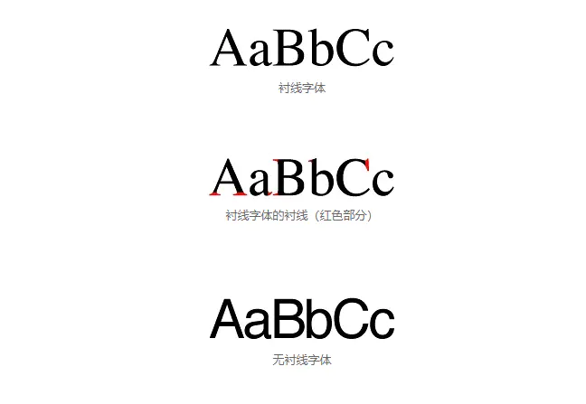
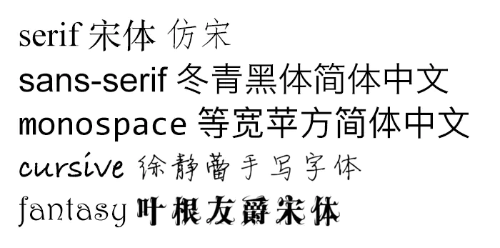
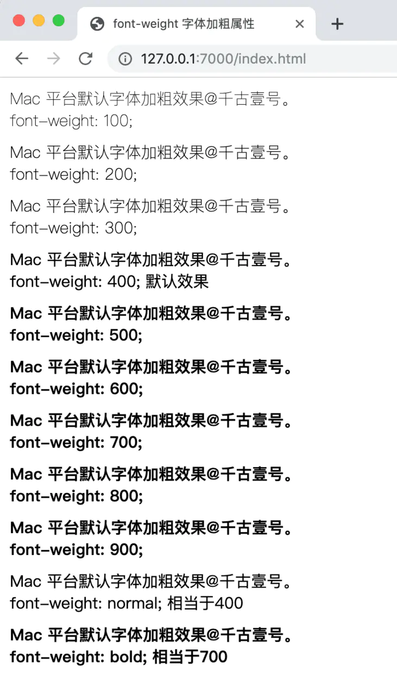
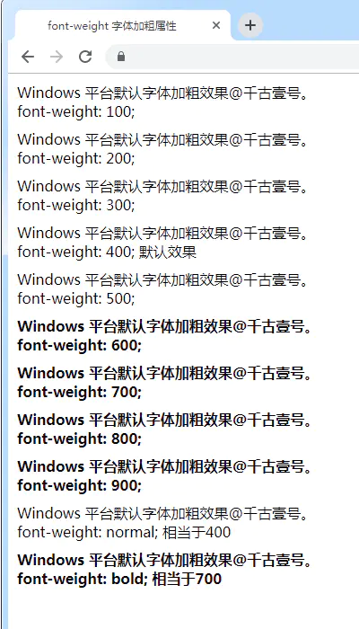
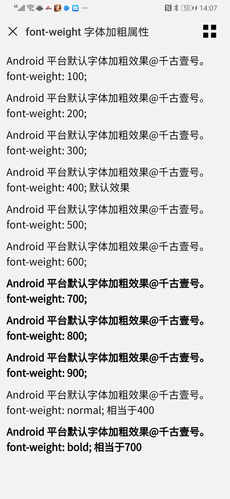

## 字体分类
分为两大类：
- serif（衬线体），代表有：宋体、楷体、Times New Roman
- sans-serif（无衬线体）


衬线体如今已经很少使用了，你所熟悉的“宋体”，也基本只能在纸质出版物中见到。而非衬线体更符合现代审美。

## 字体族
CSS 中的字体族可以理解成是某一类字体。常见的字体族可以分为五类：

- serif：衬线体。
- sans-serif：无衬线体。
- monospace：等宽字体。每一个字母所占的宽度是相同的。写代码的字体尽量用等宽字体。
- cursive：手写字体。比如徐静蕾手写体。
- fantasy：梦幻字体。比如一些艺术字。


## 多字体 fallback 机制
多字体 fallback 机制：当指定的字体找不到（或者某些文字不支持这个字体）时，那就接着往后找。比如：
```
.div1{
    font-family: "PingFang SC", "Microsoft Yahei", monospace;
}
```

## font-weight
font-weight 属性：在设置字体是否加粗时，属性值既可以直接填写 100 至 900 这样的数字，也可以填写normal、bold这样的单词。normal的值相当于 400，bold的值相当于 700。[详情参考](https://www.w3.org/TR/css-fonts-3/#font-weight-prop)

关键问题来了。很多人会发现，在 Windows 平台的浏览器中， font-weight 无论是设置300、400，还是500，文字的粗细都没有任何变化，只有到600的时候才会加粗一下，感觉浏览器好像不支持这些数值，那搞这么多档位不就是多余的吗？

**实际上，所有这些数值关键字浏览器都是支持的，之所以没有看到任何粗细的变化，是因为你所使用的字体不支持。**

就拿“微软雅黑”来举例，它只支持 400 和 700 这两种粗细，所以当你在代码里写成500的时候，也会被认为是400。但是 Mac 上的“苹方”字体，就支持从100到900之间的各种粗细。

**各大平台的默认字体加粗效果**
1. Mac 平台的默认字体加粗效果：（苹方字体）

Mac & iOS 平台的“苹方”字体：500 和600，加粗效果是不同的；>=600的加粗效果是相同的。

2. Windows 平台的默认字体加粗效果：（微软雅黑字体）

Windows 平台的“微软雅黑”字体：只有 >=600 才会加粗，而且加粗效果相同。

3. Android 平台（华为 P30 Pro）的默认字体加粗效果：（Droid Sans 字体）

Android 平台的 Droid Sans 字体，只有 >=700才会加粗；而且加粗效果相同。

## 字体库
有一点你需要知道：你所见到的大部分字体，都不是免费的。换句话说，如果你想用第三方字体从事商业活动，要先交钱，获得授权后才可以使用。你在给公司做网页的时候，就是一种商业行为。

免费字体当然有，比如思源黑体（Adobe 和 Google 在2014年7月联合推出的一款开源字体）、阿里巴巴普惠体等。但这些免费字体，我们平时基本用不到。

这也就是为什么，很多公司会专门购买一套商用字体库、甚至是自己开发一套字体出来，避免未来潜在的纠纷和麻烦。


