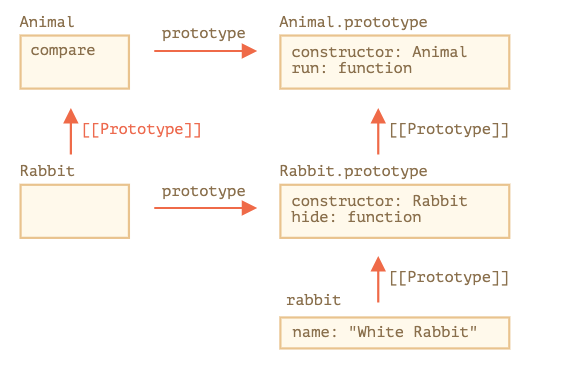

##  static function
我们可以把一个方法赋值给类的函数本身，而不是赋给它的 "prototype"。这样的方法被称为 静态的（static）。

静态方法被用于实现属于整个类的功能。它与具体的类实例无关。
```
class User {
  static staticMethod() {
    alert(this === User);
  }
}

User.staticMethod(); // true

// 等价于
User.staticMethod = function () {
    alert(this === User);
}

```

## static 属性
```
class Article {
  static publisher = "Levi Ding";
}

alert( Article.publisher ); // Levi Ding

// 等价于
Article.publisher = "Levi Ding";
```
## static function 继承
```
class Animal {
  static planet = "Earth";

  constructor(name, speed) {
    this.speed = speed;
    this.name = name;
  }

  run(speed = 0) {
    this.speed += speed;
    alert(`${this.name} runs with speed ${this.speed}.`);
  }

  static compare(animalA, animalB) {
    return animalA.speed - animalB.speed;
  }

}

// 继承于 Animal
class Rabbit extends Animal {
    ...
}

let rabbits = [
  new Rabbit("White Rabbit", 10),
  new Rabbit("Black Rabbit", 5)
];

rabbits.sort(Rabbit.compare);

rabbits[0].run(); // Black Rabbit runs with speed 5.
```
现在我们调用 Rabbit.compare 时，继承的 Animal.compare 将会被调用.

如何工作的？ 来看extends 做了什么？


