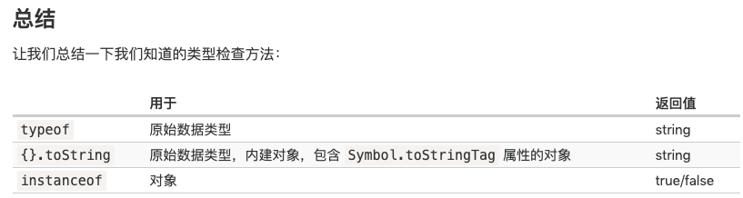

## 类检查
1. instanceof 操作符用于检查一个对象是否属于某个特定的 class。同时，它还考虑了继承。
```
// 判断原理
obj instanceOf Class
obj.__proto__ === Class.prototype?
obj.__proto__.__proto__ === Class.prototype?
obj.__proto__.__proto__.__proto__ === Class.prototype?

// 等价于 isPrototypeOf
Class.prototype.isPrototypeOf(obj)

// 举例
class Rabbit {}
let rabbit = new Rabbit();

// rabbit 是 Rabbit class 的对象吗？
alert( rabbit instanceof Rabbit );
```
- hasInstance: 如果 class 含有静态方法 hasInstance
```
 // 设置 instanceOf 检查
// 并假设具有 canEat 属性的都是 animal
class Animal {
  static [Symbol.hasInstance](obj) {
    if (obj.canEat) return true;
  }
}

let obj = { canEat: true };

alert(obj instanceof Animal); 
```
2. Object.prototype.toString()
```
let obj = {};

alert(obj); // [object Object]
alert(obj.toString())

// 等价于
let s = Object.prototype.toString;

alert( s.call(123) ); // [object Number]
alert( s.call(null) ); // [object Null]
alert( s.call(alert) ); // [object Function]
```
3. Symbol.toStringTag
可以使用特殊的对象属性 Symbol.toStringTag 自定义对象的 toString 方法的行为。

例如：
```
let user = {
  [Symbol.toStringTag]: "User"
};

alert( {}.toString.call(user) ); // [object User]
```
