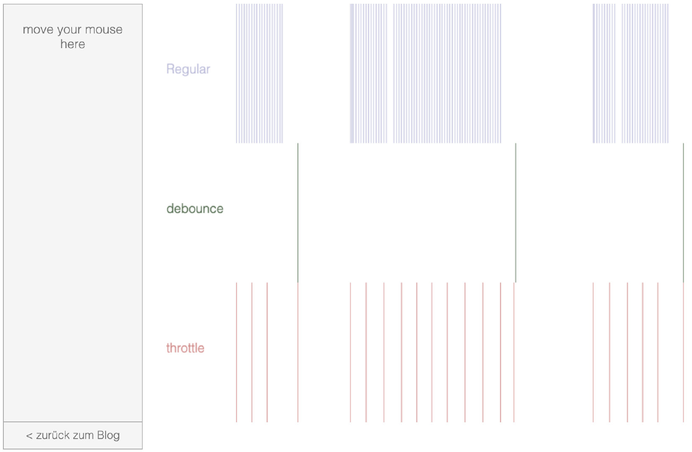

## 防抖与节流
效果动态图：[The Difference Between Throttling and Debouncing](https://css-tricks.com/the-difference-between-throttling-and-debouncing/)



### 实现
#### 节流
```
const betterFn = function(...args) {
  let now = +new Date();
  if (now - previous > wait) {
    previous = now
    // 执行 fn 函数
    fn.apply(this, args)
  }
}
```

#### 防抖
```
function debounce(fn, delay) {
  let timer
  return function(...args) {
    if (timer) clearTimeout(timer)
    // 使用箭头函数来处理this问题
    timer = setTimeout(() => fn.apply(this, args), delay)
  }
}

```