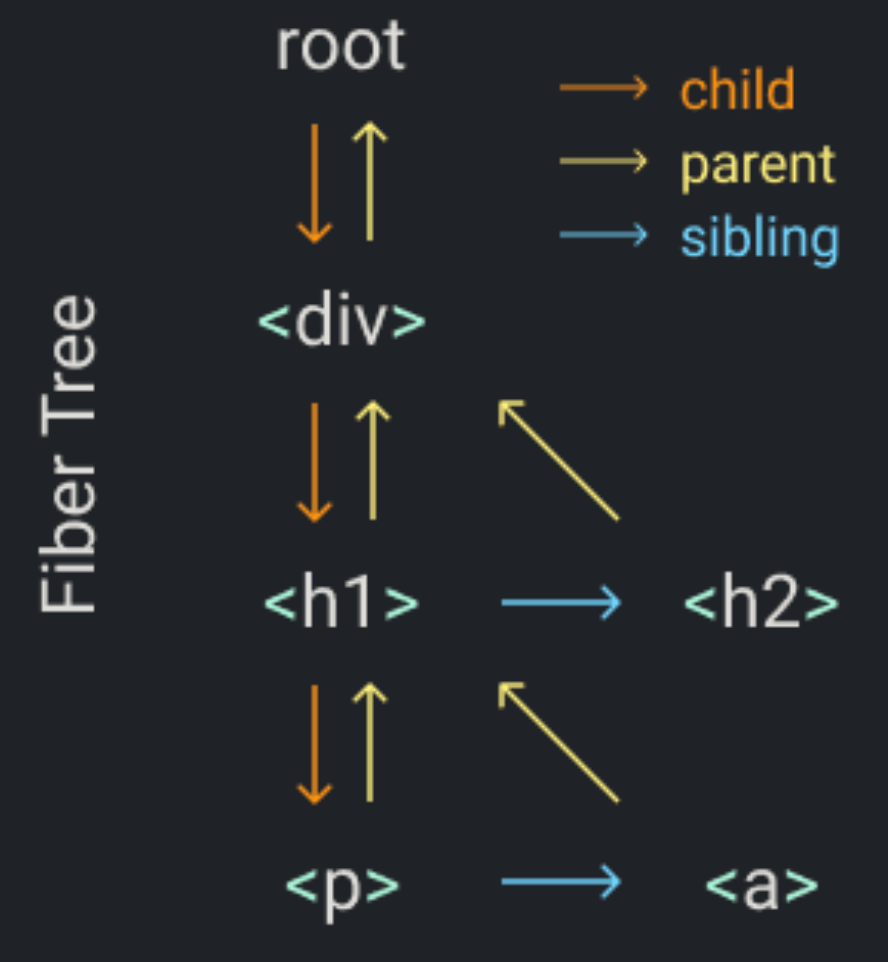

## Fiber
> [走进React Fiber的世界 - 掘金](https://juejin.cn/post/6943896410987659277)

React 16 引入的一个新概念 Fiber，为什么引入这个概念呢？

下面来看完整的一帧（1s 60帧，每帧16.6ms）中，具体做了哪些事情：


1. 首先需要处理输入事件，能够让用户得到最早的反馈
2. 接下来是处理定时器，需要检查定时器是否到时间，并执行对应的回调
3. 接下来处理 Begin Frame（开始帧），即每一帧的事件，包括 window.resize、scroll、media query change 等
4. 接下来执行请求动画帧 requestAnimationFrame，即在每次绘制之前，会执行对应回调
5. 紧接着进行 Layout 操作，包括计算布局和更新布局，即这个元素的样式是怎样的，它应该在页面如何展示
6. 接着进行 Paint 操作，得到树中每个节点的尺寸与位置等信息，浏览器针对每个元素进行内容填充
7. 到这时以上的六个阶段都已经完成了，接下来处于空闲阶段，可以在这时执行 requestIdleCallback 里注册的任务（后面会详细讲到这个 requestIdleCallback ，它是 React Fiber 实现的基础）

- requestAnimationFrame

在 Fiber 中使用到了，它是浏览器提供的绘制动画的 api 。它要求浏览器在下次重绘之前调用指定的回调函数更新动画。

- requestIdleCallback 

Fiber 实现的基础 api ，说明有多余的空闲时间，此时就会执行requestIdleCallback 里注册的任务。


React 15.x 及以前的 Stack Reconcilation，每次更新需要对比新旧虚拟 DOM 树的操作，找出需要更新的内容（patch），通过打补丁的方式更新真实 DOM 树，当要对比的组件树非常多时，就会发生大量的新旧节点对比，这期间react 会一直占用浏览器资源，会导致用户触发的事件得不到响应。当耗时大大超过 16.6ms时，用户会感觉到明显的卡顿。这一系列操作是通过递归的方式实现的，是 同步且不可中断 的。因为一旦中断，调用栈就会被销毁，中间的状态就丢失了。

React 16 引入 的 Fiber Reconcilation，的一个重点工作就是优化更新组件时大量的 CPU 计算，使用 “时间分片” 的方案，就是将原本要一次性做的工作，拆分成一个个异步任务，在浏览器空闲的时间时执行。

### 什么是 Fiber
Fiber 可以理解为是一个执行单元，也可以理解为是一种数据结构。

**一个执行单元**
每次执行完一个执行单元，React 就会检查现在还剩多少时间，如果没有时间则将控制权让出去。React Fiber 与浏览器的核心交互流程如下：


Fiber 可以被理解为划分一个个更小的执行单元，它是把一个大任务拆分为了很多个小块任务，一个小块任务的执行必须是一次完成的，不能出现暂停，但是一个小块任务执行完后可以移交控制权给浏览器去响应用户，从而不用像之前一样要等那个大任务一直执行完成再去响应用户。

**一种数据结构**

React Fiber 就是采用链表实现的。每个 Virtual DOM 都可以表示为一个 Fiber，一个 Fiber 节点定义如下：
```
function FiberNode(
  this: $FlowFixMe,
  tag: WorkTag,
  pendingProps: mixed,
  key: null | string,
  mode: TypeOfMode,
) {
  // Instance
  this.tag = tag; // Fiber对应组件的类型 Function/Class/Host...
  this.key = key; // key属性
  this.elementType = null; // 大多数情况同type属性
  this.type = null; // 对于 FunctionComponent，指函数本身，对于ClassComponent，指class，对于HostComponent，指DOM节点tagName
  this.stateNode = null; // Fiber对应的真实DOM节点，由此实现虚拟 DOM 和真实 DOM 的映射

  // Fiber tree 
  this.return = null; // 指向父级Fiber节点
  this.child = null;  // 指向子Fiber节点
  this.sibling = null;  // 指向第一个兄弟Fiber节点
  
  ... // 略去其他
  }

  ```
一个 DOM 对应 fiber 树结构如下：
```
<div>
    <h1>
        <p/>
        <a/>
    </h1>
    <h2/>
 </div>
```
