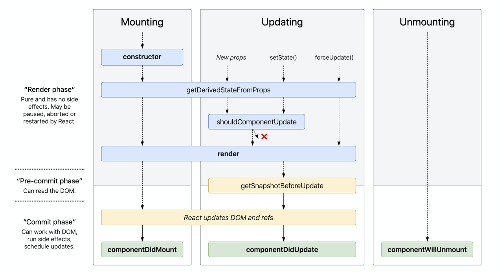

# 人人都能看懂的 React
## 为什么需要 React
> [Why did we build React? | React](https://react-cn.github.io/react/blog/2013/06/05/why-react.html)
> 解释 react 是什么的可爱文档 [React 是什么东东：给小白的图解教程](https://learnreact.design/posts/what-is-react/zh)

一个页面的基本构成：


为了让页面更有交互性，于是操作 dom 的 api 应运而生。


当页面结构非常复杂时，操作 dom 的代码也变得越来越复杂，Web 开发的传统方法越来越显得捉襟见肘。人们开始寻找更高效、更便捷的开发方法，于是 React 应运而生。


React 给前端开发者带来了哪些好处？
1. **组件化思想**：每个页面都可以由“组件积木”拼成，大大提升复用性、可读&维护性、提升开发效率，当某个或某些组件出现问题，可以方便地进行隔离；同一个页面也可以很好得按组件分工实现多人同步开发。

2. **虚拟 DOM & diff 算法带来高渲染性能**：在UI渲染过程中，React通过在虚拟DOM中的微操作来实现对实际DOM的局部更新

3. **单向数据流**：React应用程序中的数据从父组件传递到子组件，当数据发生变化时，React会自动重新渲染并将新的数据传递给子组件，从而更新子组件的界面，使得应用程序的结构更加清晰、易于理解和调试

4. **跨平台兼容**：虚拟DOM帮助我们解决了跨浏览器问题，同时 React 代码可以借助 ReactNative 实现移动端app的迁移

5. **数据驱动界面渲染&自动更新**：React 把用户界面当作简单状态机。把用户界面想像成拥有不同状态然后渲染这些状态，可以轻松让用户界面和数据保持一致。只需更新组件的 state，然后根据新的 state 重新渲染用户界面（不要操作 DOM）。React 来决定如何最高效地更新 DOM。

6. **强大的社区支持**：在facebook 和开发者社区驱动下持续优化实现，从13年诞生至今持续经历多个版本的更新迭代，孵化出更优的dom diff 算法&fiber架构&hook思想&优先级调度等优秀的设计理念，同时涌现出一大批“成熟的轮子”：material-ui（google）、antd （阿里）、semi（抖音）...

以组件化思想举例：

“组件化” 是一个相对抽象的概念，可以是基于cocopods引入的独立业务组件、基础组件等，也可以是小而美的 UI 功能小组件，这里我们先专注于 UI 层面，也是 React 设计的核心思想，即所有界面都可以拆分成独立的组件。组件化有高内聚、低耦合、表现稳定、开发效率高等很多好处。
> 图片来自：https://react.dev/learn/thinking-in-react，可以看到构建一个页面的推荐步骤


> 举例：https://react.dev/ 

**为什么想分享React？**
- 首先，很多优秀的前端（vue）和跨端框架（Lynx、ReactNative等）框架在虚拟 DOM 和 基于diff 算法的思路是相通的，有助于大家融汇贯通；
- 其次希望借此带给大家一些优秀的架构设计思路，扩展架构设计视角；
- 最后多一项技能，React 作为前端最成熟和广泛使用的框架之一，日常平台开发、移动端开发(RN)都可以直接使用（btw. 也可以让 React 代码在 lynx 环境运行，参见ReactLynx 入门开发流程分享）

下文会通过介绍 React 渲染流程，讲解下 React 最经典的虚拟 DOM 和 diff 算法。

## 基本架构
> 引自 [这篇文档](https://react.iamkasong.com/preparation/idea.html#react%E7%90%86%E5%BF%B5)
React 16 之后架构可以分为三层：


备注：红框中的步骤随时可能由于以下原因被中断：1. 有其他更高优任务需要先更新 2. 当前帧没有剩余时间。由于红框中的工作都在内存中进行，不会更新页面上的DOM，所以即使反复中断，用户也感知不到。

- **Scheduler（调度器）—— 根据任务的优先级调度**
  因此 React 在浏览器每一帧的时间中，预留5ms 给JS线程计算更新，当预留的时间不够，React将线程控制权交还给浏览器使其有时间渲染UI，等下一帧时间到来，继续被中断的工作。
为此我们需要一种机制，当浏览器有剩余时间时通知我们。所以React就实现了一个Scheduler（调度器），除了在空闲时触发回调的功能外，Scheduler还提供了多种调度优先级供任务设置。
- **Reconciler（协调器）—— 负责找出变化的组件**
  - 生成虚拟 DOM
  - 执行 diff 算法找出本次更新中变化的虚拟 DOM 节点
  - 通知 Renderer 将变化的虚拟DOM渲染到页面上
- **Renderer（渲染器）—— 负责将变化的组件渲染到页面上**
  - 在每次更新发生时，Renderer 接到 Reconciler通知，将变化的组件渲染在当前宿主环境。不同平台有不同的Renderer，浏览器环境渲染 ReactDOM，还有 ReactNative渲染器渲染App原生组件

下面的内容主要围绕 Reconciler 部分展开介绍。

## Reconciler
为方便理解，先给大家介绍一下虚拟 DOM 相关知识。

### 虚拟 DOM 
真实 dom 写法，可以用 JavaScript（以下简称 js） 代码对 dom 增删改查，dom 元素监听的事件（比如点击）也会调用对应 js 逻辑，如：
```
<ul id="myList">
  <li>Coffee</li>
  <li>Tea</li>
</ul>

<button onclick="myFunction()">Append</button>

<script>
function myFunction() {
    const node = document.createElement("li");
    const textnode = document.createTextNode("Water");
    node.appendChild(textnode);
    document.getElementById("myList").appendChild(node);
}
</script>
```

React会先将你的代码转换成一个 js 对象，然后这个 js 对象再转换成真实DOM。这个 js 对象就是所谓的虚拟DOM。
比如左侧的代码，在 React 中会被转成右侧的虚拟 dom：
```
<div class="title">
    <span>Hello React</span>
    <ul>
        <li>苹果</li>
        <li>橘子</li>
    </ul>
 </div>
```
```
// 为方便理解省略一些属性
const VitrualDom = {
  type: 'div',
  props: { class: 'title' },
  children: [
    {
      type: 'span',
      children: 'Hello React'
    },
    {
      type: 'ul',
      children: [
        { type: 'li', children: '苹果' },
        { type: 'li', children: '橘子' }
      ]
    }
  ]
}
```
当我们需要创建或更新元素时，React 首先会让这个虚拟 dom 对象进行创建和更改，然后再将虚拟 dom 对象渲染成真实DOM；当我们需要对DOM进行事件监听时，首先对VitrualDom进行事件监听，VitrualDom会代理原生的DOM事件从而做出响应。


#### 为什么需要虚拟 dom？

真实 dom 的渲染成本很高（[dom 操作为什么耗时](https://peterchen1997.github.io/Frontend-Repo/nav.07.HTML/01-%E6%A0%87%E5%87%86/DOM%E6%93%8D%E4%BD%9C%E4%B8%BA%E4%BB%80%E4%B9%88%E8%80%97%E6%97%B6.html#dom%E6%93%8D%E4%BD%9C%E5%8E%9F%E7%90%86)），一次改动引发 dom 树的重新计算布局和重绘可能数百毫秒甚至达到秒级（与dom树深度和节点树相关）。 所以通过将虚拟 dom 和 Diff 算法相结合，减少不必要的多次重新渲染，得到较好的渲染性能，同时一致性也可以有较好的保证。
此外虚拟 dom 还有以下优势：
  - 简单方便：如果使用手动操作真实 dom 来完成页面，在大规模应用下维护起来也很困难
  - 跨平台：React 借助虚拟 dom，带来了跨平台的能力，一套代码多端运行
当然也有一些缺点，比如首次渲染大量 dom 时，由于多了一层虚拟 dom 的计算，速度比正常稍慢

#### 虚拟 dom 是怎么生成的？
每一个虚拟 dom 在内存中是一个 ReactElement，通过createElement创建，调用该方法需要传入三个参数：
- type
- config
- children

> type指代这个ReactElement的类型
> - 字符串比如div，p代表原生DOM，称为HostComponent
> - Class类型是我们继承自Component或者PureComponent的组件，称为> > ClassComponent
> - 方法就是 functional Component
> （其他先略过..）

```
export function createElement(type, config, children) {
  return ReactElement(
    type,
    key,
    ref,
    self,
    source,
    ReactCurrentOwner.current,
    props,
  );
}

const ReactElement = function(type, key, ref, self, source, owner, props) {
  const element = {
    // This tag allows us to uniquely identify this as a React Element
    $$typeof: REACT_ELEMENT_TYPE,

    // Built-in properties that belong on the element
    type: type,
    key: key,
    ref: ref,
    props: props,

    // Record the component responsible for creating this element.
    _owner: owner,
  };

  return element
}
```

难道我们要手动调用 api 自己构建虚拟 dom 树吗？当然不用！

> 关于 jsx ：JSX is a syntax extension for JavaScript that lets you write HTML-like markup inside a JavaScript file.
比如：


底层通过 babel 调用 jsx 方法(_jsxs) 创建虚拟 DOM 节点，再连成虚拟 DOM 树，举个例子：


真实的虚拟 DOM 树是非常复杂的（推荐 chrome 安装 React Developer）

 


   
## 渲染原理
### Reconciler 做了哪些事？

> 推荐阅读：[走进React Fiber的世界 - 掘金](https://juejin.cn/post/6943896410987659277)

此阶段会找出所有节点的变更，如节点新增、删除、属性变更等，这些变更 react 统称为副作用（effect），此阶段会构建一棵Fiber tree，以虚拟dom节点为维度对任务进行拆分，即一个虚拟dom节点对应一个任务，最后产出的结果是effect list，从中可以知道哪些节点更新、哪些节点增加、哪些节点删除了。



当数据更新触发组件更新时，触发一次render + commit 阶段（优先级调度本文不展开）

参考资料
React Diff详解 
走进React Fiber的世界 - 掘金
- https://pomb.us/build-your-own-react/
- https://zhuanlan.zhihu.com/p/20312691
- https://react.dev/blog/2023/03/16/introducing-react-dev
- https://react.iamkasong.com/preparation/idea.html


