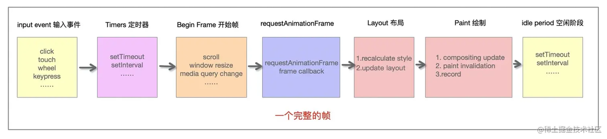

# 人人都能看懂的 React
## 为什么需要 React
> [Why did we build React? | React](https://react-cn.github.io/react/blog/2013/06/05/why-react.html)
> 解释 react 是什么的可爱文档 [React 是什么东东：给小白的图解教程](https://learnreact.design/posts/what-is-react/zh)

一个页面的基本构成：


为了让页面更有交互性，于是操作 dom 的 api 应运而生。


当页面结构非常复杂时，操作 dom 的代码也变得越来越复杂，Web 开发的传统方法越来越显得捉襟见肘。人们开始寻找更高效、更便捷的开发方法，于是 React 应运而生。


React 给前端开发者带来了哪些好处？
1. **组件化思想**：每个页面都可以由“组件积木”拼成，大大提升复用性、可读&维护性、提升开发效率，当某个或某些组件出现问题，可以方便地进行隔离；同一个页面也可以很好得按组件分工实现多人同步开发。

2. **虚拟 DOM & diff 算法带来高渲染性能**：在UI渲染过程中，React通过在虚拟DOM中的微操作来实现对实际DOM的局部更新

3. **单向数据流**：React应用程序中的数据从父组件传递到子组件，当数据发生变化时，React会自动重新渲染并将新的数据传递给子组件，从而更新子组件的界面，使得应用程序的结构更加清晰、易于理解和调试

4. **跨平台兼容**：虚拟DOM帮助我们解决了跨浏览器问题，同时 React 代码可以借助 ReactNative 实现移动端app的迁移

5. **数据驱动界面渲染&自动更新**：React 把用户界面当作简单状态机。把用户界面想像成拥有不同状态然后渲染这些状态，可以轻松让用户界面和数据保持一致。只需更新组件的 state，然后根据新的 state 重新渲染用户界面（不要操作 DOM）。React 来决定如何最高效地更新 DOM。

6. **强大的社区支持**：在facebook 和开发者社区驱动下持续优化实现，从13年诞生至今持续经历多个版本的更新迭代，孵化出更优的dom diff 算法&fiber架构&hook思想&优先级调度等优秀的设计理念，同时涌现出一大批“成熟的轮子”：material-ui（google）、antd （阿里）、semi（抖音）...

以组件化思想举例：

“组件化” 是一个相对抽象的概念，可以是基于cocopods引入的独立业务组件、基础组件等，也可以是小而美的 UI 功能小组件，这里我们先专注于 UI 层面，也是 React 设计的核心思想，即所有界面都可以拆分成独立的组件。组件化有高内聚、低耦合、表现稳定、开发效率高等很多好处。
> 图片来自：https://react.dev/learn/thinking-in-react，可以看到构建一个页面的推荐步骤


> 举例：https://react.dev/ 

**为什么想分享React？**
- 首先，很多优秀的前端（vue）和跨端框架（Lynx、ReactNative等）框架在虚拟 DOM 和 基于diff 算法的思路是相通的，有助于大家融汇贯通；
- 其次希望借此带给大家一些优秀的架构设计思路，扩展架构设计视角；
- 最后多一项技能，React 作为前端最成熟和广泛使用的框架之一，日常平台开发、移动端开发(RN)都可以直接使用（btw. 也可以让 React 代码在 lynx 环境运行，参见ReactLynx 入门开发流程分享）

下文会通过介绍 React 渲染流程，讲解下 React 最经典的虚拟 DOM 和 diff 算法。

## 基本架构
> 引自 [这篇文档](https://react.iamkasong.com/preparation/idea.html#react%E7%90%86%E5%BF%B5)
React 16 之后架构可以分为三层：


备注：红框中的步骤随时可能由于以下原因被中断：1. 有其他更高优任务需要先更新 2. 当前帧没有剩余时间。由于红框中的工作都在内存中进行，不会更新页面上的DOM，所以即使反复中断，用户也感知不到。

- **Scheduler（调度器）—— 根据任务的优先级调度**
  因此 React 在浏览器每一帧的时间中，预留5ms 给JS线程计算更新，当预留的时间不够，React将线程控制权交还给浏览器使其有时间渲染UI，等下一帧时间到来，继续被中断的工作。
为此我们需要一种机制，当浏览器有剩余时间时通知我们。所以React就实现了一个Scheduler（调度器），除了在空闲时触发回调的功能外，Scheduler还提供了多种调度优先级供任务设置。
- **Reconciler（协调器）—— 负责找出变化的组件**
  - 生成虚拟 DOM
  - 执行 diff 算法找出本次更新中变化的虚拟 DOM 节点
  - 通知 Renderer 将变化的虚拟DOM渲染到页面上
- **Renderer（渲染器）—— 负责将变化的组件渲染到页面上**
  - 在每次更新发生时，Renderer 接到 Reconciler通知，将变化的组件渲染在当前宿主环境。不同平台有不同的Renderer，浏览器环境渲染 ReactDOM，还有 ReactNative渲染器渲染App原生组件

下面的内容主要围绕 Reconciler 部分展开介绍。

## Reconciler
为方便理解，先给大家介绍一下虚拟 DOM 相关知识。

### 虚拟 DOM 
真实 dom 写法，可以用 JavaScript（以下简称 js） 代码对 dom 增删改查，dom 元素监听的事件（比如点击）也会调用对应 js 逻辑，如：
```
<ul id="myList">
  <li>Coffee</li>
  <li>Tea</li>
</ul>

<button onclick="myFunction()">Append</button>

<script>
function myFunction() {
    const node = document.createElement("li");
    const textnode = document.createTextNode("Water");
    node.appendChild(textnode);
    document.getElementById("myList").appendChild(node);
}
</script>
```

React会先将你的代码转换成一个 js 对象，然后这个 js 对象再转换成真实DOM。这个 js 对象就是所谓的虚拟DOM。
比如左侧的代码，在 React 中会被转成右侧的虚拟 dom：
```
<div class="title">
    <span>Hello React</span>
    <ul>
        <li>苹果</li>
        <li>橘子</li>
    </ul>
 </div>
```
```
// 为方便理解省略一些属性
const VitrualDom = {
  type: 'div',
  props: { class: 'title' },
  children: [
    {
      type: 'span',
      children: 'Hello React'
    },
    {
      type: 'ul',
      children: [
        { type: 'li', children: '苹果' },
        { type: 'li', children: '橘子' }
      ]
    }
  ]
}
```
当我们需要创建或更新元素时，React 首先会让这个虚拟 dom 对象进行创建和更改，然后再将虚拟 dom 对象渲染成真实DOM；当我们需要对DOM进行事件监听时，首先对VitrualDom进行事件监听，VitrualDom会代理原生的DOM事件从而做出响应。


- 为什么需要虚拟 dom？
真实 dom 的渲染成本很高（[dom 操作为什么耗时](https://peterchen1997.github.io/Frontend-Repo/nav.07.HTML/01-%E6%A0%87%E5%87%86/DOM%E6%93%8D%E4%BD%9C%E4%B8%BA%E4%BB%80%E4%B9%88%E8%80%97%E6%97%B6.html#dom%E6%93%8D%E4%BD%9C%E5%8E%9F%E7%90%86)），一次改动引发 dom 树的重新计算布局和重绘可能数百毫秒甚至达到秒级（与dom树深度和节点树相关）。 所以通过将虚拟 dom 和 Diff 算法相结合，减少不必要的多次重新渲染，得到较好的渲染性能，同时一致性也可以有较好的保证。
此外虚拟 dom 还有以下优势：
  - 简单方便：如果使用手动操作真实 dom 来完成页面，在大规模应用下维护起来也很困难
  - 跨平台：React 借助虚拟 dom，带来了跨平台的能力，一套代码多端运行
当然也有一些缺点，比如首次渲染大量 dom 时，由于多了一层虚拟 dom 的计算，速度比正常稍慢

- 虚拟 dom 是怎么生成的？
每一个虚拟 dom 在内存中是一个 ReactElement，通过createElement创建，调用该方法需要传入三个参数：
- type
- config
- children
type指代这个ReactElement的类型
- 字符串比如div，p代表原生DOM，称为HostComponent
- Class类型是我们继承自Component或者PureComponent的组件，称为ClassComponent
- 方法就是 functional Component
（其他先略过..）

```
export function createElement(type, config, children) {
  return ReactElement(
    type,
    key,
    ref,
    self,
    source,
    ReactCurrentOwner.current,
    props,
  );
}

const ReactElement = function(type, key, ref, self, source, owner, props) {
  const element = {
    // This tag allows us to uniquely identify this as a React Element
    $$typeof: REACT_ELEMENT_TYPE,

    // Built-in properties that belong on the element
    type: type,
    key: key,
    ref: ref,
    props: props,

    // Record the component responsible for creating this element.
    _owner: owner,
  };

  return element
}
```
难道我们要手动调用 api 自己构建虚拟 dom 树吗？当然不用！

> 关于 jsx ：JSX is a syntax extension for JavaScript that lets you write HTML-like markup inside a JavaScript file.
比如：


底层通过 babel 调用 jsx 方法(_jsxs) 创建虚拟 DOM 节点，再连成虚拟 DOM 树，举个例子：


真实的虚拟 DOM 树是非常复杂的（推荐 chrome 安装 React Developer 


## Fiber
> [走进React Fiber的世界 - 掘金](https://juejin.cn/post/6943896410987659277)

React 16 引入的一个新概念 Fiber，为什么引入这个概念呢？

下面来看完整的一帧（1s 60帧，每帧16.6ms）中，具体做了哪些事情：


1. 首先需要处理输入事件，能够让用户得到最早的反馈
2. 接下来是处理定时器，需要检查定时器是否到时间，并执行对应的回调
3. 接下来处理 Begin Frame（开始帧），即每一帧的事件，包括 window.resize、scroll、media query change 等
4. 接下来执行请求动画帧 requestAnimationFrame，即在每次绘制之前，会执行对应回调
5. 紧接着进行 Layout 操作，包括计算布局和更新布局，即这个元素的样式是怎样的，它应该在页面如何展示
6. 接着进行 Paint 操作，得到树中每个节点的尺寸与位置等信息，浏览器针对每个元素进行内容填充
7. 到这时以上的六个阶段都已经完成了，接下来处于空闲阶段，可以在这时执行 requestIdleCallback 里注册的任务（后面会详细讲到这个 requestIdleCallback ，它是 React Fiber 实现的基础）

- requestAnimationFrame
在 Fiber 中使用到了，它是浏览器提供的绘制动画的 api 。它要求浏览器在下次重绘之前调用指定的回调函数更新动画。
- requestIdleCallback 
Fiber 实现的基础 api ，说明有多余的空闲时间，此时就会执行requestIdleCallback 里注册的任务。


React 15.x 及以前的 Stack Reconcilation，每次更新需要对比新旧虚拟 DOM 树的操作，找出需要更新的内容（patch），通过打补丁的方式更新真实 DOM 树，当要对比的组件树非常多时，就会发生大量的新旧节点对比，这期间react 会一直占用浏览器资源，会导致用户触发的事件得不到响应。当耗时大大超过 16.6ms时，用户会感觉到明显的卡顿。这一系列操作是通过递归的方式实现的，是 同步且不可中断 的。因为一旦中断，调用栈就会被销毁，中间的状态就丢失了。

React 16 引入 的 Fiber Reconcilation，的一个重点工作就是优化更新组件时大量的 CPU 计算，使用 “时间分片” 的方案，就是将原本要一次性做的工作，拆分成一个个异步任务，在浏览器空闲的时间时执行。

**什么是 Fiber**
Fiber 可以理解为是一个执行单元，也可以理解为是一种数据结构。
一个执行单元
每次执行完一个执行单元，React 就会检查现在还剩多少时间，如果没有时间则将控制权让出去。React Fiber 与浏览器的核心交互流程如下：

Fiber 可以被理解为划分一个个更小的执行单元，它是把一个大任务拆分为了很多个小块任务，一个小块任务的执行必须是一次完成的，不能出现暂停，但是一个小块任务执行完后可以移交控制权给浏览器去响应用户，从而不用像之前一样要等那个大任务一直执行完成再去响应用户。

一种数据结构
React Fiber 就是采用链表实现的。每个 Virtual DOM 都可以表示为一个 Fiber，一个 Fiber 节点定义如下：
function FiberNode(
  this: $FlowFixMe,
  tag: WorkTag,
  pendingProps: mixed,
  key: null | string,
  mode: TypeOfMode,
) {
  // Instance
  this.tag = tag; // Fiber对应组件的类型 Function/Class/Host...
  this.key = key; // key属性
  this.elementType = null; // 大多数情况同type属性
  this.type = null; // 对于 FunctionComponent，指函数本身，对于ClassComponent，指class，对于HostComponent，指DOM节点tagName
  this.stateNode = null; // Fiber对应的真实DOM节点，由此实现虚拟 DOM 和真实 DOM 的映射

  // Fiber tree 
  this.return = null; // 指向父级Fiber节点
  this.child = null;  // 指向子Fiber节点
  this.sibling = null;  // 指向第一个兄弟Fiber节点
  
  ... // 略去其他
  }
一个 DOM 对应 fiber 树结构如下：
<div>
    <h1>
        <p/>
        <a/>
    </h1>
    <h2/>
 </div>

[图片]
   
渲染原理
Reconciler 做了哪些事？
推荐阅读：走进React Fiber的世界 - 掘金
此阶段会找出所有节点的变更，如节点新增、删除、属性变更等，这些变更 react 统称为副作用（effect），此阶段会构建一棵Fiber tree，以虚拟dom节点为维度对任务进行拆分，即一个虚拟dom节点对应一个任务，最后产出的结果是effect list，从中可以知道哪些节点更新、哪些节点增加、哪些节点删除了。
[图片]
当数据更新触发组件更新时，出发一次render + commit 阶段（优先级调度本文不展开）
Render 
双缓存Fiber树
当我们用 canvas 绘制动画，每一帧绘制前都会调用 ctx.clearRect 清除上一帧的画面。如果当前帧画面计算量比较大，导致清除上一帧画面到绘制当前帧画面之间有较长间隙，就会出现白屏。
为了解决这个问题，我们可以在内存中绘制当前帧动画，绘制完毕后直接用当前帧替换上一帧画面，由于省去了两帧替换间的计算时间，不会出现从白屏到出现画面的闪烁情况。这种在内存中构建并直接替换的技术叫做双缓存。
React 使用“双缓存”来完成 Fiber树 的构建与替换——对应着DOM树的创建与更新。

在 React 中最多会同时存在两棵 Fiber 树。当前屏幕上显示内容对应的 Fiber 树称为 current Fiber树（树上节点称为 current fiber），正在内存中构建的 Fiber 树称为 workInProgress Fiber树（树上节点称为workInProgress fiber），两棵树上的节点通过 alternate 属性连接。

function App() {
    const [num, add] = useState(0);
    return (<p onClick={() => add(num + 1)}>{num}</p>)
}

ReactDOM.render(<App/>, document.getElementById('root'));
首次执行 ReactDOM.render 会创建 fiberRootNode 和 rootFiber。其中 fiberRootNode 是整个应用的根节点，rootFiber 是<App/>所在组件树的根节点。

[图片]
接下来进入 render 阶段，根据组件返回的JSX在内存中依次创建 Fiber 节点并连接在一起构建 Fiber 树，被称为workInProgress Fiber树。构建时会尝试复用current Fiber树中已有的Fiber节点内的属性。

[图片]

图中右侧已构建完的 workInProgress Fiber树在commit阶段渲染到页面。fiberRootNode的current指针指向workInProgress Fiber树使其变为current Fiber 树。

[图片]
update时，我们点击p节点触发状态改变，这会开启一次新的render阶段并构建一棵新的workInProgress Fiber 树，可以复用 current Fiber树对应的节点数据，这个决定是否复用的过程就是Diff算法。

[图片]
[图片]
Render 阶段
“递”阶段，首先从rootFiber开始向下深度优先遍历。为遍历到的每个Fiber节点调用beginWork方法。该方法会根据创建子Fiber节点，并将这两个Fiber节点连接起来。当遍历到叶子节点（即没有子组件的组件）时就会进入“归”阶段。 
“归”阶段，会调用completeWork处理Fiber节点。当某个Fiber节点执行完completeWork，如果其存在兄弟Fiber节点（即fiber.sibling !== null），会进入其兄弟Fiber的“递”阶段。如果不存在兄弟Fiber，会进入父级Fiber的“归”阶段。
function App() {return (
    <div>
      i am
      <span>KaSong</span>
    </div>)
}
ReactDOM.render(<App />, document.getElementById("root"));
对应的Fiber树结构： 
[图片]
render阶段会依次执行：
1. rootFiber beginWork
2. App Fiber beginWork
3. div Fiber beginWork
4. "i am" Fiber beginWork
5. "i am" Fiber completeWork
6. span Fiber beginWork
7. span Fiber completeWork
8. div Fiber completeWork
9. App Fiber completeWork
10. rootFiber completeWork
beginWork 和 completeWork 具体做的事情参见这篇文章。

⚠️值得特别介绍的是：
- beginWork
dom diff 算法就是在这个阶段发生的，在current fiber 和 新 jsx 节点比较时，标记 fiber 操作的具体类型在fiber.effectTag中，你可以从这里看到effectTag对应的DOM操作，比如：
export const Placement = /*                    */ 0b000000000000010;
export const Update = /*                       */ 0b000000000000100;
export const PlacementAndUpdate = /*           */ 0b000000000000110;
export const Deletion = /*                     */ 0b000000000001000;
- completeWork
  - 将每个 fiber 需要更新的信息，比如数据属性、交互事件方法、样式属性放到fiber的一个数组（updateQueue) 中，偶数index作为key，奇数index放value，在下方的commit阶段统一更新到dom上；
  - effectList 的巧妙设计
    作为DOM操作的依据，commit 阶段需要找到所有有 effectTag 的 Fiber 节点并依次执行 effectTag 对应操作。难道需要在 commit 阶段再遍历一次Fiber树寻找 effectTag !== null 的Fiber节点么？这显然是很低效的。
    为了解决这个问题，每个Fiber执行完 completeWork 且 存在effectTag的Fiber节点会被保存在一条被称为 effectList的单向链表中。通过每个节点更新结束时向上归并effect list来收集任务结果，最后根节点的effect list里就记录了包括了所有需要变更的结果，最终形成一条以rootFiber.firstEffect为起点的单向链表。
                       nextEffect         nextEffect
rootFiber.firstEffect -----------> fiber -----------> fiber
  这样，在commit阶段只需要遍历effectList就能执行所有effect了。
  借用React团队成员Dan Abramov的话：effectList相较于Fiber树，就像圣诞树上挂的那一串彩灯。
左图：react源码解析8.render阶段 - 全栈潇晨 - 博客园，右图：走进React Fiber的世界 - 掘金，effeclist 实现原理也参见这篇文档
[图片]
[图片]
Commit 
具体源码解析参见这篇文章
commit 共分为 3 个阶段：before mutation、mutation、layout
- before mutation 阶段，这个阶段 DOM 节点还没有被渲染到界面上去，过程会触发生命周期方法。
- mutation 阶段，负责 DOM 节点的渲染。遍历 effectList，根据 flags 的不同，执行不同的 DOM 操作。
- layout 阶段，处理 DOM 渲染完毕之后的收尾逻辑。比如 调用 componentDidMount/componentDidUpdate，还会把 fiberRoot 的 current 指针指向 workInProgress Fiber 树。
commit 阶段 是一个 绝对同步的过程。render 阶段可以同步也可以异步。

Diff 算法的实现
diff 算法可以帮助我们计算出虚拟 DOM 中真正变化的部分，并只针对该部分进行实际的 DOM 操作，而非渲染整个页面，从而保证了每次操作后页面的高效渲染。
React 提出了三个前提，最终时间复杂度从 O(n3) 降为 O(n)：
1. 只对同级比较，跨层级的 DOM 不进行复用，因为 Web UI 中 DOM 节点跨层级的移动操作特别少
2. 不同类型节点生成的 DOM 树不同，此时会直接销毁老节点及子孙节点，并新建节点（类型指 html 标签类型）
3. 可以通过 key 来对元素 diff 的过程提供复用的线索，例如：
// 更新前
<div>
  <p key="ka">ka</p>
  <h3 key="song">song</h3>
</div>

// 更新后
<div>
  <h3 key="song">song</h3>
  <p key="ka">ka</p>
</div>

如果没有key，React会认为div的第一个子节点由p变为h3，第二个子节点由h3变为p。这符合限制2的设定，会销毁并新建。
但是当我们用key指明了节点前后对应关系后，React知道key === "ka"的p在更新后还存在，所以DOM节点可以复用，只是需要交换下顺序。

一个DOM节点在某一时刻最多会有4个节点和他相关
1. current Fiber，如果该DOM节点已在页面中，current Fiber代表该DOM节点对应的Fiber节点
2. workInProgress Fiber，如果该DOM节点将在本次更新中渲染到页面中，workInProgress Fiber代表该DOM节点对应的Fiber节点
3. JSX对象（虚拟dom），即ClassComponent的render方法的返回结果，或FunctionComponent的调用结果。JSX对象中包含描述DOM节点的信息
4. DOM节点本身
Diff算法的本质是对比1和3，生成2，即 dom-diff 是老 fiber 树跟新 jsx 的对比，生成新的 fiber 树的过程

我们从Diff的入口函数 reconcileChildFibers 出发，该函数会根据newChild（即JSX对象）类型调用不同的处理函数。
// 根据newChild类型选择不同diff函数处理
function reconcileChildFibers(
    returnFiber: Fiber,
    currentFirstChild: Fiber | null,
    newChild: any,
  ): Fiber | null {
  
    const isObject = typeof newChild === 'object' && newChild !== null;
  
    if (isObject) {
      // object类型，可能是 REACT_ELEMENT_TYPE 或 REACT_PORTAL_TYPE
      switch (newChild.$$typeof) {
        case REACT_ELEMENT_TYPE:
            // 调用 reconcileSingleElement 处理
            // ...省略其他case
      }
    }
  
    if (typeof newChild === 'string' || typeof newChild === 'number') {
        // 调用 reconcileSingleTextNode 处理
        // ...省略
    }
  
    if (isArray(newChild)) {
        // 调用 reconcileChildrenArray 处理
        // ...省略
    }
  
    // 一些其他情况调用处理函数省略
  
    // 以上都没有命中，删除节点
    return deleteRemainingChildren(returnFiber, currentFirstChild);
  }
我们可以从同级的节点数量将Diff分为两类：
1. 当newChild类型为object、number、string，代表同级只有一个节点，比如：
// 旧
<div>
   <h1 key="h1">h1</h1>
   <h2 key="h2">h2</h2>
</div>

// 新
<div>
   <h2 key="h2">h2</h2>
</div>
// 旧
<div>
   <Welcome>lili</Welcome>
   <Hello>lili</Hello>
</div>

// 新
<div>
   <Hello>lili</Hello>
</div>
2. 当newChild类型为Array，同级有多个节点，比如
//老
<ul>
  <li key="A">A</li>
  <li key="B">B</li>
  <li key="C">C</li>
  <li key="D">D</li>
</ul>

//新
<ul>
  <div key="A">A-new</div>
  <li key="B">B-new</li>
  <li key="C">C-new</li>
  <li key="D">D-new</li>
</ul>
<div>
   <Welcome>lili</Welcome>
   <Hello>lili</Hello>
</div>

// 新
<div>
   <Hello>lili</Hello>
   <World>lili</World>
</div>
在接下来两节我们会分别讨论这两类节点的Diff。

单节点 Diff
源码参见：reconcileSingleElement
function reconcileSingleElement(
    returnFiber: Fiber,
    currentFirstChild: Fiber | null,
    element: ReactElement
  ): Fiber {
    const key = element.key; // 新虚拟dom节点的key
    let child = currentFirstChild; // old fiber树的第一个子节点
    
    while (child !== null) {
      // 存在DOM节点，接下来判断是否可复用
      // 首先比较key是否相同
      if (child.key === key) {
        // key相同，接下来比较type是否相同
        switch (child.tag) {
          // ...省略case
          
          default: {
            if (child.elementType === element.type) {
              // type相同则表示可以复用
              // 将该fiber的兄弟节点标记为删除
              deleteRemainingChildren(returnFiber, child.sibling);
              // 更新当前fiber的属性
              const existing = useFiber(child, element.props);
              // 返回找到的可服用的fiber节点
              return existing;
            }
            // type不同则跳出switch
            break;
          }
        }
        // 代码执行到这里代表：key相同但是type不同
        // 将该fiber及其兄弟fiber标记为删除
        deleteRemainingChildren(returnFiber, child);
        break;
      } else {
        // key不同，将该fiber标记为删除
        deleteChild(returnFiber, child);
      }
      child = child.sibling;
    }
    // 创建新Fiber，并返回 ...省略
  }
从代码可以看出，React通过先判断key是否相同，如果key相同则判断type是否相同，只有都相同时一个DOM节点才能复用。
这里有个细节需要关注下：
- 当 child !== null 且 key 相同 且 type 不同 时执行deleteRemainingChildren将 child 及其兄弟 fiber 都标记删除（左例）
- 当 child !== null 且 key不同 时仅将 child 标记删除（右例，比较到 h1 只会把 h1 标记删除，继续遍历）
// 旧
<div>
   <h1 key="h1">h1</h1>
   <h2 key="h2">h2</h2>
   <h3 key="h3">h2</h2>
</div>

// 新
<div>
   <p key="h1">h1</p>
</div>
// 旧
<div>
   <h1 key="h1">h1</h1>
   <h2 key="h2">h2</h2>
</div>

// 新
<div>
   <h2 key="h2">h2</h2>
</div>
多节点 Diff
同级多个节点的Diff，一定属于以下三种情况中的一种或多种：
情况1：节点更新
// 旧
<ul>
  <li key="0" className="before">0<li>
  <li key="1">1<li>
</ul>

// 新 情况1 节点属性变化
<ul>
  <li key="0" className="after">0<li>
  <li key="1">1<li>
</ul>

//新 情况2 节点类型更新
<ul>
  <div key="0">0</div>
  <li key="1">1<li>
</ul>
情况2：节点新增或减少
// 旧
<ul>
  <li key="0">0<li>
  <li key="1">1<li>
  <li key="2">2<li>
</ul>

// 新 情况1 —— 新增节点
<ul>
  <li key="0">0<li>
  <li key="1">1<li>
  <li key="2">2<li>
  <li key="3">3<li>
</ul>

// 新 情况2 —— 删除节点
<ul>
  <li key="1">1<li>
  <li key="3">3<li>
</ul>
情况3：节点位置变化
// 旧
<ul>
  <li key="0">0<li>
  <li key="1">1<li>
</ul>

// 新
<ul>
  <li key="1">1<li>
  <li key="0">0<li>
</ul>

React团队发现，在日常开发中，相较于新增和删除，更新组件发生的频率更高，所以 Diff 会优先判断当前节点是否属于更新。
当数组遇上单链表
在我们做数组相关的算法题时，经常使用双指针从数组头和尾同时遍历以提高效率，但是这里却不行。
虽然本次更新的 JSX 对象  newChildren 为数组形式，但是和 newChildren 中每个组件进行比较的是current fiber，同级的 Fiber 节点是由 sibling 指针链接形成的单链表，即不支持双指针遍历。
即 newChildren[0] 与 fiber 比较，newChildren[1]与 fiber.sibling 比较。
所以无法使用双指针优化。
reconcileChildFibers的newChild参数类型为Array
function List () {
    return (
        <ul>
            <li key="0">0</li>
            <li key="1">1</li>
            <li key="2">2</li>
            <li key="3">3</li>
        </ul>
    )
  }
[图片]
基于以上原因，Diff算法的整体逻辑会经历两轮遍历：
第一轮遍历：处理更新的节点。
第二轮遍历：处理剩下的不属于更新的节点。

第一轮遍历步骤如下：
1. let i = 0，遍历newChildren，将newChildren[0]与oldFiber比较，判断DOM节点是否可复用。
2. 如果可复用，i++，继续比较newChildren[1]与oldFiber.sibling，可以复用则继续遍历。
3. 如果不可复用，分两种情况：
  - key不同导致不可复用，立即跳出整个遍历，第一轮遍历结束。
  - key相同type不同导致不可复用，会将oldFiber标记为DELETION，并继续遍历
4. 如果newChildren遍历完（即i === newChildren.length - 1）或者oldFiber遍历完（即oldFiber.sibling === null），跳出遍历，第一轮遍历结束。

当遍历结束后，会有两种结果：
1. newChildren 没有遍历完，oldFiber 也没有遍历完（上面第3步），例如：
// 之前
<li key="0">0</li>
<li key="1">1</li>
<li key="2">2</li>
            
// 之后
<li key="0">0</li>
<li key="2">1</li>
<li key="1">2</li>
第一个节点可复用，遍历到key === 2的节点发现key改变，不可复用，跳出遍历，等待第二轮遍历处理。
此时oldFiber剩下key === 1、key === 2未遍历，newChildren剩下key === 2、key === 1未遍历。
2. newChildren遍历完，或oldFiber遍历完，或他们同时遍历完，例如：
// 之前
<li key="0" className="a">0</li>
<li key="1" className="b">1</li>
            
// 之后 情况1 —— newChildren与oldFiber都遍历完
<li key="0" className="aa">0</li>
<li key="1" className="bb">1</li>
            
// 之后 情况2 —— newChildren没遍历完，oldFiber遍历完
// newChildren剩下 key==="2" 未遍历
<li key="0" className="aa">0</li>
<li key="1" className="bb">1</li>
<li key="2" className="cc">2</li>
            
// 之后 情况3 —— newChildren遍历完，oldFiber没遍历完
// oldFiber剩下 key==="1" 未遍历
<li key="0" className="aa">0</li>

第二轮遍历分3种情况：
- newChildren 没遍历完，oldFiber 遍历完
  已有的 DOM 节点都复用了，这时还有新加入的节点，意味着本次更新有新节点插入，我们只需要遍历剩下的newChildren生成的workInProgress fiber依次标记 Placement。
- newChildren 遍历完，oldFiber 没遍历完
      本次更新比之前的节点数量少，有节点被删除了。所以需要遍历剩下的oldFiber，依次标记 Deletion。
- newChildren 与 oldFiber 都没遍历完
      这意味着有节点在这次更新中改变了位置。这是Diff算法最精髓也是最难懂的部分。

源码参见 link
我们的参照物是：最后一个可复用的节点在oldFiber中的位置索引，用变量lastPlacedIndex表示。
由于本次更新中节点是按newChildren的顺序排列。在遍历newChildren过程中，每个节点一定在lastPlacedIndex对应的可复用的节点的后面。
那么我们只需要比较newChildren当前的节点在oldFiber中的位置是否在lastPlacedIndex对应的fiber后面，就能知道newChildren中两个相邻节点的相对位置是否发生改变。
我们用变量oldIndex表示newChildren当前的节点在oldFiber中的位置索引。如果oldIndex < lastPlacedIndex，代表本次更新该节点需要向右移动。
lastPlacedIndex初始为0，每遍历一个可复用的节点，如果oldIndex >= lastPlacedIndex，则lastPlacedIndex = oldIndex。

例子说明：
暂时无法在飞书文档外展示此内容
第一轮遍历开始：
a vs a，key不变，可复用
此时 a 对应的节点在之前的数组（abcd）中索引为0，所以 lastPlacedIndex = 0
暂时无法在飞书文档外展示此内容
继续第一轮遍历
c（新）vs b（旧），key改变，不能复用，跳出第一轮遍历，此时 lastPlacedIndex = 0
第一轮遍历结束

第二轮遍历开始
newChildren  cdb，没用完，不需要执行删除旧节点
oldFiber bcd，没用完，不需要执行插入新节点
将剩余oldFiber（bcd）保存为 map { bkey：b节点，ckey：c节点，dkey：d节点}
继续遍历剩余 newChildren cdb
暂时无法在飞书文档外展示此内容
c 在 oldFiber中存在（map查找），此时 oldIndex = 2（c在旧数组中的索引值）
比较 oldIndex 与 lastPlacedIndex
如果 oldIndex >= lastPlacedIndex 代表该节点不需要移动，并将 lastPlacedIndex = oldIndex；
如果 oldIndex < lastplacedIndex 该节点在旧数组的索引小于新数组中需要插入的位置，代表该节点需要向右移动

在例子中，oldIndex 2 > lastPlacedIndex 0，则 lastPlacedIndex = 2；
c节点位置不变

继续遍历剩余newChildren
d 在 oldFiber中存在，oldIndex 3 > lastPlacedIndex 2，则 lastPlacedIndex = 3;
d节点位置不变

继续遍历剩余newChildren
b 在 oldFiber中存在，oldIndex 1 < lastPlacedIndex 3，则 b节点需要向右移动
第二轮遍历结束

另一个简单的例子来自 https://zhuanlan.zhihu.com/p/553744711
上图是jsx树，下图是对应的 current fiber 树：
[图片]
再次渲染的时候，渲染出了 A、C、B、E 的 vdom，这时候怎么处理呢？
[图片]
第一轮遍历对比新的 vdom 和 老的 fiber，发现 A 是可以复用的，那就创建新 fiber 节点，打上更新标记：
[图片]
C 不可复用，所以结束第一轮遍历，进入第二轮遍历。
[图片]
把剩下的 老 fiber 节点放到 map 里，然后遍历新的 vdom 节点，从 map 中能找到的话，就是可复用，移动过来打上更新的标记。
遍历完之后，剩下的老 fiber 节点删掉，剩下的新 vdom 新增。

参考资料
React Diff详解 
走进React Fiber的世界 - 掘金
https://pomb.us/build-your-own-react/
https://zhuanlan.zhihu.com/p/20312691
https://react.dev/blog/2023/03/16/introducing-react-dev
https://react.iamkasong.com/preparation/idea.html
