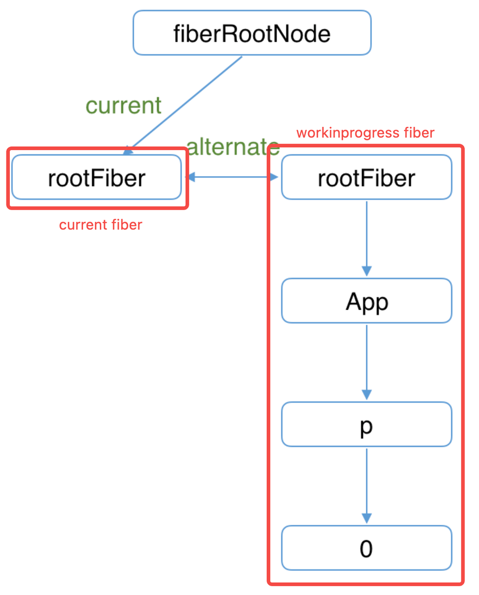

# Render 


## 双缓存Fiber树
当我们用 canvas 绘制动画，每一帧绘制前都会调用 ctx.clearRect 清除上一帧的画面。如果当前帧画面计算量比较大，导致清除上一帧画面到绘制当前帧画面之间有较长间隙，就会出现白屏。

为了解决这个问题，我们可以在内存中绘制当前帧动画，绘制完毕后直接用当前帧替换上一帧画面，由于省去了两帧替换间的计算时间，不会出现从白屏到出现画面的闪烁情况。这种在内存中构建并直接替换的技术叫做双缓存。
React 使用“双缓存”来完成 Fiber树 的构建与替换——对应着DOM树的创建与更新。

在 React 中最多会同时存在 **两棵 Fiber 树**。当前屏幕上显示内容对应的 Fiber 树称为 **current Fiber树**（树上节点称为 current fiber），正在内存中构建的 Fiber 树称为 **workInProgress Fiber树**（树上节点称为workInProgress fiber），两棵树上的节点通过 alternate 属性连接。

```
function App() {
    const [num, add] = useState(0);
    return (
        <p onClick={() => add(num + 1)}>{num}</p>
    )
}

ReactDOM.render(<App/>, document.getElementById('root'));

```

首次执行 ReactDOM.render 会创建 fiberRootNode 和 rootFiber。其中 fiberRootNode 是整个应用的根节点，rootFiber 是 <App \/>  所在组件树的根节点。


接下来进入 render 阶段，根据组件返回的 JSX 在内存中依次创建 Fiber 节点并连接在一起构建 Fiber 树，被称为workInProgress Fiber树。构建时会尝试复用current Fiber树中已有的Fiber节点内的属性。



图中已构建完的 workInProgress Fiber树在commit阶段渲染到页面。fiberRootNode 的 current 指针指向workInProgress Fiber树使其变为current Fiber 树。


update时，我们点击p节点触发状态改变，这会开启一次新的render阶段并构建一棵新的workInProgress Fiber 树，可以复用 current Fiber树对应的节点数据，这个决定是否复用的过程就是Diff算法。


#### Render 阶段
“递”阶段，首先从rootFiber开始向下深度优先遍历。为遍历到的每个Fiber节点调用beginWork方法。该方法会根据创建子Fiber节点，并将这两个Fiber节点连接起来。当遍历到叶子节点（即没有子组件的组件）时就会进入“归”阶段。 
“归”阶段，会调用completeWork处理Fiber节点。当某个Fiber节点执行完completeWork，如果其存在兄弟Fiber节点（即fiber.sibling !== null），会进入其兄弟Fiber的“递”阶段。如果不存在兄弟Fiber，会进入父级Fiber的“归”阶段。

```
function App() {return (
    <div>
      i am
      <span>KaSong</span>
    </div>)
}
ReactDOM.render(<App />, document.getElementById("root"));
```

对应的Fiber树结构： 

render阶段会依次执行：
1. rootFiber beginWork
2. App Fiber beginWork
3. div Fiber beginWork
4. "i am" Fiber beginWork
5. "i am" Fiber completeWork
6. span Fiber beginWork
7. span Fiber completeWork
8. div Fiber completeWork
9. App Fiber completeWork
10. rootFiber completeWork

beginWork 和 completeWork 具体做的事情参见这篇文章。

⚠️值得特别介绍的是：
- beginWork
dom diff 算法就是在这个阶段发生的，在current fiber 和 新 jsx 节点比较时，标记 fiber 操作的具体类型在fiber.effectTag中，你可以从这里看到effectTag对应的DOM操作，比如：
```
export const Placement = /*                    */ 0b000000000000010;
export const Update = /*                       */ 0b000000000000100;
export const PlacementAndUpdate = /*           */ 0b000000000000110;
export const Deletion = /*                     */ 0b000000000001000;
```
- completeWork
  - 将每个 fiber 需要更新的信息，比如数据属性、交互事件方法、样式属性放到fiber的一个数组（updateQueue) 中，偶数index作为key，奇数index放value，在下方的commit阶段统一更新到dom上；
  - effectList 的巧妙设计
    作为DOM操作的依据，commit 阶段需要找到所有有 effectTag 的 Fiber 节点并依次执行 effectTag 对应操作。难道需要在 commit 阶段再遍历一次Fiber树寻找 effectTag !== null 的Fiber节点么？这显然是很低效的。
    为了解决这个问题，每个Fiber执行完 completeWork 且 存在effectTag的Fiber节点会被保存在一条被称为 effectList的单向链表中。通过每个节点更新结束时向上归并effect list来收集任务结果，最后根节点的effect list里就记录了包括了所有需要变更的结果，最终形成一条以rootFiber.firstEffect为起点的单向链表。

```
                       nextEffect         nextEffect
rootFiber.firstEffect -----------> fiber -----------> fiber
```

  这样，在commit阶段只需要遍历effectList就能执行所有effect了。

  借用React团队成员Dan Abramov的话：effectList相较于Fiber树，就像圣诞树上挂的那一串彩灯。
  > - 左图：[react源码解析8.render阶段](https://www.cnblogs.com/xiaochen1024/p/14861312.html) - 全栈潇晨 - 博客园，
  > - 右图：[走进React Fiber的世界 - 掘金](https://juejin.cn/post/6943896410987659277)，effeclist 实现原理也参见这篇文档
[图片]
[图片]

**Commit** 

> 具体源码解析参见[这篇文章](https://react.iamkasong.com/renderer/mutation.html#commitmutationeffects)

commit 共分为 3 个阶段：before mutation、mutation、layout
- before mutation 阶段，这个阶段 DOM 节点还没有被渲染到界面上去，过程会触发生命周期方法。
- mutation 阶段，负责 DOM 节点的渲染。遍历 effectList，根据 flags 的不同，执行不同的 DOM 操作。
- layout 阶段，处理 DOM 渲染完毕之后的收尾逻辑。比如 调用 componentDidMount/componentDidUpdate，还会把 fiberRoot 的 current 指针指向 workInProgress Fiber 树。
commit 阶段 是一个 绝对同步的过程。render 阶段可以同步也可以异步。

## Diff 算法的实现
diff 算法可以帮助我们计算出虚拟 DOM 中真正变化的部分，并只针对该部分进行实际的 DOM 操作，而非渲染整个页面，从而保证了每次操作后页面的高效渲染。
React 提出了三个前提，最终时间复杂度从 O(n3) 降为 O(n)：
1. 只对同级比较，跨层级的 DOM 不进行复用，因为 Web UI 中 DOM 节点跨层级的移动操作特别少
2. 不同类型节点生成的 DOM 树不同，此时会直接销毁老节点及子孙节点，并新建节点（类型指 html 标签类型）
3. 可以通过 key 来对元素 diff 的过程提供复用的线索，例如：
```
// 更新前
<div>
  <p key="ka">ka</p>
  <h3 key="song">song</h3>
</div>

// 更新后
<div>
  <h3 key="song">song</h3>
  <p key="ka">ka</p>
</div>
```
如果没有key，React会认为div的第一个子节点由p变为h3，第二个子节点由h3变为p。这符合限制2的设定，会销毁并新建。
但是当我们用key指明了节点前后对应关系后，React知道key === "ka"的p在更新后还存在，所以DOM节点可以复用，只是需要交换下顺序。

一个DOM节点在某一时刻最多会有4个节点和他相关
1. current Fiber，如果该DOM节点已在页面中，current Fiber代表该DOM节点对应的Fiber节点
2. workInProgress Fiber，如果该DOM节点将在本次更新中渲染到页面中，workInProgress Fiber代表该DOM节点对应的Fiber节点
3. JSX对象（虚拟dom），即ClassComponent的render方法的返回结果，或FunctionComponent的调用结果。JSX对象中包含描述DOM节点的信息
4. DOM节点本身
Diff算法的本质是对比1和3，生成2，即 dom-diff 是老 fiber 树跟新 jsx 的对比，生成新的 fiber 树的过程

我们从Diff的入口函数 reconcileChildFibers 出发，该函数会根据newChild（即JSX对象）类型调用不同的处理函数。
```
// 根据newChild类型选择不同diff函数处理
function reconcileChildFibers(
    returnFiber: Fiber,
    currentFirstChild: Fiber | null,
    newChild: any,
  ): Fiber | null {
  
    const isObject = typeof newChild === 'object' && newChild !== null;
  
    if (isObject) {
      // object类型，可能是 REACT_ELEMENT_TYPE 或 REACT_PORTAL_TYPE
      switch (newChild.$$typeof) {
        case REACT_ELEMENT_TYPE:
            // 调用 reconcileSingleElement 处理
            // ...省略其他case
      }
    }
  
    if (typeof newChild === 'string' || typeof newChild === 'number') {
        // 调用 reconcileSingleTextNode 处理
        // ...省略
    }
  
    if (isArray(newChild)) {
        // 调用 reconcileChildrenArray 处理
        // ...省略
    }
  
    // 一些其他情况调用处理函数省略
  
    // 以上都没有命中，删除节点
    return deleteRemainingChildren(returnFiber, currentFirstChild);
  }
  ```
我们可以从同级的节点数量将Diff分为两类：
1. 当newChild类型为object、number、string，代表同级只有一个节点，比如：
```
// 旧
<div>
   <h1 key="h1">h1</h1>
   <h2 key="h2">h2</h2>
</div>

// 新
<div>
   <h2 key="h2">h2</h2>
</div>
// 旧
<div>
   <Welcome>lili</Welcome>
   <Hello>lili</Hello>
</div>

// 新
<div>
   <Hello>lili</Hello>
</div>
```
2. 当newChild类型为Array，同级有多个节点，比如
```
//老
<ul>
  <li key="A">A</li>
  <li key="B">B</li>
  <li key="C">C</li>
  <li key="D">D</li>
</ul>

//新
<ul>
  <div key="A">A-new</div>
  <li key="B">B-new</li>
  <li key="C">C-new</li>
  <li key="D">D-new</li>
</ul>
<div>
   <Welcome>lili</Welcome>
   <Hello>lili</Hello>
</div>

// 新
<div>
   <Hello>lili</Hello>
   <World>lili</World>
</div>
```
在接下来两节我们会分别讨论这两类节点的Diff。

### 单节点 Diff
源码参见：reconcileSingleElement
```
function reconcileSingleElement(
    returnFiber: Fiber,
    currentFirstChild: Fiber | null,
    element: ReactElement
  ): Fiber {
    const key = element.key; // 新虚拟dom节点的key
    let child = currentFirstChild; // old fiber树的第一个子节点
    
    while (child !== null) {
      // 存在DOM节点，接下来判断是否可复用
      // 首先比较key是否相同
      if (child.key === key) {
        // key相同，接下来比较type是否相同
        switch (child.tag) {
          // ...省略case
          
          default: {
            if (child.elementType === element.type) {
              // type相同则表示可以复用
              // 将该fiber的兄弟节点标记为删除
              deleteRemainingChildren(returnFiber, child.sibling);
              // 更新当前fiber的属性
              const existing = useFiber(child, element.props);
              // 返回找到的可服用的fiber节点
              return existing;
            }
            // type不同则跳出switch
            break;
          }
        }
        // 代码执行到这里代表：key相同但是type不同
        // 将该fiber及其兄弟fiber标记为删除
        deleteRemainingChildren(returnFiber, child);
        break;
      } else {
        // key不同，将该fiber标记为删除
        deleteChild(returnFiber, child);
      }
      child = child.sibling;
    }
    // 创建新Fiber，并返回 ...省略
  }
```
从代码可以看出，React通过先判断key是否相同，如果key相同则判断type是否相同，只有都相同时一个DOM节点才能复用。
这里有个细节需要关注下：
- 当 child !== null 且 key 相同 且 type 不同 时执行deleteRemainingChildren将 child 及其兄弟 fiber 都标记删除（左例）
- 当 child !== null 且 key不同 时仅将 child 标记删除（右例，比较到 h1 只会把 h1 标记删除，继续遍历）
```
// 旧
<div>
   <h1 key="h1">h1</h1>
   <h2 key="h2">h2</h2>
   <h3 key="h3">h2</h2>
</div>

// 新
<div>
   <p key="h1">h1</p>
</div>
// 旧
<div>
   <h1 key="h1">h1</h1>
   <h2 key="h2">h2</h2>
</div>

// 新
<div>
   <h2 key="h2">h2</h2>
</div>
```

### 多节点 Diff
同级多个节点的Diff，一定属于以下三种情况中的一种或多种：
情况1：节点更新
```
// 旧
<ul>
  <li key="0" className="before">0<li>
  <li key="1">1<li>
</ul>

// 新 情况1 节点属性变化
<ul>
  <li key="0" className="after">0<li>
  <li key="1">1<li>
</ul>

//新 情况2 节点类型更新
<ul>
  <div key="0">0</div>
  <li key="1">1<li>
</ul>
情况2：节点新增或减少
// 旧
<ul>
  <li key="0">0<li>
  <li key="1">1<li>
  <li key="2">2<li>
</ul>

// 新 情况1 —— 新增节点
<ul>
  <li key="0">0<li>
  <li key="1">1<li>
  <li key="2">2<li>
  <li key="3">3<li>
</ul>

// 新 情况2 —— 删除节点
<ul>
  <li key="1">1<li>
  <li key="3">3<li>
</ul>
情况3：节点位置变化
// 旧
<ul>
  <li key="0">0<li>
  <li key="1">1<li>
</ul>

// 新
<ul>
  <li key="1">1<li>
  <li key="0">0<li>
</ul>
```
React团队发现，在日常开发中，相较于新增和删除，更新组件发生的频率更高，所以 Diff 会优先判断当前节点是否属于更新。
当数组遇上单链表
在我们做数组相关的算法题时，经常使用双指针从数组头和尾同时遍历以提高效率，但是这里却不行。
虽然本次更新的 JSX 对象  newChildren 为数组形式，但是和 newChildren 中每个组件进行比较的是current fiber，同级的 Fiber 节点是由 sibling 指针链接形成的单链表，即不支持双指针遍历。
即 newChildren[0] 与 fiber 比较，newChildren[1]与 fiber.sibling 比较。
所以无法使用双指针优化。
reconcileChildFibers的newChild参数类型为Array
```
function List () {
    return (
        <ul>
            <li key="0">0</li>
            <li key="1">1</li>
            <li key="2">2</li>
            <li key="3">3</li>
        </ul>
    )
  }

```
[图片]
基于以上原因，Diff算法的整体逻辑会经历两轮遍历：
第一轮遍历：处理更新的节点。
第二轮遍历：处理剩下的不属于更新的节点。

第一轮遍历步骤如下：
1. let i = 0，遍历newChildren，将newChildren[0]与oldFiber比较，判断DOM节点是否可复用。
2. 如果可复用，i++，继续比较newChildren[1]与oldFiber.sibling，可以复用则继续遍历。
3. 如果不可复用，分两种情况：
  - key不同导致不可复用，立即跳出整个遍历，第一轮遍历结束。
  - key相同type不同导致不可复用，会将oldFiber标记为DELETION，并继续遍历
4. 如果newChildren遍历完（即i === newChildren.length - 1）或者oldFiber遍历完（即oldFiber.sibling === null），跳出遍历，第一轮遍历结束。

当遍历结束后，会有两种结果：
1. newChildren 没有遍历完，oldFiber 也没有遍历完（上面第3步），例如：
// 之前
<li key="0">0</li>
<li key="1">1</li>
<li key="2">2</li>
            
// 之后
<li key="0">0</li>
<li key="2">1</li>
<li key="1">2</li>
第一个节点可复用，遍历到key === 2的节点发现key改变，不可复用，跳出遍历，等待第二轮遍历处理。
此时oldFiber剩下key === 1、key === 2未遍历，newChildren剩下key === 2、key === 1未遍历。
2. newChildren遍历完，或oldFiber遍历完，或他们同时遍历完，例如：
```
// 之前
<li key="0" className="a">0</li>
<li key="1" className="b">1</li>
            
// 之后 情况1 —— newChildren与oldFiber都遍历完
<li key="0" className="aa">0</li>
<li key="1" className="bb">1</li>
            
// 之后 情况2 —— newChildren没遍历完，oldFiber遍历完
// newChildren剩下 key==="2" 未遍历
<li key="0" className="aa">0</li>
<li key="1" className="bb">1</li>
<li key="2" className="cc">2</li>
            
// 之后 情况3 —— newChildren遍历完，oldFiber没遍历完
// oldFiber剩下 key==="1" 未遍历
<li key="0" className="aa">0</li>
```

第二轮遍历分3种情况：

- newChildren 没遍历完，oldFiber 遍历完
  已有的 DOM 节点都复用了，这时还有新加入的节点，意味着本次更新有新节点插入，我们只需要遍历剩下的newChildren生成的workInProgress fiber依次标记 Placement。
- newChildren 遍历完，oldFiber 没遍历完
      本次更新比之前的节点数量少，有节点被删除了。所以需要遍历剩下的oldFiber，依次标记 Deletion。
- newChildren 与 oldFiber 都没遍历完
      这意味着有节点在这次更新中改变了位置。这是Diff算法最精髓也是最难懂的部分。


源码参见 link
我们的参照物是：最后一个可复用的节点在oldFiber中的位置索引，用变量lastPlacedIndex表示。
由于本次更新中节点是按newChildren的顺序排列。在遍历newChildren过程中，每个节点一定在lastPlacedIndex对应的可复用的节点的后面。

那么我们只需要比较newChildren当前的节点在oldFiber中的位置是否在lastPlacedIndex对应的fiber后面，就能知道newChildren中两个相邻节点的相对位置是否发生改变。

我们用变量oldIndex表示newChildren当前的节点在oldFiber中的位置索引。如果oldIndex < lastPlacedIndex，代表本次更新该节点需要向右移动。

lastPlacedIndex初始为0，每遍历一个可复用的节点，如果oldIndex >= lastPlacedIndex，则lastPlacedIndex = oldIndex。

例子说明：
暂时无法在飞书文档外展示此内容
第一轮遍历开始：
a vs a，key不变，可复用
此时 a 对应的节点在之前的数组（abcd）中索引为0，所以 lastPlacedIndex = 0
暂时无法在飞书文档外展示此内容
继续第一轮遍历
c（新）vs b（旧），key改变，不能复用，跳出第一轮遍历，此时 lastPlacedIndex = 0
第一轮遍历结束

第二轮遍历开始
newChildren  cdb，没用完，不需要执行删除旧节点
oldFiber bcd，没用完，不需要执行插入新节点
将剩余oldFiber（bcd）保存为 map { bkey：b节点，ckey：c节点，dkey：d节点}
继续遍历剩余 newChildren cdb
暂时无法在飞书文档外展示此内容
c 在 oldFiber中存在（map查找），此时 oldIndex = 2（c在旧数组中的索引值）
比较 oldIndex 与 lastPlacedIndex
如果 oldIndex >= lastPlacedIndex 代表该节点不需要移动，并将 lastPlacedIndex = oldIndex；
如果 oldIndex < lastplacedIndex 该节点在旧数组的索引小于新数组中需要插入的位置，代表该节点需要向右移动

在例子中，oldIndex 2 > lastPlacedIndex 0，则 lastPlacedIndex = 2；
c节点位置不变

继续遍历剩余newChildren
d 在 oldFiber中存在，oldIndex 3 > lastPlacedIndex 2，则 lastPlacedIndex = 3;
d节点位置不变

继续遍历剩余newChildren
b 在 oldFiber中存在，oldIndex 1 < lastPlacedIndex 3，则 b节点需要向右移动
第二轮遍历结束

另一个简单的例子来自 https://zhuanlan.zhihu.com/p/553744711
上图是jsx树，下图是对应的 current fiber 树：
[图片]
再次渲染的时候，渲染出了 A、C、B、E 的 vdom，这时候怎么处理呢？
[图片]
第一轮遍历对比新的 vdom 和 老的 fiber，发现 A 是可以复用的，那就创建新 fiber 节点，打上更新标记：
[图片]
C 不可复用，所以结束第一轮遍历，进入第二轮遍历。
[图片]
把剩下的 老 fiber 节点放到 map 里，然后遍历新的 vdom 节点，从 map 中能找到的话，就是可复用，移动过来打上更新的标记。
遍历完之后，剩下的老 fiber 节点删掉，剩下的新 vdom 新增。
