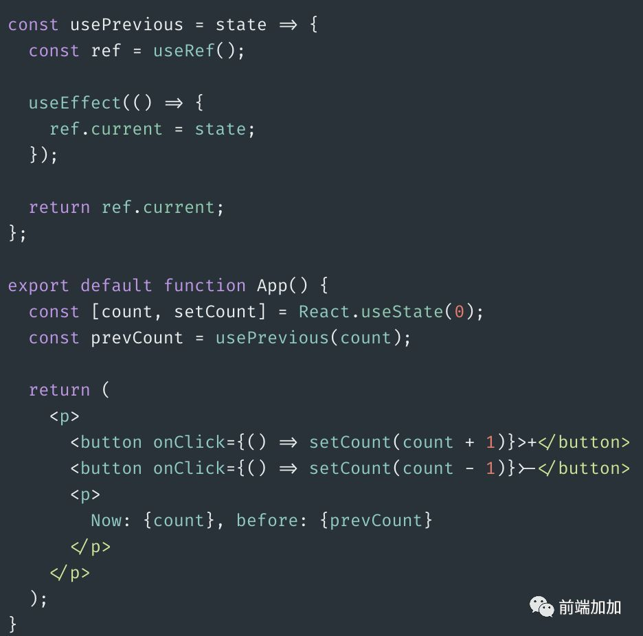

### useRef
文档：https://zh-hans.reactjs.org/docs/hooks-reference.html#useref

### 区别
1. 与普通 object 相比：
useRef() 和自建一个 {current: ...} 对象的唯一区别是，useRef 会在每次渲染时返回同一个 ref 对象。
2. createRef：每次渲染都会返回一个新的引用，而 useRef 每次都会返回相同的引用。

### usePrevious

利用 useRef 的特点，我们进行扩展

获取上一个值, 这在实际场景中并不少, 我们尝试把它封装成自定义 hook . 

【参考文章】
- https://cloud.tencent.com/developer/article/1586855
