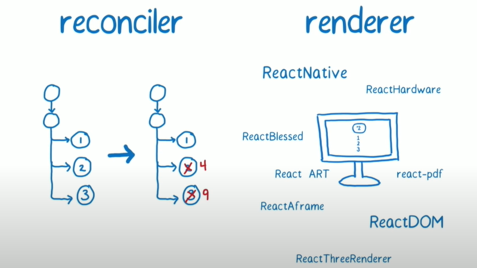

## 1. 技术选型
为什么选用react 或 vue ？
1. 声明式
- v = f(d)
- 对比手动操作 dom， 只需要考虑当前状态，降低了维护成本

命令式编程：命令“机器”如何去做事情(how)，这样不管你想要的是什么(what)，它都会按照你的命令实现。

声明式编程：告诉“机器”你想要的是什么(what)，让机器想出如何去做(how)。

2. 组件
- 可增加复用
- 降低复杂度，若多个组件融合在一起，则维护成本增加


## 2. react 三大功能
除上面的功能外，
1. Learn Once, Write Anywhere
- Web: react + react-dom
- RN: react + react-native


## 为什么react
- 更灵活，JSX写法更灵活。相较于，vue 中的template，更加灵活
- 微信小程序使用vue，技术栈统一



## [基础概念](./基础概念.md)
### 1. react
1. [react](https://github.com/facebook/react/blob/v17.0.2/packages/react-reconciler/src/ReactChildFiber.old.js#L771): 同级从左到右
- [条件渲染](https://zh-hans.reactjs.org/docs/conditional-rendering.html)：true/false/null/undefined 作为占位符
- [列表](https://zh-hans.reactjs.org/docs/lists-and-keys.html)（arr.forEach）: 用key来支持移动、插入和删除

数组中嵌套数组
```
<div key="1">
    <div key="1.1"/>
    <div key="1.2"/>
    ....
</div>
<div key="2"></div>
```

### 2. [vue2](https://github.com/vuejs/vue/blob/v2.6.12/src/core/vdom/patch.js#L424-L467)：同级双端遍历
- 条件渲染：不使用占位符
- 列表（arr.forEach）: 用key来支持移动、插入和删除


### v-dom ps react element


**类React源码学习**
- https://github.com/zpao/building-react-from-scratch
  - https://www.youtube.com/watch?v=_MAD4Oly9yg
- https://github.com/pomber/didact
  - https://pomb.us/build-your-own-react
- https://github.com/zserge/o
  - https://zserge.com/posts/worst-react-ever/
- https://github.com/yisar/fre
- https://github.com/preactjs/preact
- https://github.com/RubyLouvre/anu


## 代码复用
1. Component
2. mixins
3. Higher-Order Components
4. render props
5. Custom Hooks


```
react:
  <X b={<B/>}>
    <A>
  </X>

https://cn.vuejs.org/v2/guide/components-slots.html
```

custom hook
function A () {
  useEffect(() => {}, [])

}

自定义 hook 封装再封装

一个操作，涉及多个状态

------------------------------------------
外部状态管理

1. Redux: store, Reducers, Action, Selectors(mapStateToProps)
x => x.a

2. context:  {a: 1, b: 1}, 当 obj 变化时，所有的 consumer 都会重新render

pubsub：sub，publish

callback(sub)

pub => callback(sub)

数据更改，触发 render

class: forceUpdate

function 中
```
[a, setA] = useState({})
setA({})
```

数据更改 =>  分别触发 A、B

redux: 
a. conncet
b. useRedux

context： 
降低渲染次数的优化方案：constate, 帮助拆分多个 Provider；读写分离，对于部分只需要写的组件，可以只执行，不render


3. colocation 风格， => redux
redux 风格： 是两颗树， 状态树、组件树
context： 一颗树，component 与 数据状态，尽量往下压
维护成本小：如果状态高，修改时，需要确保依赖项，无依赖，才能修改
运行成本小：数据更改，render 的组件少

缺点：解决树形问题，左子树 和 右子树 相关联
4. Proxy 风格，vue： 最小粒度，组件； 收集依赖，运行组件期间，对数据进行监测；（mobx）
https://www.npmjs.com/package/mobx-react-lite

5. Atomic 风格，Atoms and Selectors. 


Fiber
打断，支持优先级

控制什么时候运行 组件，可以去重
状态撕裂
原来是 1， 用户输入 2
react filber 停止，用户输入， 减少一次 render，直接渲染 2

redux：外部状态管理