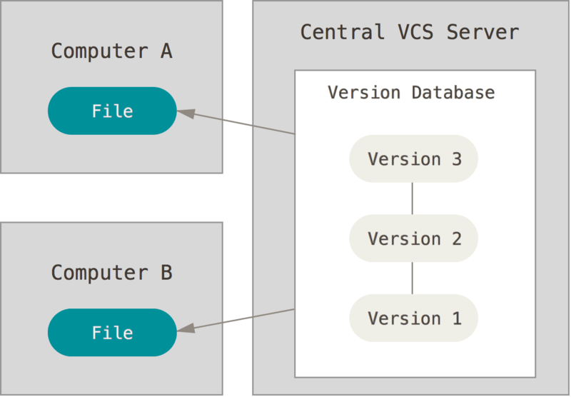

### About Version Control
- Local Version Control Systems
- Centralized Version Control Systems: CVS、SVN
- Distributed Version Control Systems: Git、Mercurial(hg)
  - 如何高效存储和传输
### Local Version Control Systems

### Centralized Version Control Systems

### Distributed Version Control Systems
