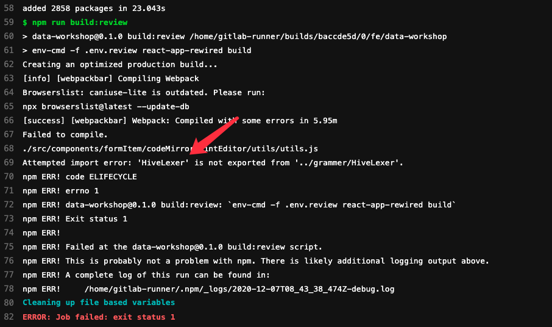

### 问题
由一个问题，引入babel的分享

**环境**：react@16.13.1、create-react-app

**路径**： /src/components/formItem/codeMirror/HintEditor/utils/grammer/hiveparser.js

**复现**： npm run build 时报错
```
// package.json
"scripts": {
    "start": "react-app-rewired start",
    "start:mock": "cross-env MOCK=1 react-app-rewired start",
    "build": "react-app-rewired build",
    ...
}


// hivepaer.js
/* eslint-disable */
"use strict";
// Generated from grammer1/HiveParser.g4 by ANTLR 4.7.3-SNAPSHOT
Object.defineProperty(exports, "__esModule", { value: true });
exports.DropMappingStatementContext = exports.AlterMappingStatementContext = exports.CreateMappingStatementContext ...

```



### 1. ES 与 babel

**ECMAScript**: 是 JavaScript 实现所基于的标准，通常缩写为 ES

**ES版本**： 令人费解的是，为什么有时 ES 版本会以版本编号引用，有时却按年份引用。
在 ES2015 之前，ECMAScript 规范通常按其版本命名。 因此，ES5 是 2009 年更新发布的ECMAScript 规范的官方名称。

在 ES2015 诞生的过程中，这个名字从 ES6 变成了 ES2015 ，但是由于这个过程比较久，人们仍然把它习惯性的称为 ES6 ，社区并不是忘记了 ES2015 版本的命名 —— 只不过大家仍然在按照版本号来称呼 ES 的版本。

下面这个表比较清楚一点：


**babel**: Babel 是一个 JavaScript 编译器; Babel 是一个工具链，主要用于将 ECMAScript 2015+ 版本的代码转换为向后兼容的 JavaScript 语法，以便能够运行在当前和旧版本的浏览器或其他环境中

### 2. 发展
粗略的描述下，各个阶段，使用bebel的情况

代码分为：src(业务代码)下的文件、非src文件(node_module)
node_module模块划分为：CJS(common模块)、ES(ES模块)、EJS && ES(同时支持ES、Common)

#### 第一阶段
背景：以ES6为例，大多数浏览器不支持ES6语法，需要通过babel转为ES5语法，甚至ES3（具体支持到哪个版本，并未暴露配置）

#### 第二阶段


### FQA

#### 为啥node_module支持 Common 模块？
- 历史原因：


