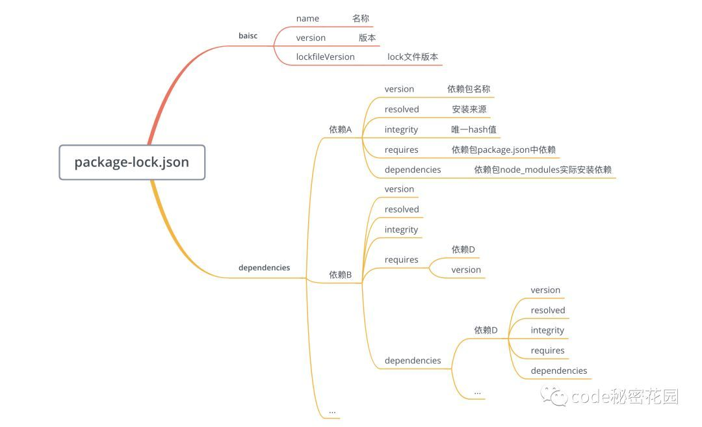
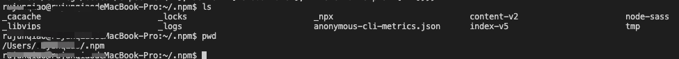

https://zhuanlan.zhihu.com/p/128625669
https://cloud.tencent.com/developer/article/1555982

### 1. package.lock.json

- integrity：包 hash 值，基于 Subresource Integrity 来验证已安装的软件包是否被改动过、是否已失效

- requires：对应子依赖的依赖，与子依赖的 package.json 中 dependencies的依赖项相同。

- dependencies：结构和外层的 dependencies 结构相同，存储安装在子依赖 node_modules 中的依赖包。

这里注意，并不是所有的子依赖都有 dependencies 属性，只有子依赖的依赖和当前已安装在根目录的  node_modules 中的依赖冲突之后，才会有这个属性。

### 2. 缓存
我们知道NPM就是用了cacache来作为缓存，所以这个目录里面应该就是缓存的内容。

1. package.local.json：pacote:range-manifest:{url}:{integrity}作为key =>  SHA256 => hash
2. 在_cacache/index-v5 中找到对应文件
3. 查到 meta 信息，其中 _shasum 为 tar 包名

> 以 c5/aa/e95d015d781c87be2624a9ab47e8ec4c837d810d460caff18786393fe403 为例，根据一些常识，能猜到这就是某个算法算出来的hash，并且前4位用来分目录，为了在文件系统中能快速查找，所以对应的hash肯定是 c5aae95d015d781c87be2624a9ab47e8ec4c837d810d460caff18786393fe403 这串东西。我们发现在 index-v5 及 content-v2 中，均是这样存储的~
