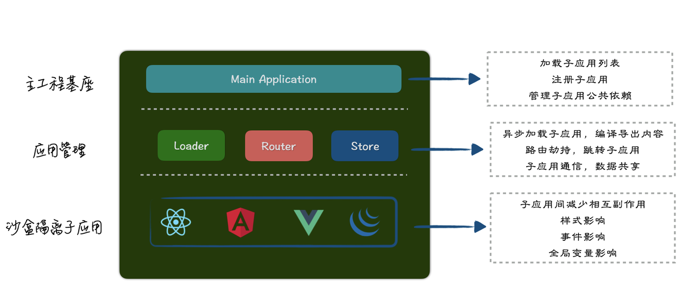
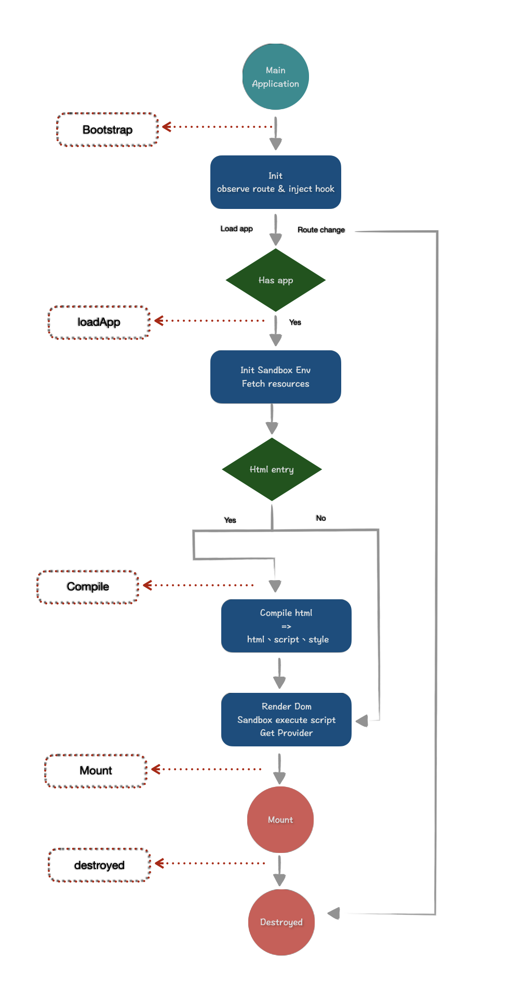
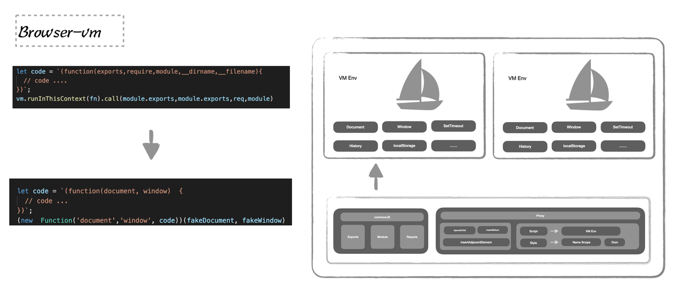

微前端
# 背景

参考：https://zhuanlan.zhihu.com/p/95085796

我认为微前端的核心价值在于 "技术栈无关"，这才是它诞生的理由。就是如何确保我的遗产代码能平滑的迁移，以及如何确保我在若干年后还能用上时下热门的技术栈？

既然「技术栈无关」是微前端的核心价值，那么整个架构方案的实现上，都应该秉持这一原则，任何违背这一原则的做法都应该被摒弃。

「技术栈无关」是架构上的准绳，具体到实现时，对应的就是：应用之间不应该有任何直接或间接的技术栈、依赖、以及实现上的耦合。

# 为什么需要微前端 
微前端是一种类似于微服务的架构，它通过将一个单体的WEB应用拆分成多个子应用，在运行时通过主应用来加载对应子应用来达到解耦子应用单独运行、开发、部署的目的。

我们先来了解一下微前端出现的原因，由于大部分开发同学开发的都是单体应用。先举几个实际工作中开发单体应用常见的问题吧：
- 同学A最近遇到了问题：
  - 场景：
    - 最近要接手一个遗留后台系统，里面的技术老旧不说，连框架都是自己造的轮子，文档也没有
  - 问题：
    - 近期可能有一些新功能要增加到旧系统内，但是在原有系统上改造难度高
    - 后续可能会对旧系统内的现有功能做一些改造，但是原有的一套技术体系老旧，想要重构到TS+React+Webpack，但是里面有些祖传页面大概率不会迭代，又必须保持线上
- 同学B团队近期也遇到了问题：
  - 场景：
    - 他们所在的团队要负责一个运营后台系统，目前系统内的功能已经非常庞大，涉及的成员也非常多，里面每一个子菜单的功能都非常庞大，每个子菜单可能都是由于不同的团队在负责。并且目前所有功能全部聚合在一个项目内
  - 问题：
    - 项目内的代码规范和技术体系选择，都会造成不同团队的争议
    - 某个子菜单内的功能进行了变更整个项目都需要重新打包部署，增加了不稳定性和分支混乱，部署时间长
    - 不同子菜单内同时有需求迭代，两者的功能需要进行合并才能部署到预发、线下，这就造成了不同需求之间的互相挤兑，影响测试发布效率，而且还需要保证相互之间没有影响

在前端应用日益复杂化，框架技术更新迭代快的场景下，现有的单体工程化方案在多团队协作、解决历史遗留代码力不从心，微前端工程化方案很好的解决了上述问题：技术栈无关、拆解单体应用。

微前端的核心价值
- 拆解单体应用为多个子应用
  - 子应用独立运行和发布
  - 增量升级
- 技术栈无关
- 沙盒隔离子应用
通过微前端我们可以很好的解决上述问题：历史遗留代码、跨多个团队协作、发布效率问题。跨空间和时间的产品很可能会导致应用变成一个巨型单体应用、技术栈老旧，导致项目的维护成本变高，微前端就是为了解决这些问题。

# Garfish是什么
Garfish是一个公司完全自研的微前端框架，起源于头条号的实际场景，头条号随着业务发展变成一个难难以维护的单体应用，同时维护的团队人员都比较分散，导致开发效率低（工程巨大，开发调试效率低）、上线困难（代码合并相互依赖），成为阻塞业务发展的一个问题。

于是在18年衍生了Garfish这个微前端框架，经过头条号、字节云和飞书等业务的一起打磨，Garfish逐渐趋于成熟。随着更多的业务场景对微前端的要求逐步变高，Garfish也在不断迭代之中。目前电商、IES、飞书、头条、Data等多个团队都已经在使用Garfish来接入微前端。

# 主流方案

目前主流微前端方案：qiankun、single-spa、SystemJS、Piral、OpenComponent、Liugi.....

目前的微前端方案都没有很好的解决：
- 应用隔离
- 通信
- 路由
- 组件、资源共享
# Garfish设计

**why not iframe**
其实从浏览器原生的方案来说，iframe 不从体验角度上来看几乎是最可靠的微前端方案了，主应用通过iframe 来加载子应用，iframe 自带的样式、环境隔离机制使得它具备天然的沙盒机制，但也是由于它的隔离性对用于体验带来了一些副作用：

- 视窗大小不同步（例如我们在 iframe 内的弹窗想要居中展示）
- 子应用间通信问题
- 组件复用
- 额外的性能开销：加载速度、构建 iframe 环境
- 路由同步
- 性能监控

## SPA微前端架构
从iframe的用户体验我们很难将其作为微前端的标准方案，那我们自己要做一套微前端框架具体要做哪些事情呢，从iframe和主流前端框架功能我们大致能够了解到，微前端框架需要具备以下几个功能：

- 子应用加载器（Loader）
  - 支持 html-entry
  - 预加载
- 路由托管（Router）
  - 路由分发应用
  - 控制子应用路由
- 沙箱隔离（Sandbox）
  - 多应用同时运行
  - 不与主应用产生影响
  - 样式不相互影响
- 子应用通信（Store）
  - 建立通信桥梁
  - 共享机制



## 生命周期


## 基本思想
### 加载器
加载器是实现微前端的基础，是微前端框架载入子应用的手段。在3.0中我们的微前端方案核心设计思想是将子应用打包成js-bundle，子应用将路由导出，Garfish-loader将js-bundle下载下来，并利用commonJS规范获取子应用的导出内容（下面会沙箱部分有如何使用commonJS规范获取子应用导出内容），将路由注册到主应用中。
```
// 子应用
export provider () {
    return {
        router: [
            {
                path: '/app2/home',
                component: Home
            },
            {
                path: '/app2/detail',
                component: Detail
            }
        ]
    };
};

// 构建结果
///static/app2/index.js

// 主应用, download app2/index.js compile => provider
let { router } = window.Garfish.loader.loadApp('app2');
routers.push(router);
```

Garfish内部的加载器实现可以简单概括为：
- fetch子应用js-bundle资源
- 获取子应用provider内容

虽然，这样保证了实现了SPA模式下的微前端架构。但是这样的一种加载模式带来的弊端较为明显：主应用和子应用必须为相同框架、子应用必须依赖主应用运行、子应用间路由可能产生冲突、业务接入侵入性高、现有子应用改造成本高。

这显然是不符合我们对微前端的定位，我们希望它接入能像iframe一样简单，不需要考虑子应用的框架、仅知道子应用的html地址就能加载子应用，而不是将子应用打包成单个js-bundle，加载这个js子应用的路由。

另外一个比较关键的点是，我们将约定导出路由变成了约定导出渲染函数和销毁函数，这样主应用不需要与子应用同框架，主应用只需要在要加载子应用时调用子应用的渲染函数，离开时调用子应用销毁函数即可。
#### Html-entry
要实现html-entry，具体要做哪些事情呢。从浏览器加载页面的基本流程我们得知，页面的加载可以简单的分为一下四个步骤：下载html内容、渲染解析html、加载外部script和style、执行脚本样式绘制页面。因此我们加载子应用也可以分为这三个步骤，但在我们新版沙箱的设计中我们希望尽可能的收集子应用的副作用避免应用间产生影响，所以我们需要将可能对页面产生副作用影响的style和script从html中进行抽离，通过沙箱来处理style和script。

所以Loader从下载资源到解析导出内容的能力变成了：
- fetch-html内容
- 去除不需要的节点、body、head...
- 将script、style标签提取
- 获取子应用provider内容

### 沙箱 (Garfish 分享 - 沙箱的实现 )
在微前端中沙箱属于其中比较难且具备挑战的事情，由于将单体应用拆分成多个子应用后涉及的应用的团队和开发同学规模和人数都涉及多且广，无法从代码和规范层面保证应用间不产生影响。避免子应用间相互产生应用有哪些副作用需要被有效的隔离呢？

目前子应用间的可能产生的相互影响主要集中在：
- 全局环境
- 监听事件
- 定时器
- localstorage
- 样式（内测中）
- dom操作（待解决）

所以沙箱的目的尽可能减少子应用在这几方面相互之间产生的影响。

Garfish在3.0主要通过快照模式实现应用间的隔离，通过收集子应用运行期间产生的副作用，这样会导致：无法与主应用进行隔离、无法支持多实例、非副作用被清除。

那么要做到主应用和子应用隔离，并且支持多实例我们需要解决哪些问题，首先要解决的问题是每个子应用具备自己的运行时环境，保证相互之间不产生影响。那么我们就需要实现browser-vm，从node实现commonJS规范并且结合JS作用域和闭包特性，new Function来作为执行子应用代码的容器。

```
let code = `(function(exports,require,module,__dirname,__filename){

})`;
vm.runInThisContext(fn).call(module.exports,module.exports,req,module)
```
利用作用域和闭包的特性模式构建沙箱环境：
```
let code = function(document, window) {
  // 实际子应用代码
};
(new Function('document','window', code.toString))(fakeDocument, fakeWindow)
```


#### 构建vm环境
那子应用自己环境内的window和document属性在哪里来呢，目前子应用环境变量的来源主要由两个，第一个是创建iframe，将iframe的window、document作为子应用的环境变量，并假设白名单将部分主应用的环境变量穿透到子应用环境内或直接代理到子应用的window上。
```
let iframe = document.createElement('iframe');
let proxyWindow = iframe.contentWindow;
let code = `...`; // 子应用代码
(new Function('document','window', code.toString))(fakeDocument, fakeWindow)
```
第二个方案是基于主应用的环境创建代理对象，将代理对象作为子应用的执行环境。由于Proxy的支持情况我们使用了ProxyPolyfill，Proxy的Polyfill只能覆盖到读操作和修改操作（PolyFill是基于Object.defineProperty做的），这对我们来说已经完全够用了！因为删除、新增操作都是基于新代理的对象，不会对主应用上的原始操作产生应用，而修改操作我们可以将其赋值到我们内部的一个暂存对象上，不让他影响主应用属性。不过基于主应用的环境缺点在于如果子应用通过对象深层次赋值，可能产生变量副作用逃逸的情况，因为劫持对象目前是惰性劫持。
```
let proxyWindow = new Proxy(window,{})
let code = `...`; // 子应用代码
(new Function('document','window', code.toString))(fakeDocument, fakeWindow)
```
保证运行环境
子应用动态创建script运行，将会导致逃逸vm环境。需要劫持子应用所有创建script，将script中的内容放置沙箱内执行，主要思路是递归劫持document，劫持添加到dom的节点，如果是script，将放置沙盒内执行（目前存在跨域问题，目前没有更好的解决方案）。

#### 路由托管
依托于现代框架的设计思想，路由驱动视图。用户在一般微前端场景中列如中后台，子应用的渲染区域通常是固定的节点，Garfish除了提供手动挂载，还提供了将路由与子应用进行绑定，用户只需要配置应用路由表，在进入离开对应路由将会自动触发挂载和销毁子应用。

```
import Garfish from '@byted/garfish';
Garfish.run({
  domGetter: '#submodule',
  apps: [
    {
      name: 'vue-app',
      activeWhen: '/vue-app',
      entry: 'http://localhost:9090'
    },
    {
      name: 'react-app',
      activeWhen: '/react-app',
      entry: 'http://localhost:3000'
    }
  ]
});
```

如果要支持路由托管，自动分发子应用我们做了哪些事情进行支持呢。主要集中在监听路由变化分发子应用、主应用能控制子应用路由跳转并视图更新、主应用和子应用路由同步。

要实现路由变化，框架自动挂载和销毁子应用。因此子应用需要暴露出渲染函数和销毁函数，由Garfish在路由发生变化时挂载和销毁子应用。比较麻烦的地方在于主应用需要控制子应用路由跳转和视图更新，并且保证主应用和子应用的路由是正常同步的。

实际场景：

目前实现路由托管子应用通常有两个实现方向：

1.子应用具备自己的路由环境，利用iframe中的history来存储路由状态，路由发生变化时同步到主应用的浏览器地址中

2.与主应用使用同一个路由环境，通过basepath进行隔离，每个子应用激活时增加scope，并将当前路径作为basename传递给子应用，子应用将其作为路由初始化的basepath。

```
export function provider({ dom, basename }) {
  return {
    render() {
      ReactDOM.render(<App basename={basename} />, dom.querySelector('#app'));
    },
    destroy() {
      ReactDOM.unmountComponentAtNode(dom);
    },
  };
}
```
触发子应用更新视图

因为目前主流框架实现路由的方式并不是监听路由变化触发组件更新，而是通过内部的方法，触发组件更新，因为目前的框架router设计要监听浏览器后退事件触发组件更新，因此我们可以利用这个特性跳转子应用子路由。