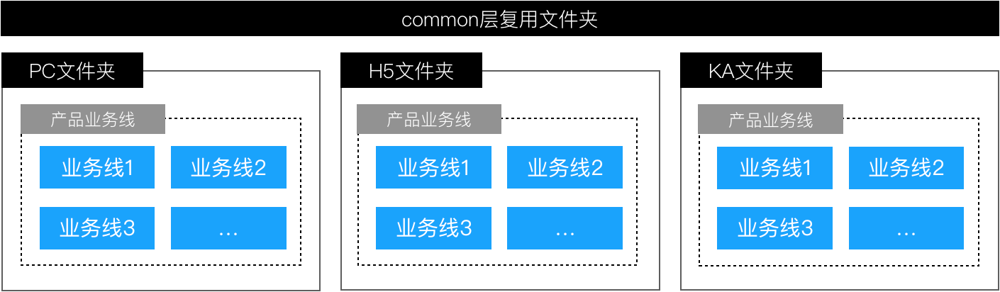

# 代码复用

随着前端业务场景越来越复杂，为了可以解决工程膨胀、开发维护困难等问题。我们面临的问题有：

- 如何进行物理层面的复用（不同端的代码在不同地址的 Git 仓库）。
- 如何进行逻辑层面的复用（不同端的相同逻辑如何使用一份代码进行抽象）。

总结了以下几种方案以及它们各自主要的特点


|方案	| 技术栈是否能统一|	单独打包 |	单独部署 |	打包部署速度 |	单页应用体验 |	子工程切换速度 |	工程间通信难度 |	现有工程侵入性 
| ---| ------------	| ---	|	 ---	 |	 ---	 |	 ---	 |	 ---	 |	 ---	 |	 ---	
|NPM式	| 是（不强制）|	否 |	否 |	慢 |	是 |	快 |	正常 |	高 |	高
|iframe式 |	是（不强制） |	是	是 |	正常 |	否 |	慢 |	高 |	高 |	低
|特定中心路由基座式  |	是（强制） |	是 |	是 |	快 |	是 |	快 |	正常 |	低

## 1. Common 层复用代码

我们尝试了 NPM 包、Git subtree 等类“共享文件”的方式后发现，最有效率的复用方式是把三个系统放在一个仓库里，去消除物理空间上的隔离，而不是去连接不同的物理空间。当然，我们三端系统的技术栈是一致的，所以就进行了如下图的改造：


随着业务的扩展，带来的问题：


## 2. iframe

```
<iframe id="inlineFrameExample"
    title="Inline Frame Example"
    width="300"
    height="200"
    src="https://www.openstreetmap.org/export/embed.html?bbox=-0.004017949104309083%2C51.47612752641776%2C0.00030577182769775396%2C51.478569861898606&layer=mapnik">
</iframe>
```

https://www.yuque.com/kuitos/gky7yw/gesexv
iframe 最大的特性就是提供了浏览器原生的硬隔离方案，不论是样式隔离、js 隔离这类问题统统都能被完美解决。但他的最大问题也在于他的隔离性无法被突破，导致应用间上下文无法被共享，随之带来的开发体验、产品体验的问题。 但是存在问题如下：

1. 全局上下文完全隔离，内存变量不共享。iframe 内外系统的通信、数据同步等需求，主应用的 cookie 要透传到根域名都不同的子应用中实现免登效果。
2. 慢。每次子应用进入都是一次浏览器上下文重建、资源重新加载的过程。

加载慢？

- 若对 iframe 不进行分包处理，则会导致需要加载许多无用 code；
- 会多加载一些公用的代码；
- document 初始化

## 3. npm 包

个人理解，适用于可复用的组件。比如说：目前有多个项目，为了实现统一筛选项，可将筛选项统一封装成一个 npm 包 filter。但是使用 npm 需要考虑的问题：

- 依赖包的安装。比如说：filter 中依赖 antd 4.xxx、react 18.xx。但业务里依赖的 antd：3.xx, react: 16.xx。 可能存在的问题：业务里需要安装两个版本的 antd、react，可能会带来意想不到的问题，并且导致打包时间边长、体积变大
- 调试成本高，需要在业务里安装依赖包
