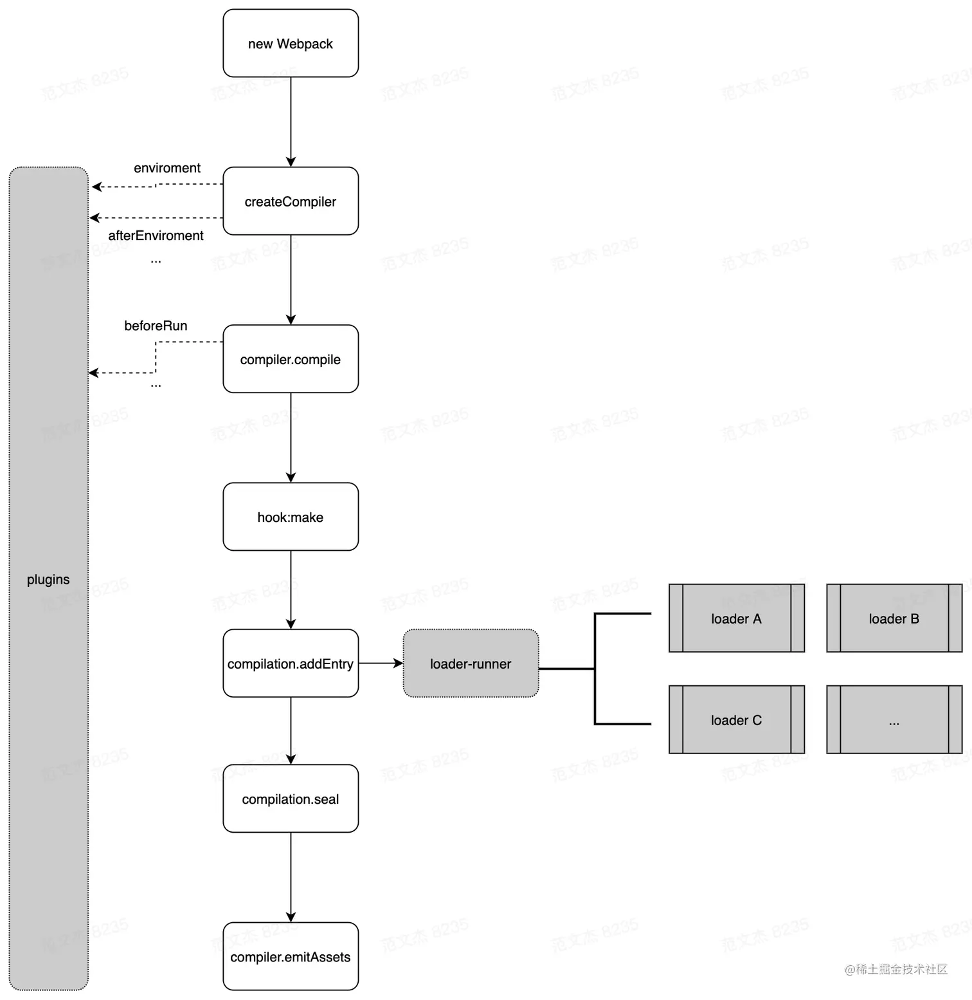

参考：["万字总结" 一文吃透 Webpack 核心原理](https://juejin.cn/post/6949040393165996040#heading-14)

# 背景
Webpack 特别难学！！！
时至 5.0 版本之后，Webpack 功能集变得非常庞大，包括：模块打包、代码分割、按需加载、HMR、Tree-shaking、文件监听、sourcemap、Module Federation、devServer、DLL、多进程等等，为了实现这些功能，webpack 的代码量已经到了惊人的程度：

```
498 份JS文件
18862 行注释
73548 行代码
54 个 module 类型
69 个 dependency 类型
162 个内置插件
237 个hook
```

在这个数量级下，源码的阅读、分析、学习成本非常高，加上 webpack 官网语焉不详的文档，导致 webpack 的学习、上手成本极其高。为此，社区围绕着 Webpack 衍生出了各种手脚架，比如 vue-cli、create-react-app，解决“用”的问题。
但这又导致一个新的问题，大部分人在工程化方面逐渐变成一个配置工程师，停留在“会用会配”但是不知道黑盒里面到底是怎么转的阶段，遇到具体问题就瞎了：

- 想给基础库做个升级，出现兼容性问题跑不动了，直接放弃
- 想优化一下编译性能，但是不清楚内部原理，无从下手

究其原因还是对 webpack 内部运行机制没有形成必要的整体认知，无法迅速定位问题 —— 对，连问题的本质都常常看不出，所谓的不能透过现象看本质，那本质是啥？我个人将 webpack 整个庞大的体系抽象为三方面的知识：

- 构建的核心流程
- loader 的作用
- plugin 架构与常用套路

三者协作构成 webpack 的主体框架：



理解了这三块内容就算是入了个门，对 Webpack 有了一个最最基础的认知了，工作中再遇到问题也就能按图索骥了

# 核心流程解析
首先，我们要理解一个点，Webpack 最核心的功能：
At its core, 「webpack」 is a static module bundler for modern JavaScript applications.
也就是将各种类型的资源，包括图片、css、js等，转译、组合、拼接、生成 JS 格式的 bundler 文件。[官网首页](https://webpack.js.org/) 的动画很形象地表达了这一点。 

这个过程核心完成了「内容转换 + 资源合并」两种功能，实现上包含三个阶段：

### 初始化阶段
- 「初始化参数」：从配置文件、配置对象、Shell 参数中读取，与默认配置结合得出最终的参数。
- 「创建编译器对象」：用上一步得到的参数创建 Compiler 对象。
- 「初始化编译环境」：包括注入内置插件、注册各种模块工厂、初始化 RuleSet 集合、加载等。
- 「开始编译」：执行 compiler 对象的 run 方法。
- 「确定入口」：根据配置中的 entry 找出所有的入口文件，调用 compilation.addEntry 将入口文件转换为 dependence 对象。

### 构建阶段
- 「编译模块(make)」：根据 entry 对应的 dependence 创建 module 对象，调用 loader 将模块转译为标准 JS 内容，调用 JS 解释器将内容转换为 AST 对象，从中找出该模块依赖的模块，再递归本步骤直到所有入口依赖的文件都经过了本步骤的处理。
- 「完成模块编译」：上一步递归处理所有能触达到的模块后，得到了每个模块被翻译后的内容以及它们之间的「依赖关系图」。

### 生成阶段
- 「输出资源(seal)」：根据入口和模块之间的依赖关系，组装成一个个包含多个模块的 Chunk ，再把每个 Chunk 转换成一个单独的文件加入到输出列表，这步是可以修改输出内容的最后机会。
- 「写入文件系统(emitAssets)」：在确定好输出内容后，根据配置确定输出的路径和文件名，把文件内容写入到文件系统。

单次构建过程自上而下按顺序执行，下面会展开聊聊细节，在此之前，对上述提及的各类技术名词不太熟悉的同学，可以先看看简介：
- **Entry**：编译入口，webpack 编译的起点。
- **Compiler**：编译管理器，webpack 启动后会创建 compiler 对象，该对象一直存活知道结束退出。
- **Compilation**：单次编辑过程的管理器，比如 `watch = true` 时，运行过程中只有一个 `compiler`，但每次文件变更触发重新编译时，都会创建一个新的 `compilation` 对象。
- **Dependence**：依赖对象，webpack 基于该类型记录模块间依赖关系。 
- **Module**：webpack 内部所有资源都会以“module”对象形式存在，所有关于资源的操作、转译、合并都是以 “module” 为基本单位进行的。 
- **Chunk**：编译完成准备输出时，webpack 会将 `module` 按特定的规则组织成一个个的 `chunk`，这些 `chunk` 某种程度上跟最终输出一一对应。 
- **Loader**：资源内容转换器，其实就是实现从内容 A 转换 B 的转换器。 
- **Plugin**：webpack构建过程中，会在特定的时机广播对应的事件，插件监听这些事件，在特定时间点介入编译过程。 