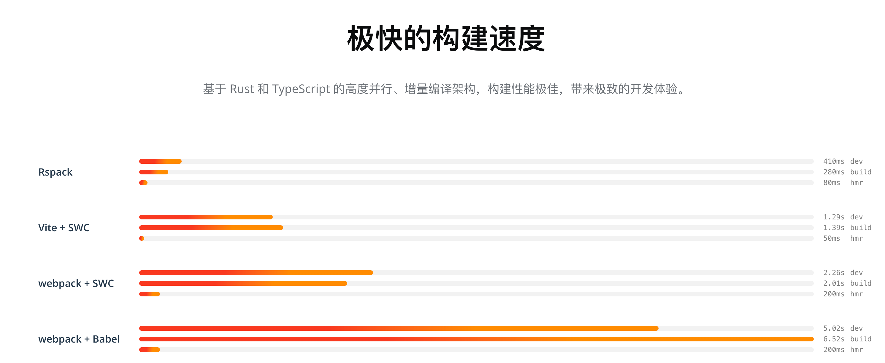

## 打包工具
|名称|版本|转译工具|来源|
| ---- | ---- | ---- | ---- |
|EdenX|v1|Babel / SWC|内部|
|Rsbuild|v1|SWC|社区|
|Next.js|v12|Babel / SWC|社区|
|Vite|v4|Babel / esbuild|社区|
|Create React App (CRA)|v5|Babel|社区|

> 上图来自 Rspack 官网

### 什么是 Babel、SWC、esbuild？
> SWC (Speedy Web Compiler) 是基于 Rust 语言编写的高性能 JavaScript 和 TypeScript 转译和压缩工具，它可以将 ES6+ 的代码转换为兼容旧浏览器的 ES5 代码，同时还支持压缩和混淆代码，以减小文件大小并提高加载速度。

> esbuild 是一个基于 Go 语言编写的快速构建工具，它可以将 JavaScript、TypeScript、CSS 和其他资源文件编译为浏览器可执行的代码，同时还支持代码压缩和混淆，以减小文件大小并提高加载速度。

> Babel 是一个广泛使用的 JavaScript 转译器，它可以将 ES6+ 的代码转换为兼容旧浏览器的 ES5 代码，同时还支持插件扩展，以支持更多的转译功能。

### 什么是 Rspack？
Rspack 是一款基于 Rust 编写的高性能 JavaScript 打包工具。它一大显著优势是对 webpack 生态具备良好的兼容性，这意味着在很多场景下，开发者能够用它无缝替换 webpack。同时，Rspack 还拥有极快的构建速度，可大幅提升项目构建效率。 

地址: https://rspack.dev/zh/

### 其它维度对比

 对比维度 | Rollup | Vite | Webpack | 
 |----------|:------------- |------|:----- |
 开发理念与定位 | 专注 JavaScript 模块打包，适用于构建库和简单前端应用，强调对 ES6 模块的原生支持及代码优化 | 新型前端构建工具，注重快速开发服务器和优化的打包流程，提升整体开发体验 | 功能全面的模块打包工具，适用于复杂大型前端项目，强调灵活性和扩展性，能与各种框架和技术栈深度集成，处理多样化的前端开发需求 |
冷启动速度 | 较慢，需对整个项目模块进行处理和打包 | 极快，基于浏览器原生 ES 模块加载机制，无需预先打包所有模块 | 相对较慢，需解析大量配置和处理多种资源 | 
热更新（HMR） | 本身无内置强大 HMR 机制，需插件实现，配置复杂且更新繁琐 | 具备出色的 HMR 功能，能快速更新模块，多数情况不导致页面重新加载 | 具备 HMR 功能，但配置相对复杂，速度可能因项目规模受影响 | 
模块处理方式 | 静态分析并合并模块，对 ES6 模块支持好，有效进行 Tree \- Shaking | 开发阶段基于浏览器原生 ES 模块加载，打包时进行转换和优化，也支持 Tree \- Shaking | 分析模块依赖，通过 loader 和插件处理多种类型模块，Tree \- Shaking 需特定配置 |
 代码输出格式 | 可输出 ES6、CommonJS、UMD 等多种格式，满足不同场景需求 | 主要输出符合现代浏览器标准的 ES 模块格式，兼顾兼容性 | 可输出多种格式，能根据配置灵活调整 | 
 插件生态系统 | 插件丰富，侧重于模块处理和代码优化 | 插件不断发展，涵盖模块处理、优化及改善开发体验等多方面 | 插件生态极为庞大，能处理各种构建需求 | 
 适用场景 | 库开发，简单前端应用构建 | 现代前端应用开发，与前端框架集成 | 大型复杂前端项目，包括单页应用（SPA）、多页应用（MPA）开发，处理如 JavaScript、CSS、图片、字体等多种资源，也适用于构建复杂的组件库以及对性能和功能有多样化需求的项目 
 

## 目前使用的打包工具
目前开发中，用的打包工具是 edenx，相对于 webpack、vite 来说，配置起来更简单，而且性能也更好。优势如下：

1. 开箱即用，默认 TS 支持，内置构建、ESLint、调试工具，全功能可测试，无需额外配置

- 开箱即用的多端支持（微信小程序、H5、React Native）
- 开箱即用的热更新
- 开箱即用的代码压缩
- 开箱即用的代码拆分

现代前端应用开发，与前端框架集成
大型复杂前端项目，包括单页应用（SPA）、多页应用（MPA）开发，处理如 JavaScript、CSS、图片、字体等多种资源，也适用于构建复杂的组件库以及对性能和功能有多样化需求的项目

