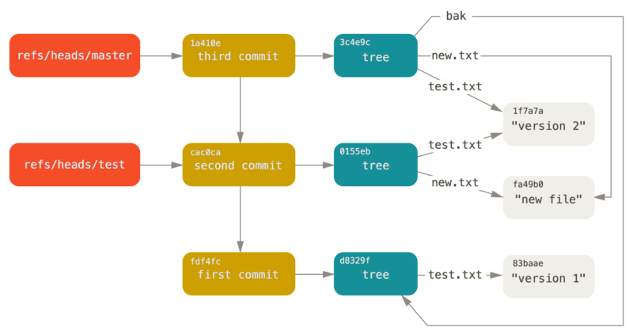
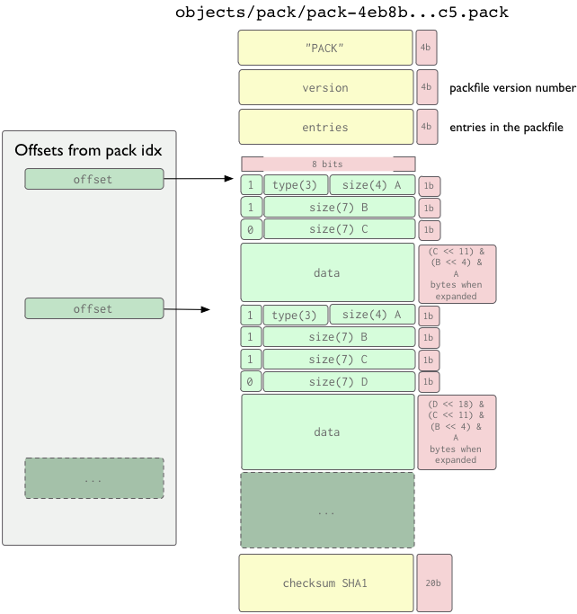
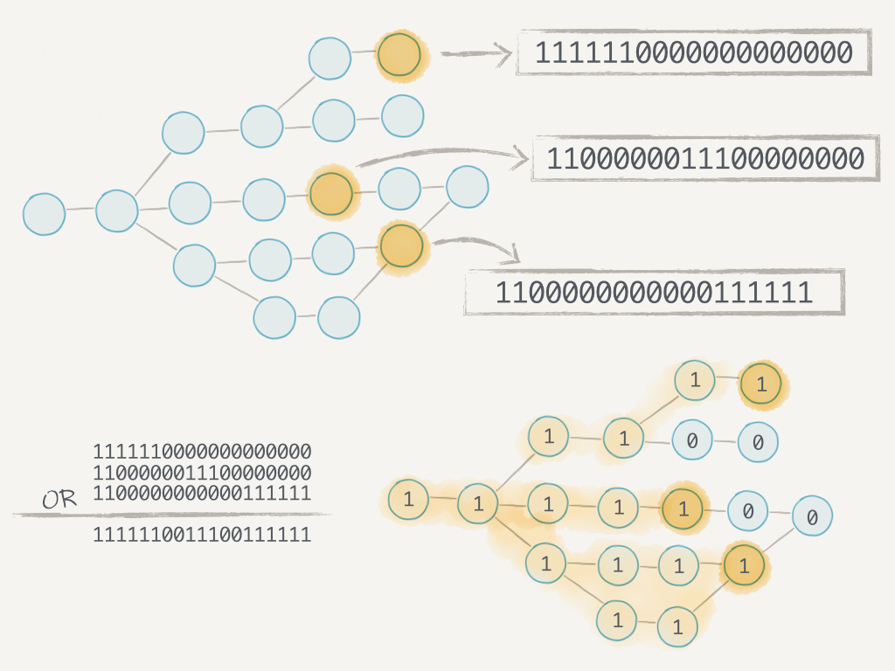

### 设计目标
- 如何高效存储多个版本
  - 相同的文件：不重复存储
  - 相似的文件：增量存储
- 机器间如何高效传输
  - 相同的文件：不传输
  - 相似的文件：增量传输

### Git Objects
  - Content-addressable Filesystem
  - store = type + ' ' + len(content) + '\0' + content
    - type: commit, tree, blob, tag
  - objectAddress = sha1(store)
- 查看object的命令：git cat-file -p objectAddress
- 自动实现了object去重
  - 忽略hash碰撞，sha1碰撞概率极低，支持迁移到sha256
- Merkle DAG（Merkle Tree）

```
ru@rudeMacBook-Pro:~/Desktop/work/data/.git/objects (GIT_DIR!)$ git cat-file -t ae6d1140e9911a1ed9cd35a679ed568166da9bad
commit
ru@rudeMacBook-Pro:~/Desktop/work/data/.git/objects (GIT_DIR!)$ git cat-file -t prod-20190628
tag
ru@rudeMacBook-Pro:~/Desktop/work/data/.git/objects (GIT_DIR!)$ git cat-file -s prod-20190628
139
ru@rudeMacBook-Pro:~/Desktop/work/data/.git/objects (GIT_DIR!)$ git cat-file -p prod-20190628
object e57db073b033a06cffae9915945d96ee0b4f3b65
type commit
tag prod-20190628
tagger 晓红 <xiaohong@xiaomi.com> 1561716722 +0800
```


### How Git Stores Objects
- Loose Objects
  - objects/ab/04d884140f7b0cf8bbf86d6883869f16a46f65
- Packed Objects
  - objects/pack/
    - pack-474ad2c527e0e95c8733435283180720af7b5069.pack
    - pack-474ad2c527e0e95c8733435283180720af7b5069.idx
    - pack-474ad2c527e0e95c8733435283180720af7b5069.bitmap

#### Loose Objects
```
 def putLooseObject(content, type):
    data = b'%s %d\0%s' % (type, len(content), content)
    sha1 = hashlib.sha1(data).hexdigest()
    path = f'{gitDir}/objects/{sha1[0:2]}/{sha1[2:40]}'
    if not os.path.exists(path):
     os.makedirs(os.path.dirname(path), exist_ok=True)
     open(path, 'wb').write(deflate(data))
    return sha1
```

#### The Packfile Format
- Object header
  - type (3bits)
    - OBJ_COMMIT (1)
    - OBJ_TREE (2)
    - OBJ_BLOB (3)
    - OBJ_TAG (4)
    - OBJ_OFS_DELTA (6)
    - OBJ_REF_DELTA (7)
  - size: 解压后的大小，变长编码
  
```
        --  +--------------------------------+
fanout      | fanout[0] = 2 (for example)    |-.
table       +--------------------------------+ |
            | fanout[1]                      | |
            +--------------------------------+ |
            | fanout[2]                      | |
            ~~~~~~~~~~~~~~~~~~~~~~~~~~~~~~~~~~ |
            | fanout[255] = total objects    |---.
        --  +--------------------------------+ | |
main        | offset                         | | |
index       | object name 00XXXXXXXXXXXXXXXX | | |
table       +--------------------------------+ | |
            | offset                         | | |
            | object name 00XXXXXXXXXXXXXXXX | | |
            +--------------------------------+<+ |
          .-| offset                         |   |
          | | object name 01XXXXXXXXXXXXXXXX |   |
          | +--------------------------------+   |
          | | offset                         |   |
          | | object name 01XXXXXXXXXXXXXXXX |   |
          | ~~~~~~~~~~~~~~~~~~~~~~~~~~~~~~~~~~   |
          | | offset                         |   |
          | | object name FFXXXXXXXXXXXXXXXX |   |
        --| +--------------------------------+<--+
```
### Git Repack策略
- 会新增objects的操作一般会自动执行git gc --auto
  - git gc --auto调用git repack的时机如下
- 当loose objects个数超过gc.auto（默认6700）时
  - 打包所有loose objects为新的packfile
  - 近似值，17这个目录里的objects数量超过gc.auto/256时
- 当packfiles个数超过gc.autoPackLimit（默认50）时
  - 重新打包所有loose objects和packfiles为新的packfile
  - 超过gc.bigPackThreshold大小的packfile不重新打包
  - 较大的git库设置gc.bigPackThreshold可避免全量重新打包
### Transfer Protocols
- The Dumb Protocol (HTTP静态服务器，低效)
  - 需要在post-receive hook执行update-server-info
    - 更新 info/refs 和 objects/info/packs
- The Smart Protocol (HTTP, SSH, Git)
  - Fetching Data
    - fetch-pack <= upload-pack
  - Pushing Data
    - send-pack => receive-pack
  - 问题弱于rsync解决的不知道对方有什么的前提下的增量同步
### Fetching Data
- upload-pack: 我的所有分支及其对应的commit是这些
- fetch-pack: 我有这几个commit，我要你的这几个commit
- upload-pack: 给你1个包含你没有的objects的packfile
  - 可能是thin packfile（增量的base object不在该packfile里）
- fetch-pack: 接收packfile
  - 少于100个objects时调用unpack-objects解包为loose objects
  - 否则调用index-pack保留该packfile，并修复thin packfile以便gc
    - 将不在该packfile里的增量base object补到packfile最后
    - 因此同一个object可能存多份
### Pushing Data
- receive-pack: 我的所有分支及其对应的commit是这些
- send-pack: 给你1个新的packfile，请更新你的分支到新commit
  - 类似upload-pack只传输服务端没有的commits相关的objects
  - 也有可能是thin packfile
- receive-pack: 类似fetch-pack接收packfile
  - 少于100个objects时解包为loose objects
  - 否则保留该packfile，并修复thin packfile
### Bitmap加速counting objects
- Counting objects / Enumerating objects
  - upload-pack和send-pack列举对方没有的commits的过程
  - clone大仓库时扫描所有objects导致这一步很慢
- Packfile Bitmap（使用了EWAH Bitmaps编码）
  - Commit => Bitmap of all Objects in the Packfile
  - 不是所有Commit，而是有选择的
  - 因此该Packfile内的Objects引用的Objects必须也在该Packfile内
    - 注意thin packfile对应的是增量base，这里是所有引用
    - 因此只有最老的基础Packfile才能有Bitmap


### git-sync线上git配置修改
[gc]
    bigPackThreshold = 1g
[pack]
    threads = 1
    deltaCacheSize = 128m
    windowMemory = 128m

### 参考资料
- https://git-scm.com/book/en/v2/Git-Internals-Git-Objects
- https://git-scm.com/book/en/v2/Git-Internals-Packfiles
- https://git-scm.com/docs/pack-format
- https://git-scm.com/docs/pack-protocol
- https://git-scm.com/docs/pack-heuristics
- https://git-scm.com/docs/git-gc
- https://shafiul.github.io/gitbook/7_the_packfile.html
- https://shafiul.github.io/gitbook/7_transfer_protocols.html
- https://github.blog/2015-09-22-counting-objects/