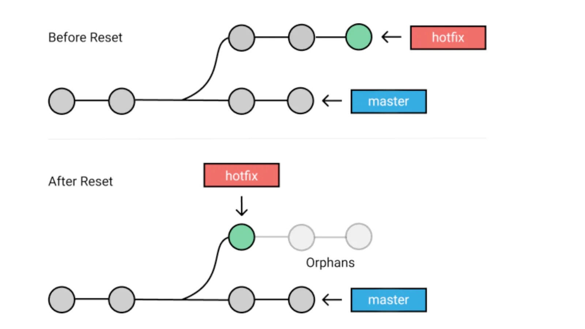
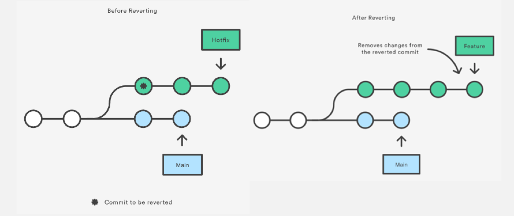

在日常开发中，经常会遇到需要暂时回滚(即：后续该功能还是要上线的) 的场景。罗列两种常见的回滚方式

**背景**
master 分支为主分支，不可直接在 master 分支上进行开发，需要在开发分支(即：feature 分支)上进行开发，开发完成，测试通过后再合入 master 分支


## git reset --hard


**回滚**
1. 保留 feature 分支
2. 在 master 分支上，执行 git reset --hard commitId
3. 在 master 分支上，执行 git push --force

**再次上线**
1. feature 分支 merge 进 master

**优点**
- 操作简单，逻辑清晰

**缺点**
操作有一定的风险，例如：
- master 为保护分支，是不允许直接 push 代码的


## git revert


必读文档：[深入理解git merge](https://zhuanlan.zhihu.com/p/412276295)

**回滚**
需要 revert 掉最新的 merged commit

1. 查看 graph
- 命令：git log --oneline --graph
- 其它: 代码平台上，例如：gitlab > Repository > Graph, 个人认为这种比较直观

> 推荐一篇关于 git log 不错的文档：[Advanced Git log](https://www.atlassian.com/git/tutorials/git-log)
2. 查看 merged commit parent
- 命令：git show --pretty=raw commitId, 详见：[How can I get the parents of a merge commit in Git?](https://stackoverflow.com/questions/9059335/how-can-i-get-the-parents-of-a-merge-commit-in-git)

例如：
```
git show --pretty=raw 94c1eaa5477977efae7238876895206847c0deca
=>
commit 94c1eaa5477977efae7238876895206847c0deca
tree 64e054cf574f29f02653877c49ded191470b05b0
parent 7cf122a081457795b361d74fa1d062d2785dbbcb  => master 
parent 4bbd01d6abf713ed9f4d4e91bee801666bd5d57b => feature 分支
author 茹俊巧 <rujunqiao@xiaomi.com> 1684227594 +0000
committer 茹俊巧 <rujunqiao@xiaomi.com> 1684227594 +0000

    Merge branch 'fix-assets-20230516' into 'master'
    
    Fix assets 20230516
    
    See merge request dp/xx !413
```
3. git revert
回撤最后一次commit，此时 parent 节点为，master 上一次 commit，所以执行：
```
git revert 94c1eaa5477977efae7238876895206847c0deca -m 1
```

需要注意的是 git revert 与 git reset 中 commit 不同（个人理解）
- git reset commitId --hard, 回滚 commitId 之后，所有的 commit。可以理解是一条线，直接切断
- git revert commitA，撤销掉 commitA. 可以理解成一个点。 

