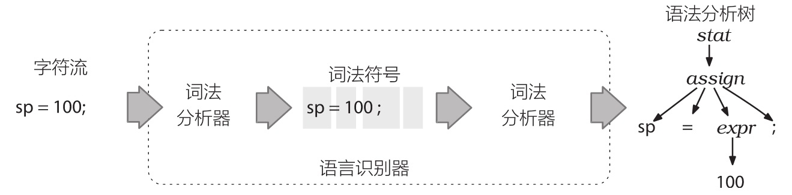

## 基本概念
语法分析器（parser）是用来识别语言的程序，本身包含两个部分：词法分析器（lexer）和语法分析器（parser）。词法分析阶段主要解决的关键词以及各种标识符，例如 INT、ID 等，语法分析主要是基于词法分析的结果，构造一颗语法分析树。大致的流程如下图参考2所示


因此，为了让词法分析和语法分析能够正常工作，在使用 Antlr4 的时候，需要定义语法（grammar），这部分就是 Antlr 元语言


## calculator demo
### grammer
我们以计算器的例子为例，简单讲解其中的概念。
```
// file: Calculator.g4
grammar Calculator;

line : expr EOF ;
expr : '(' expr ')'             # parenExpr
     | expr ('*'|'/') expr      # multOrDiv
     | expr ('+'|'-') expr      # addOrSubstract
     | FLOAT                    # float
     ;

WS : [ \t\n\r]+ -> skip;
FLOAT : DIGIT+ '.' DIGIT* EXPONET?
      | '.' DIGIT+ EXPONET?
      | DIGIT+ EXPONET?
      ;

fragment DIGIT : '0'..'9' ;
fragment EXPONET : ('e'|'E') ('+'|'-')? DIGIT+ ;

```
1. 第一行：定义了 grammar 的名字，名字需要与文件名对应
2. 第二行： line 和 expr 就是定义的语法，会使用到下方定义的词法，注意 # 后面的名字，是可以在后续访问和处理的时候使用的。一个语法有多种规则的时候可以使用 | 来进行配置。
3. 第三行：在 expr 这行，我们注意到四则运算分为了两个非常相似的语句，这样做的原因是为了实现优先级，乘除是优先级高于加减的
4. 第四行：WS 定义了空白字符，后面的 skip 是一个特殊的标记，标记空白字符会被忽略
5. 第五行： FLOAT 是定义的浮点数，包含了整数，与编程语言中的浮点数略有不同，更类似 Number 的定义。
6. 最后的 fragment 定义了两个在词法定义中使用到的符号

在语法定义的文件中，大部分的地方使用了正则表达式

### 生成文件
配置 antlr4 工具，先从官网下载 Antlr4 的 jar 包，点击下载地址进行下载
[官方的主流各大语言的语法描述下载地址](https://github.com/antlr/grammars-v4)
```
antlr4 -Dlanguage=JavaScript xxxxx.g4
```
通过命令行工具可以生成 lexer、parser、visitor、listener 等文件
visitor 是默认不生成的，需要带上参数 -visitor
```
$ antlr4 -visitor Calculator.g4

# 生成文件如下：
Calculator.interp
CalculatorBaseListener.java
CalculatorLexer.interp
CalculatorLexer.tokens
CalculatorParser.java
Calculator.tokens
CalculatorBaseVisitor.java
CalculatorLexer.java
CalculatorListener.java
CalculatorVisitor.java
```
### 使用Visitor
Visitor 的使用是最为简单方便的，继承 CalculatorBaseVisitor 类即可，内部的方法与 g4 文件定义相对应，对照看即可理解
```
public class MyCalculatorVisitor extends CalculatorBaseVisitor<Object> {
    @Override
    public Object visitParenExpr(CalculatorParser.ParenExprContext ctx) {
        return visit(ctx.expr());
    }

    @Override
    public Object visitMultOrDiv(CalculatorParser.MultOrDivContext ctx) {
        Object obj0 = ctx.expr(0).accept(this);
        Object obj1 = ctx.expr(1).accept(this);

        if ("*".equals(ctx.getChild(1).getText())) {
            return (Float) obj0 * (Float) obj1;
        } else if ("/".equals(ctx.getChild(1).getText())) {
            return (Float) obj0 / (Float) obj1;
        }
        return 0f;
    }

    @Override
    public Object visitAddOrSubstract(CalculatorParser.AddOrSubstractContext ctx) {
        Object obj0 = ctx.expr(0).accept(this);
        Object obj1 = ctx.expr(1).accept(this);

        if ("+".equals(ctx.getChild(1).getText())) {
            return (Float) obj0 + (Float) obj1;
        } else if ("-".equals(ctx.getChild(1).getText())) {
            return (Float) obj0 - (Float) obj1;
        }
        return 0f;
    }

    @Override
    public Object visitFloat(CalculatorParser.FloatContext ctx) {
        return Float.parseFloat(ctx.getText());
    }
}
```
实现了 visitor 之后，就可以完成一个简单的计算器了
```
import org.antlr.v4.runtime.ANTLRInputStream;
import org.antlr.v4.runtime.CommonTokenStream;

public class Driver {
    public static void main(String[] args) {
        String query = "3.1 * (6.3 - 4.51) + 5 * 4";

        CalculatorLexer lexer = new CalculatorLexer(new ANTLRInputStream(query));
        CalculatorParser parser = new CalculatorParser(new CommonTokenStream(lexer));
        CalculatorVisitor visitor = new MyCalculatorVisitor();

        System.out.println(visitor.visit(parser.expr()));  // 25.549
    }
}
```

【参考】
- [antlr4 calculator grammer](https://github.com/antlr/grammars-v4/blob/master/calculator/calculator.g4)
- [ANTLR 4权威指南](https://book.douban.com/subject/27082372/)