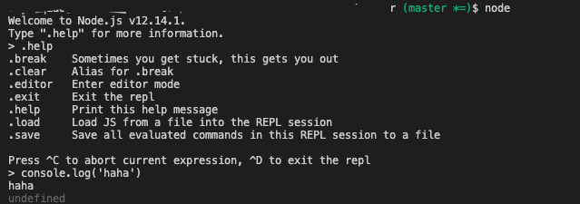

## 1. REPL 模式
在终端尝试输入 node， 则会出现如下：



1. 使用 tab 键，自动补全
2. 查看 global 对象
```
global. + tab 键
```

## 2. 环境变量
Node.js 的 process 核心模块提供了 env 属性，该属性承载了在启动进程时设置的所有环境变量。

## 3. 从命令行接收参数
```
node app.js name=joe
```
获取参数：
process.argv: 该属性是一个包含所有命令行调用参数的数组

- 第一个参数：node 命令的完整路径
- 第二个参数：执行文件的完整路径
- 其它参数：所有其他的参数从第三个位置开始。

对于则 args[0] 是 name=joe，需要对其进行解析。 最好的方法是使用 minimist 库，该库有助于处理参数：
```
const args = require('minimist')(process.argv.slice(2))
args['name'] //joe
```

但是需要在每个参数名称之前使用双破折号：
```
node app.js --name=joe
```
## 4. nvm && npm
- nvm: Node Version Manager,  is a tool that allows you to download and install Node.js. Check if you have it installed via nvm --version.
- node: Node Package Manager, is a tool that allows you to install javascript packages. Check if you have it installed via npm --version.

