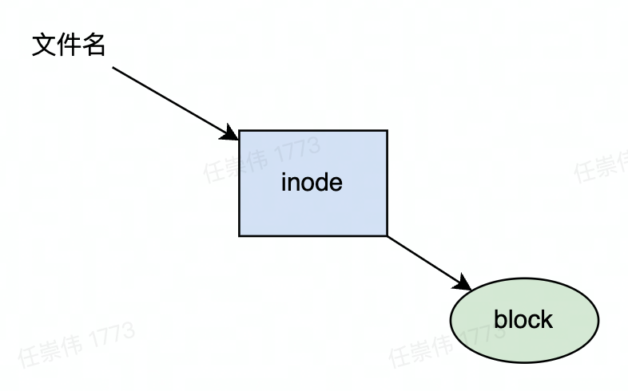
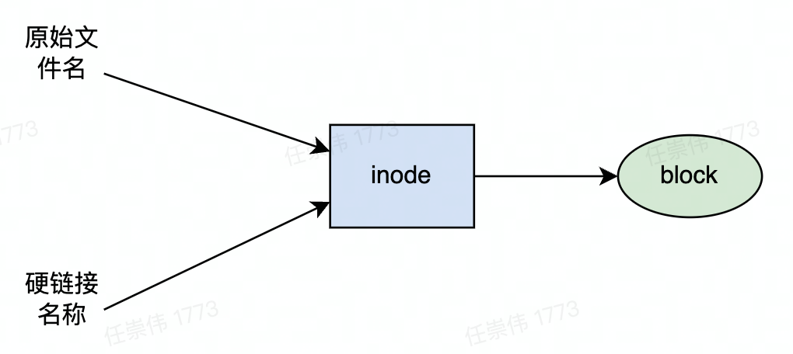
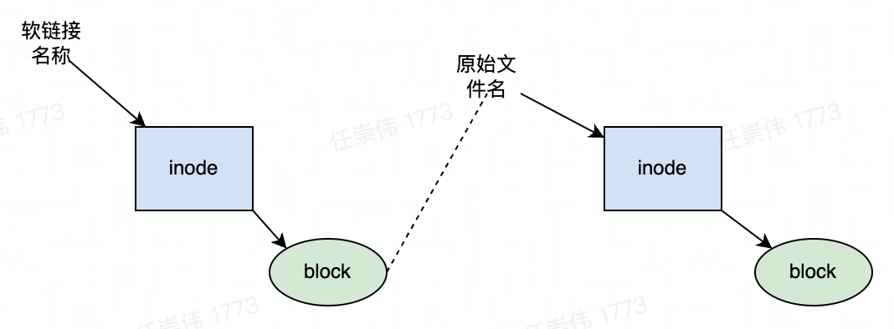
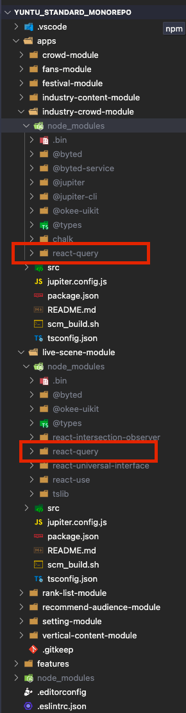
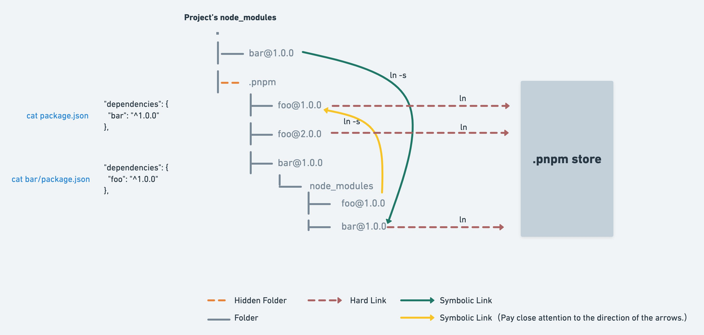

# 前置知识

## 文件存储结构
文件数据存储在硬盘上，操作系统存取硬盘的最小单位为 block，一般大小是 4 KB。在操作系统中还有一个地方储存文件的元信息，比如文件的创建者、文件的创建日期、文件的大小等等。这种储存文件元信息的区域就叫做 inode（index node），block 和 inode 的关系如下：



## inode 区域主要信息
1. 文件的字节数
2. 文件拥有者的 User ID
3. 文件的 Group ID
4. 文件的读、写、执行权限
5. 文件的时间戳，共有三个：ctime 指 inode 上一次变动的时间，mtime 指文件内容上一次变动的时间，atime 指文件上一次被访问的时间
6. 链接数，即有多少文件名指向这个 inode
7. 文件数据 block 的位置

## 硬链接
一般情况下，文件名和 inode 号码是“一一对应”关系，每个 inode 号码对应一个文件名。但是，Unix/Linux 等系统允许多个文件名指向同一个 inode 号码，每个文件名都代表一个硬链接。 



<div style="background - color: lightgreen;">

    - 文件的原始文件名本质上也是一个硬链接。

    - 系统采用引用计数的策略判断文件是否需要删除，当硬链接数量为 0 时，该文件则会被删除。

</div>

## 软链接（符号链接）
软链接类似于 Windows 的快捷方式。它实际上是一个特殊的文本文件。在软链接中，文件的 block 包含另一文件的位置信息，所以通过软链接可以找到它指向的文件。



## 包管理的痛点
场景带入，以 express 源码库为例，项目中依赖了两个包 send 和 debug，debug 依赖 ms@2.0.0，而 send 依赖 ms@2.1.3，npm 该如何安装 node_modules 中的依赖。


### npm 1-2
npm1 和 npm2 采取的方法简单粗暴，直接在 node_modules 生成层层嵌套的结构，有多少层依赖就嵌套多少层。
```
1. express/node_modules
2. |-- debug@2.6.9
3. |   |-- node_modules
4. |   |   |-- ms@2.0.0
5. |-- send@0.18.0
6. |   |-- node_modules
7. |   |   |-- ms@2.1.3
```
#### 1. **node_modules hell**
这样做看似可以，但是存在一个很严重问题，如果你的应用有很多的第三方库，同时第三方库共同依赖了一些很基础的第三方库如 lodash，你会发现你的 node_modules 里充满了各种重复版本的 lodash，造成了极大的空间浪费，也导致 npm install 很慢，这既是臭名昭著的 node_modules hell。 


### npm 3+ & yarn
npm3 以上版本和 yarn 采取了 hoist 机制，将公共包提取到顶层的 node_modules 里，如果一个包的子依赖与顶层 node_modules 版本不兼容，才会创建子级 node_modules 并安装所需依赖，这样可以实现大多数依赖的复用，node_modules 呈现一种相对扁平的结构。
```
1. express/node_modules
2. |-- debug@2.6.9
3. |-- send@0.18.0
4. |   |-- node_modules
5. |   |   |-- ms@2.1.3
6. |-- ms@2.0.0
```
这时我们看似解决了 node_modules hell，但是还存在以下问题...
#### 1. **不确定性**
npm 是根据安装顺序来决定是否把包放在顶层的 node_modules 中的，如上图，debug 先于 send 安装，所以 debug 依赖的 ms@2.0.0 安装在顶层 node_modules 中，而 send 依赖的 ms@2.1.3 则只能安装在它内部的 node_modules 中，所以我们并没有一个很有效的手段来控制顶层依赖的版本。有时会出现错误的版本 hoist 到顶层 node_modules 中，这种现象会引起版本冲突问题。

#### 2. **doppelgangers**
如果此时又有一个 xmodule 依赖的是 ms@2.1.3，那么还是会造成同一个版本重复安装的问题。
```
1. express/node_modules
2. |-- debug@2.6.9
3. |-- send@0.18.0
4. |   |-- node_modules
5. |   |   |-- ms@2.1.3
6. |-- xmodule@x.x.x
7. |   |-- node_modules
8. |   |   |-- ms@2.1.3
9. |-- ms@2.0.0
```
这个问题在 monorepo 中尤为明显，以 yuntu_standard-monorepo 为例，多个子应用依赖了的 react - query@3.24.5，但是顶层的 node_modules 版本为 react - query@3.24.4，所以子应用内部还是分别安装了 react - query@3.24.5。 



#### 3、**phantom dependency**
hoist 机制导致大量子依赖包被提取到 node_modules 顶层，我们可以引入 dependencies 之外的包，这种现象称为 phantom depdencies 。当我们使用 monorepo 管理项目的情况下，问题更加严重，一个 package 不但可能引入 DevDependency 引入的 phantom 依赖，更很有可能引入其他 package 的依赖，使用不可控的依赖有可能会产生 bug。 


# Pnpm

## Pnpm 介绍
> 快速的，节省磁盘空间的包管理工具


## Pnpm Cli
使用方法和 npm 几乎没有区别，具体可以参考官方文档。
与 npm 不同的是，pnpm 会校验所有的参数。 比如，pnpm install --target_arch x64 会执行失败，因为 --target_arch x64 不是 pnpm install 的有效参数。

## Pnpm 包管理原理
Pnpm 的核心思想如下：
- Pnpm 会创建一个全局的 store，pnpm 所有下载的包都保存在这个 store 中，项目通过硬链接使用 store 里面的模块，这样就实现了模块的全局共享，解决了 node_modules hell 的问题。
- Pnpm 项目只能引用 dependencies 中声明的依赖，不能引用子依赖，解决了 phantom dependency 的问题。
- Pnpm 项目中以软链接的方式维护了 node_modules 嵌套的拓扑结构，保证了依赖的确定性。


举个🌰，如果我们执行 pnpm install express，node_modules 会生成以下目录结构。
```
node_modules
├── .pnpm
│ └── express@4.18.1
│     └── node_modules
│         └── express(hardlink to pnpm store)
│         └── debug(symlink to .pnpm/debug@2.6.9/debug)
│         └── send(symlink to .pnpm/send@0.18.0/send)
│ └── debug@2.6.9
│     └── node_modules
│         └── debug(hardlink to pnpm store)
│         └── ms(symlink to .pnpm/ms@2.1.3/ms)
│ └── send@0.18.0
│     └── node_modules
│         └── sendms(hardlink to pnpm store)
│         └── ms(symlink to .pnpm/ms@2.0.0/ms)
│ └── ms@2.1.3
│     └── node_modules
│         └── ms(hardlink)
│ └── ms@2.0.0
│     └── node_modules
│         └── ms(hardlink)
│ └── .......
├── express(symlink to .pnpm/express@4.18.1/express)

```

## Pnpm monorepo
  在 monorepo 使用 pnpm 特别简单，直接声明一个 pnpm-workspace.yaml 即可。如果想维持原来的 lock 文件，执行 pnpm import 

```
  package-lock.json/yarn.lock。
// pnpm-workspace.yaml
packages:
  # all packages in direct subdirs of packages/
  - 'packages/*'
```
## Pnpm 清理缓存
可以使用 pnpm store prune 从全局 store 中删除未引用的包。运行 pnpm store prune  是无害的，对您的项目没有副作用。 如果以后的安装需要已经被删除的包，pnpm 将重新下载他们。最好的做法是  pnpm store prune  来清理存储，但不要太频繁。 有时，未引用的包会再次被需要。 这可能在切换分支和安装旧的依赖项时发生，在这种情况下，pnpm 需要重新下载所有删除的包，会暂时减慢安装过程。

# Pnpm 缺点
Pnpm 当前存在一定的兼容问题，在少数场景不可用。主要可能有以下两个原因。1、软链接本身在不同环境下存在一定兼容问题。2、部分 npm 包在进行软链接的之后会产生意料之外的bug。

# 参考资料
Fast, disk space efficient package manager | pnpm
理解inode - 阮一峰的网络日志
Monorepo，从 yarn 到 pnpm 
node_modules 困境 
How npm3 Works | How npm Works
# Q&A
## 1.pnpm store prune  是如何判断缓存是否需要删除的
当硬链接引用计数为 1 时则代表该文件没有在其他项目中用到，则进行删除
Pnpm 源码中相关判断逻辑如下：
```
export default async function prune (storeDir: string) {
    //....
    if (stat.nlink === 1 || stat.nlink === BIG_ONE) {  // 判断硬连接数量是否为1
        await fs.unlink(filePath) // 删除文件
        fileCounter++
        removedHashes.add(ssri.fromHex(`${dir}${fileName}`, 'sha512').toString())
    }
    //....
}
```
## 2. pnpm 为什么对于全局 store 用硬链接，而其他地方用软链接
其实 pnpm 团队起初是不想使用硬链接的，因为硬链接有个致命的问题：不能直接链接文件夹，如果想要硬链接文件夹必须对文件夹里的每个文件单独进行硬链接，这样有很大的性能问题。但是如果使用软链接链接全局 store，又会存在路径解析的错误（详情见这个[issue](https://github.com/nodejs/node-eps/issues/46)）。
所以 pnpm 决定使用软链接+硬链接结合的方式：在项目的内部使用软链接维护 npm 依赖的嵌套关系，最后使用硬链接链接到全局 store。
## 3.在 monorepo 中使用 pnpm 会不会有 phantom dependency 现象
不会，pnpm 安装的依赖都放在顶层目录 node_modules/.pnpm 目录下，子项目通过软链链接到相应的依赖，这个路径不能直接被 nodejs 解析。