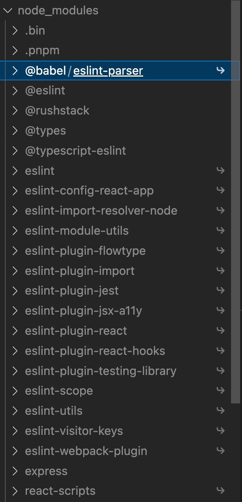

[Why should we use pnpm?](https://medium.com/pnpm/why-should-we-use-pnpm-75ca4bfe7d93)

### 背景
#### 1. npm 中存在的问题

NPM 中用到的方法与传统的包管理方式有很多不同点：

- 每一个（根级）目录的 node_module 树来存储大量的库文件夹副本，甚至一个很小的 NodeJS 项目的文件夹下可能有超过 10,000 个文件。

- 在 NPM 2.x 版本中，node_modules 文件树非常深，而且存在很多重复，这可以消除换依赖。NPM 3.x 的安装算法改成了将树扁平化，这消除了大量重复想，但代价是引入了幻影依赖，在某些情况下这个新算法会选择一个更久的版本的包（虽然依旧符合语义化规范）来消除包文件夹的重复。

- 安装后的 node_modules 树并不唯一，有很多种可能来重新组织文件夹来使得其接近菱形，并没有独一无二的“标准化”排列。安装后的树依赖于你的包管理器使用了哪种算法，NPM 自身的算法甚至对你添加的包的次序有关

文档：https://rushjs.io/zh-cn/pages/advanced/phantom_deps/

#### 2. 幻影依赖
日常oncall碰到了很多关于pnpm以及幻影依赖的问题，有的问题比较复杂，涉及到了pnpm背后的实现原理，因此本文展开讲一讲pnpm的link机制。

我们通常说pnpm的一大优点就是避免了幻影依赖，默认禁止了hoist，但是当我们说起hoist的时候，说的可能不是一回事，因为pnpm的hoist可能分为很多种情况。而且pnpm禁止不同hoist采取的策略也有所不同。
我们就结合pnpm的link策略来看看不同hoist的表现行为。

在讨论具体的hoist行为前，我们需要先区分两种代码，一种为application code即我们日常开发的业务代码，另一种为vendor code即三方库的代码，也包括三方库自身依赖的三方库。
这时候hoist的不同表现就体现在vendor和application的各种交互上。

> 因为pnpm@6和pnpm@7存在一些差异，本章讨论都建立在pnpm@7基础上

**a. application与vendor之间的hoist行为(public-hoist)**

 public-hoist最常见也是我们日常所说的hoist行为。即我们的application code能够访问未声明在application的dependency的里直接依赖的vendor code。

当我们配置pnpm的node-linker为hoisted的情况下，即默认所有的三方库都被hoist。

我们简单看个例子https://github.com/hardfist/explain-pnpm/tree/node-linker， 这里我们虽然只依赖了express这个库，但是仍然可以在src/index.js自由的访问debug这个库，这个正是因为hoist所致。

 举例说明：
- 目录结构
```
node_modules/
  debug
  express
  ...
 src/index.js
 package.json
```
- package.json
```
{
  "dependencies": {
    "express": "4.18.1"
  }
}
```
- src/index.tsx
```
const debug = require('debug');
console.log(debug);
```

对于这类幻影依赖，pnpm默认是严格禁止的，那么是如何做到禁止的呢。方法很简单，只要不将express之外的库直接放置到项目根目录(root)下的node_modules里即可。https://github.com/hardfist/explain-pnpm/tree/node-linker
此时的项目结构如下，我们看到node_modules里已经没有了express之外的库了，这样自然无法在src/index.js里进行访问了。

```
node_modules/
   express
   .pnpm
src/index.js
```
但是因为prettier和eslint的相关设计缺陷，导致其经常强依赖其相关的plugin存放在项目根目录的node_modules里，因此pnpm默认并没有禁止所有的库的hoist行为，而是给eslint和prettier开了后门。

如我们引入了create-react-app这个直接依赖进行安装后，惊讶的发现我们根目录的node_modules多了很多的其他的依赖。我们发现其中都是eslint和types的相关依赖被hoist上来。


默认值见: https://pnpm.io/npmrc#public-hoist-pattern。


hoist问题似乎就这样迎刃而解了。但是这里碰到的一个问题是，如果我们直接依赖了A和B两个库，但是A和B又同时依赖了同一个版本的C，那么我们的C该怎么处理。

最简单粗暴的处理方式即将C放在A和B各自的node_modules里。
```
node_modules/
  A/
    node_modules/
    C
  B/
    node_modules/
    C
```
此时面临的问题就是C的内容是重复的，占据了我们磁盘空间，如果我们的项目非常大，那么这将充斥着我们的磁盘。（这也是npm@{1,2}的默认行为)

既然害怕C冲突，那么很简单，我们将C链接到一个地方不就行了吗。

#### systemlink vs hardlink
一般操作系统都支持两种链接方式，软链接(symlink)和硬链接(hardlink),这两种链接方式在pnpm都有使用，我们以一个例子为例(example from [hardlink vs symlink](https://stackoverflow.com/questions/185899/what-is-the-difference-between-a-symbolic-link-and-a-hard-link#:~:text=A%20simple%20way%20to%20see,to%20the%20actual%20file%20itself.))简单介绍下异同。

我们先创建一个文件，以及其hardlink和symlink
```
echo "111" > a
ln a b
ln -s a c
```

此时 a、b、c的结果为
```
cat a --> 111
cat b --> 111
cat c --> 111
```

我们看到 a、b、c的结果保持同步，如果我们尝试下删除 a文件，此时我们可以看到
```
rm a
cat a --> No such file or directory
cat b --> 111
cat c --> No such file or directory
```

此时可以看到，c的内容一并被删除，但是b的内容不受到影响，我们再尝试将a的内容复原
```
echo "222" > a
cat a --> 222
cat b --> 111
cat c --> 222
```

此时我们发现 a和b的内容不一致，但是a和c的内容一致，这反映了hardlink和symlink的一个重要区别
- 删除文件并不会影响hardlink的内容，但是会影响symlink的内容
- 文件删除后再恢复内容，那么hardlink的link关系将不再维持，后续所有变更不会同步到hardlink里，但是仍然会和symlink保持同步

<font color="yellow">因为hardlink难以保证和原文件的一致性，因此难以保证hmr的正常。</font>

hardlink相比symlink还有一个限制就是其无法支持hard link到一个目录，而symlink可以。

**node resolve**
另一个区别就是两者在node resolve情况下行为的差异

我们创建三个package
```
echo "console.log('resolve:', module.paths[0]);" >> a/index.js
ln a/index.js b/index.js
ln -s a/index.js c/index.js
```
我们看下 三个目录的寻路算法
```
node a/index.js --> a/node_modules
node b/index.js --> b/node_modules
node c/index.js --> a/node_modules
```
我们发现对于hardlink其resolve算法和被link的原文件无关，而对于symlink其resolve算法是从被linked的源文件算起，这对于运行时行为是比较大的差异，会影响到最终寻路的结果。

其实symlink不一定是基于被linked路径算起，大部分的工具和node都提供了一个preserveSymlink参数(typescript symlink, webpack symlink, node symlink）

当我们使用preserveLink的时候，symlink的计算路径就是基于该symlink的路径而非被linked文件路径进行计算。
```
node --preserve-symlinks-main --preserve-symlinks c/index.js --> c/node_modules
```
使用preserveLink和hard link最大的风险在于，可能导致该查找到的库查找不到，或者同一个库resolve到了不同的结果，从而破坏了单例模式和导致bundle了多份产物，导致包大小问题。


**b. vendor与vendor的hoist行为(hoist)**

vendor和vendor的hoist是指，一个三方库可以访问不在其依赖里的其他三方库代码，这听起来有点不可思议，既然一个库用到了某个依赖，那理所当然应当将其列入其依赖，否则这个库肯定跑不起来啊，然而不幸的是，仍然有大量的三方库，没遵守这个约定。
以webpack-cli为例，其虽然依赖了ts-node等来将ts配置文件翻译为js，但是其并没有将ts-node列入到其dependency和peer-dependency里，这里存在的一个风险就是，如果你之前恰好安装了webpack-cli和另一个库A且另一个库A正好又依赖了ts-node,并且你的webpack配置文件使用了ts文件，那么你很幸运的能够将webpack跑起来，突然有一天库A决定不使用ts-node作为依赖，那么不幸的是你的webpack将无法正常编译。

虽然有这种潜在的风险，奈何整个js的生态库都良莠不齐，导致pnpm也只能默认开启hoist模式，默认所有的vendor都是可以互相蹭的。你如果比较有追求，可以通过设置https://pnpm.io/npmrc#hoist 为false,关闭三方库的vendor的hoist行为。


