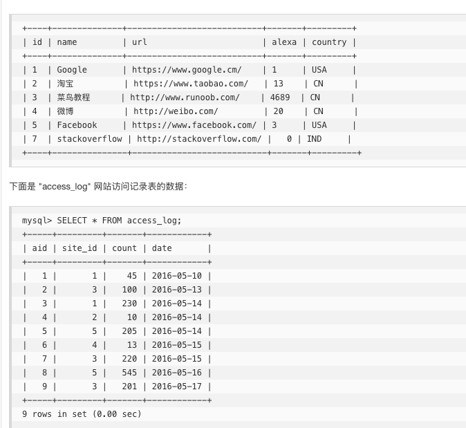
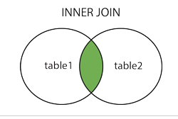
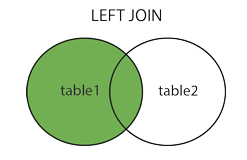
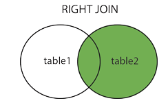
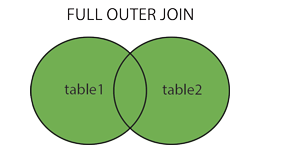

SQL join 用于把来自两个或多个表的行结合起来。

下图展示了 LEFT JOIN、RIGHT JOIN、INNER JOIN、OUTER JOIN 相关的 7 种用法。


下面以这两个表为例：


### 1. INNER JOIN

最常见的 JOIN 类型：SQL INNER JOIN（简单的 JOIN）

取交集; 

```
// INNER JOIN 关键字在表中存在至少一个匹配时返回行。如果 "Websites" 表中的行在 "access_log" 中没有匹配，则不会列出这些行
SELECT Websites.name, access_log.count, access_log.date
FROM Websites
INNER JOIN access_log
ON Websites.id=access_log.site_id
ORDER BY access_log.count;
```

### 2. LEFT JOIN
关键字从左表（table1）返回所有的行，即使右表（table2）中没有匹配。如果右表中没有匹配，则结果为 NULL

```
SELECT Websites.name, access_log.count, access_log.date
FROM Websites
LEFT JOIN access_log
ON Websites.id=access_log.site_id
ORDER BY access_log.count DESC;
```

### 3. RIGHT JOIN 
RIGHT JOIN 关键字从右表（table2）返回所有的行，即使左表（table1）中没有匹配。如果左表中没有匹配，则结果为 NULL

```
SELECT websites.name, access_log.count, access_log.date
FROM websites
RIGHT JOIN access_log
ON access_log.site_id=websites.id
ORDER BY access_log.count DESC;
```
### FULL OUTER JOIN
FULL OUTER JOIN 关键字只要左表（table1）和右表（table2）其中一个表中存在匹配，则返回行.

FULL OUTER JOIN 关键字结合了 LEFT JOIN 和 RIGHT JOIN 的结果

```
SELECT Websites.name, access_log.count, access_log.date
FROM Websites
FULL OUTER JOIN access_log
ON Websites.id=access_log.site_id
ORDER BY access_log.count DESC;
```