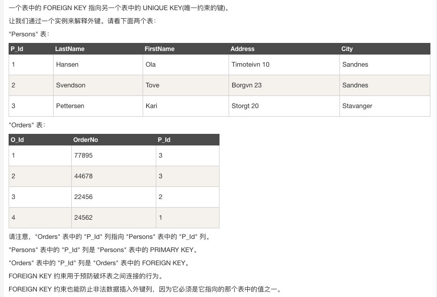

一个数据库通常包含一个或多个表。每个表有一个名字标识（例如:"Websites"）,表包含带有数据的记录（行）。

在本教程中，我们在 MySQL 的 RUNOOB 数据库中创建了 Websites 表，用于存储网站记录。

### [SQL快速参考](https://www.runoob.com/sql/sql-quickref.html)

> SQL 对大小写不敏感：SELECT 与 select 是相同的。


- use RUNOOB; 命令用于选择数据库。
- set names utf8; 命令用于设置使用的字符集。
- SELECT * FROM Websites; 读取数据表的信息
- SELECT - 从数据库中提取数据
- UPDATE - 更新数据库中的数据
- DELETE - 从数据库中删除数据
- INSERT INTO - 向数据库中插入新数据

- CREATE DATABASE dbname - 创建新数据库
- ALTER DATABASE - 修改数据库
- DROP DATABASE database_name - 删除数据库

- CREATE TABLE tablename - 创建新表
- ALTER TABLE - 变更（改变）数据库表
- DROP TABLE table_name - 删除表
- TRUNCATE TABLE table_name - 仅仅需要删除表内的数据，但并不删除表本身

- CREATE INDEX - 创建索引（搜索键）
- DROP INDEX - 删除索引

#### 1. 关键字
下面是选自 "Websites" 表的数据


1. DISTINCT
```
关键词用于返回唯一不同的值。在表中，一个列可能会包含多个重复值，有时您也许希望仅仅列出不同（distinct）的值
SELECT DISTINCT column_name,column_name  FROM table_name
SELECT DISTINCT country FROM Websites // 从 "Websites" 表的 "country" 列中选取唯一不同的值，也就是去掉 "country" 列重复值：

```
2.  WHERE
```
用于提取那些满足指定条件的记录
SELECT column_name FROM table_name WHERE column_name operator value
SELECT * FROM Websites WHERE country='CN' // 从 "Websites" 表中选取国家为 "CN" 的所有网站
```
3. OR && AND
```
SELECT * FROM Websites WHERE country='USA' OR country='CN';
从 "Websites" 表中选取国家为 "USA" 或者 "CN" 的所有客户
```
4. ORDER BY 
```
关键字用于对结果集按照一个列或者多个列进行排序
ORDER BY 关键字默认按照升序对记录进行排序。如果需要按照降序对记录进行排序，您可以使用 DESC 关键字
SELECT * FROM Websites ORDER BY alexa; // 从 "Websites" 表中选取所有网站，并按照"alexa" 列排序
```
5. INSERT INTO

INSERT INTO 语句用于向表中插入新记录
```
第一种形式无需指定要插入数据的列名，只需提供被插入的值即可：
INSERT INTO table_name VALUES (value1,value2,value3,...);

第二种形式需要指定列名及被插入的值：
INSERT INTO table_name (column1,column2,column3,...) VALUES (value1,value2,value3,...);

INSERT INTO Websites (name, url, alexa, country)
VALUES ('百度','https://www.baidu.com/','4','CN')
```
6. UPDATE

UPDATE 语句用于更新表中已存在的记录
```
把 "菜鸟教程" 的 alexa 排名更新为 5000，country 改为 USA
UPDATE Websites SET alexa='5000', country='USA' WHERE name='菜鸟教程';
```
7. DELETE

DELETE 语句用于删除表中的记录
```
我们要从 "Websites" 表中删除网站名为 "Facebook" 且国家为 USA 的网站
DELETE FROM Websites WHERE name='Facebook' AND country='USA
```

8. CREATE DATABASE
CREATE DATABASE 语句用于创建数据库。

SQL CREATE DATABASE 语法
CREATE DATABASE dbname;

#### 2. 高级关键字

1. LIMIT

用于规定要返回的记录的数目
> 注意:并非所有的数据库系统都支持 SELECT TOP 语句。 MySQL 支持 LIMIT 语句来选取指定的条数数据， Oracle 可以使用 ROWNUM 来选取。
```
// MYSQL中
从 "Websites" 表中选取头两条记录
SELECT * FROM Websites LIMIT 2;

// Microsoft SQL Server 
从 websites 表中选取前面百分之 50 的记录
SELECT TOP 50 PERCENT * FROM Websites;
```
2. LIKE 操作符
LIKE 操作符用于在 WHERE 子句中搜索列中的指定模式
```
选取 name 以字母 "G" 开始的所有客户
SELECT * FROM Websites WHERE name LIKE 'G%';

选取 name 以字母 "k" 结尾的所有客户
SELECT * FROM Websites
WHERE name LIKE '%k';

"%" 符号用于在模式的前后定义通配符（默认字母）
```

### 3. 别名
通过使用 SQL，可以为表名称或列名称指定别名；通过使用 SQL，可以为表名称或列名称指定别名。
基本上，创建别名是为了让列名称的可读性更强。
```
列的 SQL 别名语法
SELECT column_name AS alias_name FROM table_name;

表的 SQL 别名语法
SELECT column_name(s) FROM table_name AS alias_name;

// DEMO
// 下面的 SQL 语句指定了两个别名，一个是 name 列的别名，一个是 country 列的别名。提示：如果列名称包含空格，要求使用双引号或方括号：
SELECT name AS n, country AS c FROM Websites;

// 我们把三个列（url、alexa 和 country）结合在一起，并创建一个名为 "site_info" 的别名：
SELECT name, CONCAT(url, ', ', alexa, ', ', country) AS site_info
FROM Websites;

// 我们使用 "Websites" 和 "access_log" 表，并分别为它们指定表别名 "w" 和 "a"（通过使用别名让 SQL 更简短）
SELECT w.name, w.url, a.count, a.date
FROM Websites AS w, access_log AS a
WHERE a.site_id=w.id and w.name="菜鸟教程";
```

### 4. 约束
- NOT NULL - 指示某列不能存储 NULL 值。
- UNIQUE - 保证某列的每行必须有唯一的值。
- PRIMARY KEY - NOT NULL 和 UNIQUE 的结合。确保某列（或两个列多个列的结合）有唯一标识，有助于更容易更快速地找到表中的一个特定的记录。
- FOREIGN KEY - 保证一个表中的数据匹配另一个表中的值的参照完整性。
- CHECK - 保证列中的值符合指定的条件。
- DEFAULT - 规定没有给列赋值时的默认值

```
CREATE TABLE Persons
(
    Id_P int NOT NULL AUTO_INCREMENT, // Auto-increment 会在新记录插入表中时生成一个唯一的数字
    LastName varchar(255) NOT NULL,
    FirstName varchar(255),
    Address varchar(255),
    City varchar(255),
    PRIMARY KEY (Id_P)  //PRIMARY KEY约束
)
CREATE TABLE Persons
(
    LastName varchar(255) NOT NULL,
    FirstName varchar(255),
    Address varchar(255),
    City varchar(255)
    UNIQUE (P_Id) // 约束唯一标识数据库表中的每条记录
)

// UNIQUE: demo
当表已被创建时，如需在 "P_Id" 列创建 UNIQUE 约束，请使用下面的 SQL：
ALTER TABLE Persons
ADD UNIQUE (P_Id)

撤销 UNIQUE 约束
如需撤销 UNIQUE 约束，请使用下面的 SQL：
ALTER TABLE Persons
DROP INDEX uc_PersonID

// DEFAULT: demo  mysql中
ALTER City SET DEFAULT 'SANDNES'
ALTER TABLE Persons ALTER City DROP DEFAULT

```

### 5. 常见概念
#### a. PRIMARY KEY
PRIMARY KEY 约束唯一标识数据库表中的每条记录。

主键必须包含唯一的值。

主键列不能包含 NULL 值。

每个表都应该有一个主键，并且每个表只能有一个主键
```
CREATE TABLE Persons
(
    P_Id int NOT NULL,
    LastName varchar(255) NOT NULL,
    CHECK (P_Id>0), // CHECK 约束规定 "P_Id" 列必须只包含大于 0 的整数。
    Address varchar(255) DEFAULT 'Sandnes', // 在 "Address" 列上创建 DEFAULT 约束
    City varchar(255),
    PRIMARY KEY (P_Id)
)
```

#### b.FOREIGN KEY
一个表中的 FOREIGN KEY 指向另一个表中的 UNIQUE KEY(唯一约束的键)

```
当 "Orders" 表已被创建时，如需在 "P_Id" 列创建 FOREIGN KEY 约束，请使用下面的 SQL：

ALTER TABLE Orders
ADD FOREIGN KEY (P_Id)
REFERENCES Persons(P_Id)
```

### 6. 与聚合函数相关的筛选条件

```
下面是 "access_log" 网站访问记录表的数据：

+-----+---------+-------+------------+
| aid | site_id | count | date       |
+-----+---------+-------+------------+
|   1 |       1 |    45 | 2016-05-10 |
|   2 |       3 |   100 | 2016-05-13 |
|   3 |       1 |   230 | 2016-05-14 |
|   4 |       2 |    10 | 2016-05-14 |
|   5 |       5 |   205 | 2016-05-14 |
|   6 |       4 |    13 | 2016-05-15 |
|   7 |       3 |   220 | 2016-05-15 |
|   8 |       5 |   545 | 2016-05-16 |
|   9 |       3 |   201 | 2016-05-17 |
+-----+---------+-------+------------+


下面是选自 "Websites" 表的数据：

+----+--------------+---------------------------+-------+---------+
| id | name         | url                       | alexa | country |
+----+--------------+---------------------------+-------+---------+
| 1  | Google       | https://www.google.cm/    | 1     | USA     |
| 2  | 淘宝          | https://www.taobao.com/   | 13    | CN      |
| 3  | 菜鸟教程      | http://www.runoob.com/    | 4689  | CN      |
| 4  | 微博          | http://weibo.com/         | 20    | CN      |
| 5  | Facebook     | https://www.facebook.com/ | 3     | USA     |
| 7  | stackoverflow | http://stackoverflow.com/ |   0 | IND     |
+----+---------------+---------------------------+-------+---------+
```

#### a. GROUP BY
GROUP BY 语句用于结合聚合函数，根据一个或多个列对结果集进行分组。


// 统计 access_log 各个 site_id 的访问量
SELECT site_id, SUM(access_log.count) AS nums
FROM access_log GROUP BY site_id;

#### b. HAVING 子句
在 SQL 中增加 HAVING 子句原因是，WHERE 关键字无法与聚合函数一起使用。

HAVING 子句可以让我们筛选分组后的各组数据。
```
SELECT Websites.name, Websites.url, SUM(access_log.count) AS nums FROM (access_log
INNER JOIN Websites
ON access_log.site_id=Websites.id)
GROUP BY Websites.name
HAVING SUM(access_log.count) > 200;
```

#### c. EXISITS
EXISTS 运算符用于判断查询子句是否有记录，如果有一条或多条记录存在返回 True，否则返回 False
```
现在我们想要查找总访问量(count 字段)大于 200 的网站是否存在
SELECT Websites.name, Websites.url 
FROM Websites 
WHERE EXISTS (SELECT count FROM access_log WHERE Websites.id = access_log.site_id AND count > 200);

// EXISITS NOT
SELECT Websites.name, Websites.url 
FROM Websites 
WHERE NOT EXISTS (SELECT count FROM access_log WHERE Websites.id = access_log.site_id AND count > 200);
```


