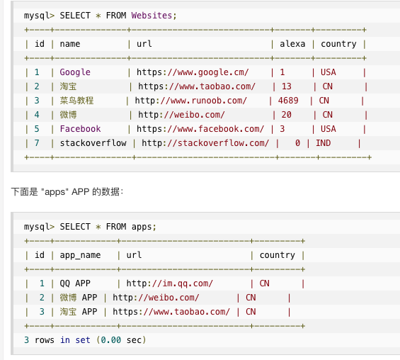
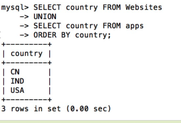

## 操作符 
以如下为例：


### 1. IN

允许您在 WHERE 子句中规定多个值
```
选取 name 为 "Google" 或 "菜鸟教程" 的所有网站
SELECT * FROM Websites WHERE name IN ('Google','菜鸟教程'); 
等价于
select * from Websites where name='Google' or name='菜鸟教程';
```
### 2. BETWEEN

用于选取介于两个值之间的数据范围内的值
```
SELECT * FROM Websites WHERE alexa BETWEEN 1 AND 20; // 选取 alexa 介于 1 和 20 之间的所有网站
SELECT * FROM Websites
WHERE (alexa BETWEEN 1 AND 20)
AND country NOT IN ('USA', 'IND'); // 选取 alexa 介于 1 和 20 之间但 country 不为 USA 和 IND 的所有网站
SELECT * FROM Websites
WHERE name NOT BETWEEN 'A' AND 'H'; // 选取 name 不介于 'A' 和 'H' 之间字母开始的所有网站
```
### 3. UNION
SQL UNION 操作符合并两个或多个 SELECT 语句的结果。

UNION 操作符用于合并两个或多个 SELECT 语句的结果集。

请注意，UNION 内部的每个 SELECT 语句必须拥有相同数量的列。列也必须拥有相似的数据类型。同时，每个 SELECT 语句中的列的顺序必须相同。
```
SELECT country FROM Websites
UNION
SELECT country FROM apps
ORDER BY country;
```
> 注释：UNION 不能用于列出两个表中所有的country。如果一些网站和APP来自同一个国家，每个国家只会列出一次。UNION 只会选取不同的值。请使用 UNION ALL 来选取重复的值！
```
SELECT country FROM Websites
UNION ALL
SELECT country FROM apps
ORDER BY country;
```
### 4. SELECT INTO
#### a. SELECT INTO

通过 SQL，您可以从一个表复制信息到另一个表。
SELECT INTO 语句从一个表复制数据，然后把数据插入到另一个新表中。
```
创建 Websites 的备份复件
SELECT *
INTO WebsitesBackup2016
FROM Websites;

只复制一些列插入到新表中：
SELECT name, url
INTO WebsitesBackup2016
FROM Websites;

只复制中国的网站插入到新表中：
SELECT *
INTO WebsitesBackup2016
FROM Websites
WHERE country='CN';
```


#### b. SELECT INTO SELECT
通过 SQL，您可以从一个表复制信息到另一个表。

INSERT INTO SELECT 语句从一个表复制数据，然后把数据插入到一个已存在的表中
NSERT INTO SELECT 语句从一个表复制数据，然后把数据插入到一个已存在的表中。目标表中任何已存在的行都不会受影响。
```
复制 "apps" 中的数据插入到 "Websites" 中：
实例
INSERT INTO Websites (name, country)
SELECT app_name, country FROM apps;

只复 QQ 的 APP 到 "Websites" 中：
实例
INSERT INTO Websites (name, country)
SELECT app_name, country FROM apps
WHERE id=1;
```