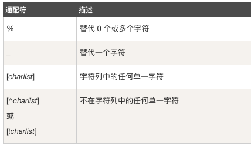

## 通配符
通配符可用于替代字符串中的任何其他字符。在 SQL 中，通配符与 SQL LIKE 操作符一起使用，SQL 通配符用于搜索表中的数据。



### 1. %、_
```
SELECT * FROM Websites WHERE url LIKE 'https%'; // 选取 url 以字母 "https" 开始的所有网站
SELECT * FROM Websites WHERE url LIKE '%oo%'; //下面的 SQL 语句选取 url 包含模式 "oo" 的所有网站
SELECT * FROM Websites
WHERE name LIKE '_oogle'; // 选取 name 以一个任意字符开始，然后是 "oogle" 的所有客户
```
### 2. REGEXP

MySQL 中使用 REGEXP 或 NOT REGEXP 运算符 (或 RLIKE 和 NOT RLIKE) 来操作正则表达式
```
SELECT * FROM Websites WHERE name REGEXP '^[GFs]'; // 选取 name 以 "G"、"F" 或 "s" 开始的所有网站
SELECT * FROM Websites WHERE name REGEXP '^[A-H]'; // 选取 name 以 A 到 H 字母开头的网站
SELECT * FROM Websites WHERE name REGEXP '^[^A-H]; // 选取 name 不以 A 到 H 字母开头的网站
```