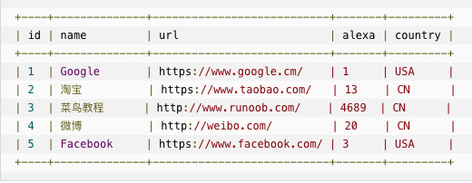

一个数据库通常包含一个或多个表。每个表有一个名字标识（例如:"Websites"）,表包含带有数据的记录（行）。

在本教程中，我们在 MySQL 的 RUNOOB 数据库中创建了 Websites 表，用于存储网站记录。
> SQL 对大小写不敏感：SELECT 与 select 是相同的。

- use RUNOOB; 命令用于选择数据库。
- set names utf8; 命令用于设置使用的字符集。
- SELECT * FROM Websites; 读取数据表的信息
- SELECT - 从数据库中提取数据
- UPDATE - 更新数据库中的数据
- DELETE - 从数据库中删除数据
- INSERT INTO - 向数据库中插入新数据
- CREATE DATABASE - 创建新数据库
- ALTER DATABASE - 修改数据库
- CREATE TABLE - 创建新表
- ALTER TABLE - 变更（改变）数据库表
- DROP TABLE - 删除表
- CREATE INDEX - 创建索引（搜索键）
- DROP INDEX - 删除索引

#### 1. 基础关键字
下面是选自 "Websites" 表的数据

1. DISTINCT
```
关键词用于返回唯一不同的值。在表中，一个列可能会包含多个重复值，有时您也许希望仅仅列出不同（distinct）的值
SELECT DISTINCT column_name,column_name  FROM table_name
SELECT DISTINCT country FROM Websites // 从 "Websites" 表的 "country" 列中选取唯一不同的值，也就是去掉 "country" 列重复值：

```
2.  WHERE
```
用于提取那些满足指定条件的记录
SELECT column_name FROM table_name WHERE column_name operator value
SELECT * FROM Websites WHERE country='CN' // 从 "Websites" 表中选取国家为 "CN" 的所有网站
```
3. OR && AND
```
SELECT * FROM Websites WHERE country='USA' OR country='CN';
从 "Websites" 表中选取国家为 "USA" 或者 "CN" 的所有客户
```
4. ORDER BY 
```
关键字用于对结果集按照一个列或者多个列进行排序
ORDER BY 关键字默认按照升序对记录进行排序。如果需要按照降序对记录进行排序，您可以使用 DESC 关键字
SELECT * FROM Websites ORDER BY alexa; // 从 "Websites" 表中选取所有网站，并按照"alexa" 列排序
```
5. INSERT INTO
INSERT INTO 语句用于向表中插入新记录
```
第一种形式无需指定要插入数据的列名，只需提供被插入的值即可：
INSERT INTO table_name VALUES (value1,value2,value3,...);

第二种形式需要指定列名及被插入的值：
INSERT INTO table_name (column1,column2,column3,...) VALUES (value1,value2,value3,...);

INSERT INTO Websites (name, url, alexa, country)
VALUES ('百度','https://www.baidu.com/','4','CN')
```
6. UPDATE
UPDATE 语句用于更新表中已存在的记录
```
把 "菜鸟教程" 的 alexa 排名更新为 5000，country 改为 USA
UPDATE Websites SET alexa='5000', country='USA' WHERE name='菜鸟教程';
```
7. DELETE
DELETE 语句用于删除表中的记录
```
我们要从 "Websites" 表中删除网站名为 "Facebook" 且国家为 USA 的网站
DELETE FROM Websites WHERE name='Facebook' AND country='USA
```
#### 2. 高级关键字
1. LIMIT

用于规定要返回的记录的数目
> 注意:并非所有的数据库系统都支持 SELECT TOP 语句。 MySQL 支持 LIMIT 语句来选取指定的条数数据， Oracle 可以使用 ROWNUM 来选取。
```
// MYSQL中
从 "Websites" 表中选取头两条记录
SELECT * FROM Websites LIMIT 2;

// Microsoft SQL Server 
从 websites 表中选取前面百分之 50 的记录
SELECT TOP 50 PERCENT * FROM Websites;
```
2. LIKE 操作符
LIKE 操作符用于在 WHERE 子句中搜索列中的指定模式
```
选取 name 以字母 "G" 开始的所有客户
SELECT * FROM Websites WHERE name LIKE 'G%';

选取 name 以字母 "k" 结尾的所有客户
SELECT * FROM Websites
WHERE name LIKE '%k';

"%" 符号用于在模式的前后定义通配符（默认字母）
```
### 3. 通配符
通配符可用于替代字符串中的任何其他字符。在 SQL 中，通配符与 SQL LIKE 操作符一起使用，SQL 通配符用于搜索表中的数据。


```
SELECT * FROM Websites WHERE url LIKE 'https%'; // 选取 url 以字母 "https" 开始的所有网站
SELECT * FROM Websites WHERE url LIKE '%oo%'; //下面的 SQL 语句选取 url 包含模式 "oo" 的所有网站
SELECT * FROM Websites
WHERE name LIKE '_oogle'; // 选取 name 以一个任意字符开始，然后是 "oogle" 的所有客户
```
