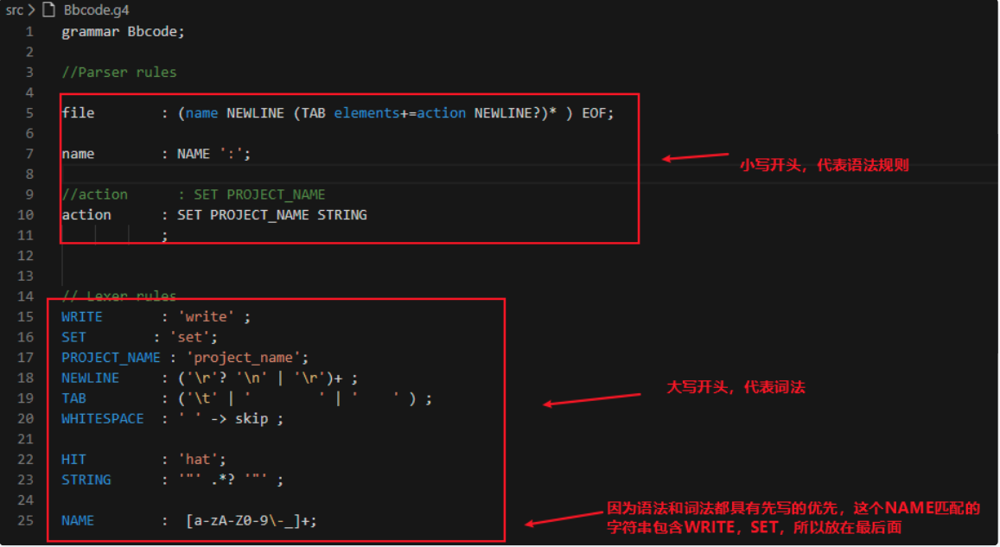

## antlr
antlr是一个包含了词法分析,语法分析两大模块的工具，并且提供了大量主流语言的现成的语法描述grammar文件

使用antlr你可以将某种语言的代码文件，以纯文本字符串的方式输入，被antlr整理分析成一个语法树，一个可以清晰地从树状结构里，看到代码真正的逻辑的结构化数据

### 使用
#### 语法
以Bbcode.g4 为例


#### antlr4ts Getting started

1. Install antlr4ts as a runtime dependency using your preferred package manager.
```
npm install antlr4ts --save 
或
yarn add antlr4ts
```
2. Install antlr4ts-cli as a development dependency using your preferred package manager.
```
npm install antlr4ts-cli --save-dev
或
yarn add -D antlr4ts-cli
```
3. 使用
- Add a grammar to your project, e.g. path/to/MyGrammar.g4

- Add a script to package.json for compiling your grammar to TypeScript

```
"scripts": {
  // ...
  "antlr4ts": "antlr4ts -visitor path/to/MyGrammar.g4"
}
```
- Use your grammar in TypeScript
```
import { ANTLRInputStream, CommonTokenStream } from 'antlr4ts';

// Create the lexer and parser
let inputStream = new ANTLRInputStream("text");
let lexer = new MyGrammarLexer(inputStream);
let tokenStream = new CommonTokenStream(lexer);
let parser = new MyGrammarParser(tokenStream);

// Parse the input, where `compilationUnit` is whatever entry point you defined
let result = parser.compilationUnit();
```

> 为什么要用antlr4ts, 而不是直接用antlr. 事实上antlr4ts只是antlr的ts运行时实现, antlr4默认支持 java, c#, go, python等运行时. 也就是我们可以用其他语言解析grammar. 但是生成其他语言的lexer, parser等需要antlr4 tool (这是由java写的)

#### antlr4 

文档：https://github.com/antlr/antlr4/blob/master/doc/javascript-target.md


【参考】
- [Getting Started with ANTLR v4](https://github.com/antlr/antlr4/blob/master/doc/getting-started.md)
- [从antlr扯淡到一点点编译原理](https://awhisper.github.io/2016/11/18/%E4%BB%8Eantlr%E5%88%B0%E8%AF%AD%E6%B3%95%E8%A7%A3%E6%9E%90/)
- [使用antlr4构造我的语法树](https://cloud.tencent.com/developer/article/1571188)
[antlr4ts - TypeScript/JavaScript target for ANTLR 4](https://www.npmjs.com/package/antlr4ts/v/0.5.0-alpha.2)
[使用antlr4, 用ts/js还原protobuf生成的java代码为pb (一)](https://www.jianshu.com/p/e54011f407e9)