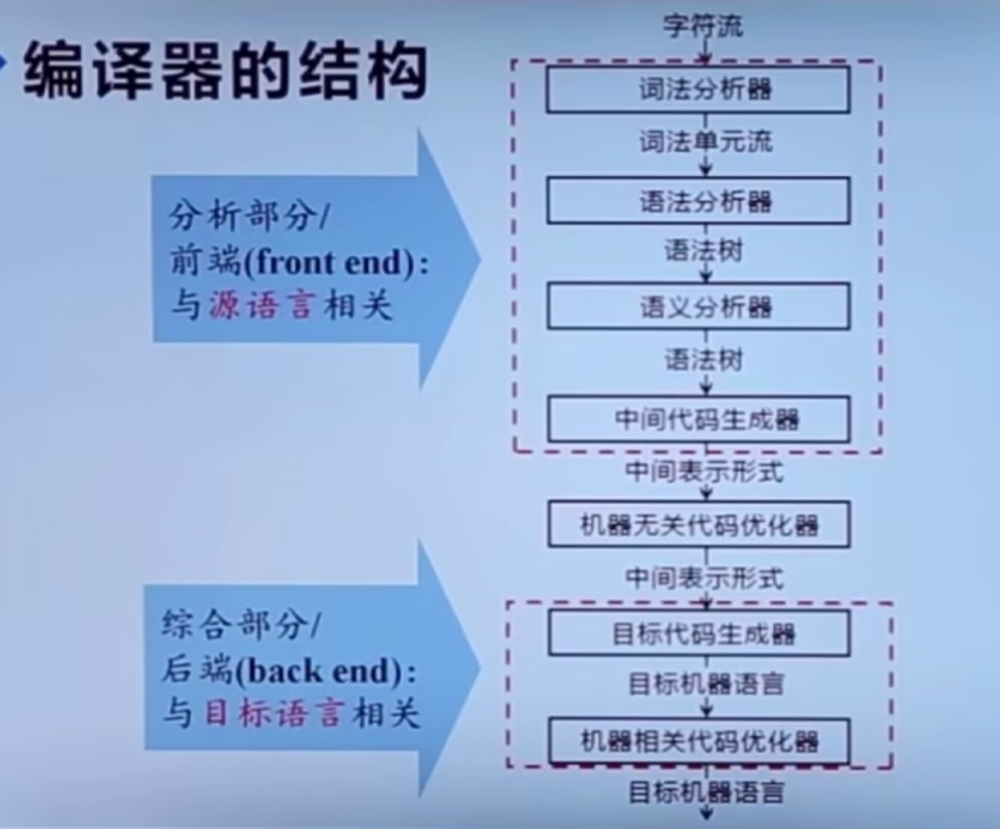
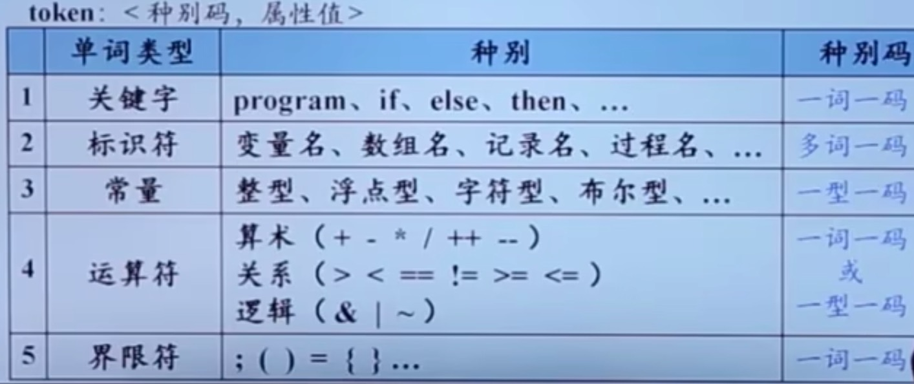
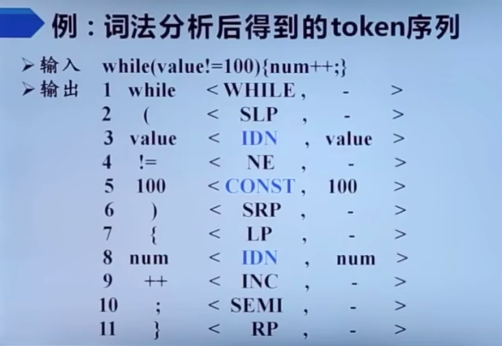
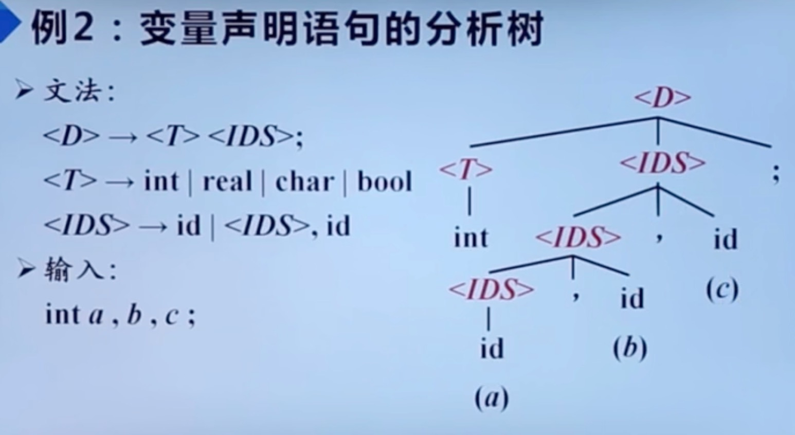

### 1. 词法分析
从左到右逐行扫描源程序的字符，识别出各个单词，确定单词的类型。将识别出的单词转换成统一的机内表示 --- 词法单元（token）形式
token：<识别码，属性值>

### 2. 语法分析（Parsing）
语法分析器（parser）从词法分析器输出的 token 序列中，识别出各种短语，并构造成”语法分析树“（Parsing Tree）

### 3. 语义分析
主要任务：

1. 收集标识符的属性信息
- 种属 Kind
  - 简单变量、复合变量（数组、记录...）、过程...
- 类型 Type
  - 整形、字符型、布尔型、指针型...
- 存储位置、长度
- 值
- 作用域
- 参数和返回值信息
2. 语义检查
- 变量名未经声明便使用
- 变量或过程名重复
....

### 4. 中间代码生成
 

### 5. 编译器后端

