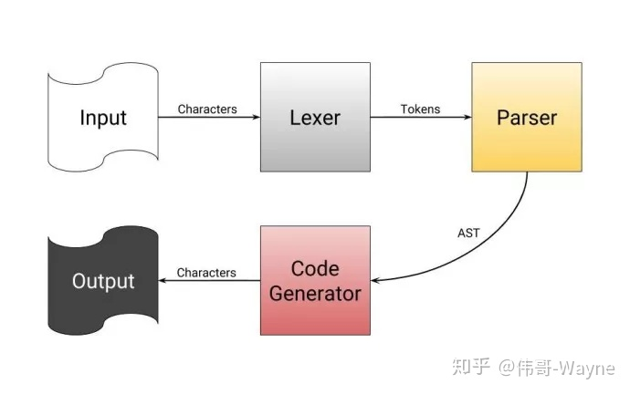
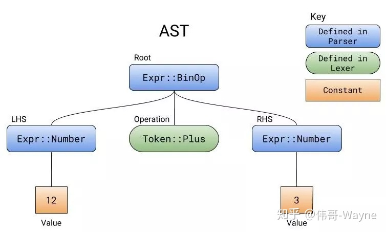
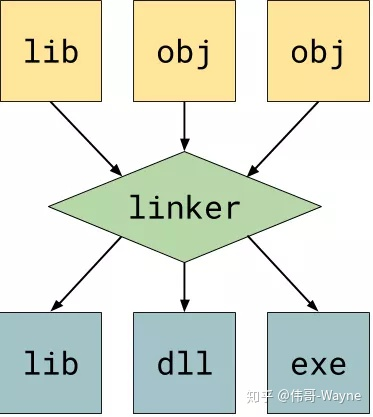

### 编译器
#### 1. 编译器是什么？
编译器读入一个文本文件，经过大量的处理，最终产生一个二进制文件。 编译器的语言部分就是它处理的文本样式。因为电脑只能读取 1 和 0 ，而人们编写 Rust 程序要比直接编写二进制程序简单地多，因此编译器就被用来把人类可读的文本转换成计算机可识别的机器码。

编译器可以是任何可以把文本文件转换成其他文件的程序。例如，下面有一个用 Rust 语言写的编译器把 0 转换成 1，把 1 转换成 0 ：

#### 编译器做什么？
简言之，编译器获取源代码，产生一个二进制文件。因为从复杂的、人类可读的代码直接转化成0/1二进制会很复杂，所以编译器在产生可运行程序之前有多个步骤：


1. 从你给定的源代码中读取单个词。
2. 把这些词按照单词、数字、符号、运算符进行分类。
3. 通过模式匹配从分好类的单词中找出运算符，明确这些运算符想进行的运算，然后产生一个运算符的树（表达式树）。
4. 最后一步遍历表达式树中的所有运算符，产生相应的二进制数据。

尽管我说编译器直接从表达式树转换到二进制，但实际上它会产生汇编代码，之后汇编代码会被汇编/编译到二进制数据。汇编程序就好比是一种高级的、人类可读的二进制。



### 解释器
类似于编译器，跳过了代码生成，然后及时编译并执行AST。编译器编译一个程序可能在一秒到几分钟不等，然而解释器可以立即开始执行程序，而不必编译。解释器最大的缺点在于它必须安装在用户电脑上，程序才可以执行。


### 词法分析
第一步是把输入一个词一个词的拆分开。

例如：
```
input: "12+3"
[Number(12), Plus, Number(3)]
```
[play.rust...](https://play.rust-lang.org/?gist=070c3b6b985098a306c62881d7f2f82c&version=stable&mode=debug&edition=2015)


### 解析
解析器确实是语法解析的核心。解析器提取由词法分析器产生的标记，并尝试判断它们是否符合特定的模式，然后把这些模式与函数调用，变量调用，数学运算之类的表达式关联起来。 解析器逐词地定义编程语言的语法。

例如：
[paly.rust...](https://play.rust-lang.org/?gist=205deadb23dbc814912185cec8148fcf&version=stable&mode=debug&edition=2015)
```
input: "12+3"
tokens: [Number(12), Plus, Number(3)]
ast: BinOp(
    Plus,
    Number(
        12,
    ),
    Number(
        3,
    ),
)
```
解析器在解析时产生的树状结构被称为 抽象的语法树，或者称之为 AST。用 // BEGIN PARSER // 和 // END PARSER // 的注释标记出了新的解析器代码的开头和结尾。

### 代码生成器 
接收一个 AST ,然后生成相应的代码或者汇编代码。在生成汇编代码之后，这些汇编代码会被写入到一个新的汇编文件中 (.s 或 .asm)。然后该文件会被传递给汇编器，汇编器是汇编语言的编译器，它会生成相应的二进制代码。之后这些二进制代码会被写入到一个新的目标文件中 (.o) 。

目标文件是机器码，但是它们并不可以被执行。 为了让它们变成可执行文件，目标文件需要被链接到一起。链接器读取通用的机器码，然后使它变为一个可执行文件、共享库或是 静态库。


【参考】

[人人都能读懂的编译器原理](https://zhuanlan.zhihu.com/p/53336801)