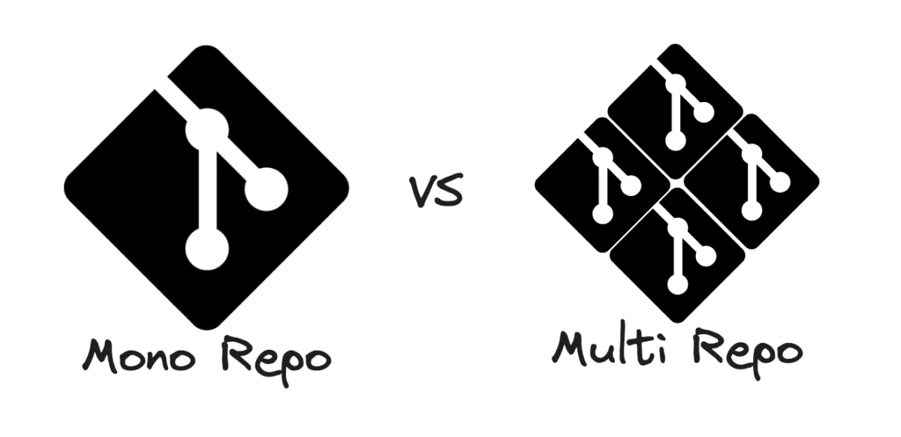
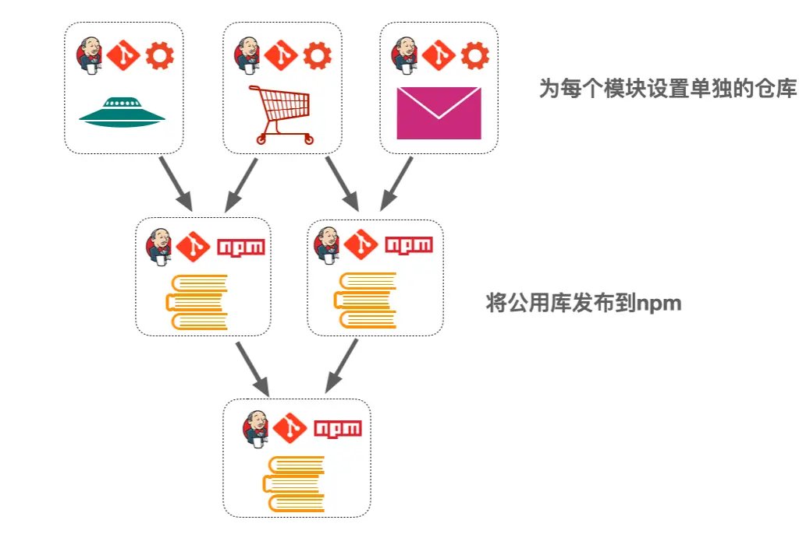
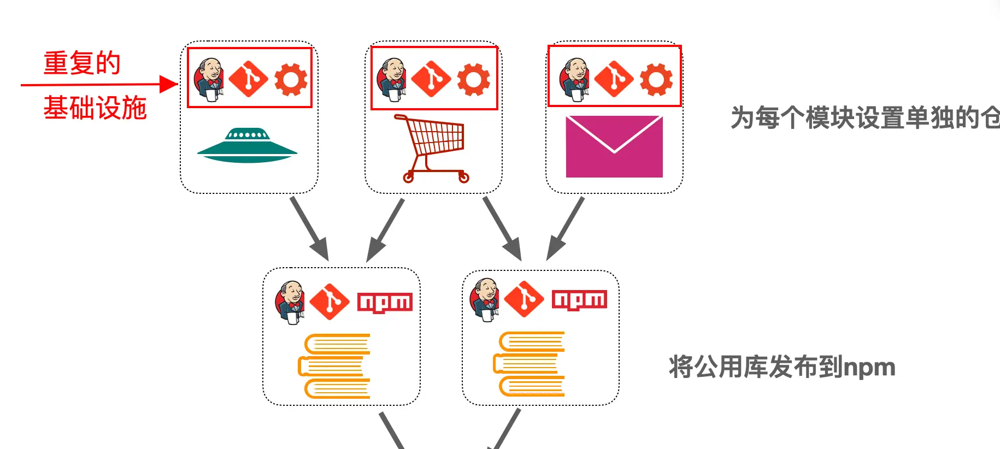
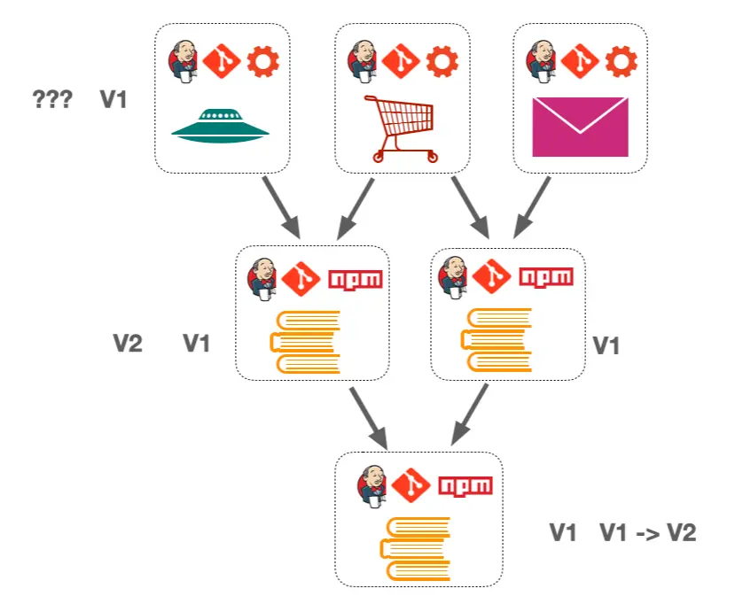
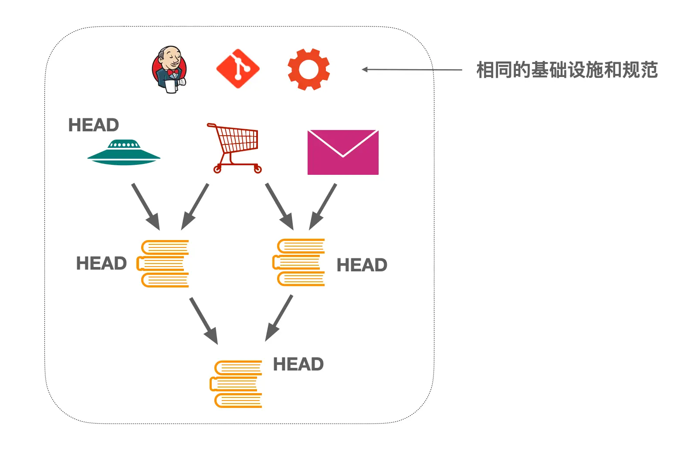
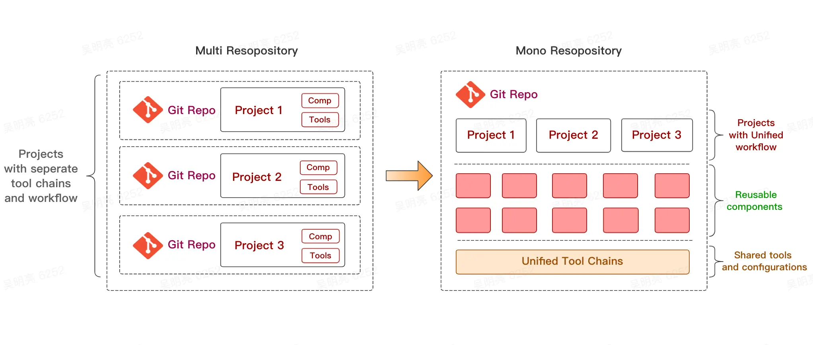
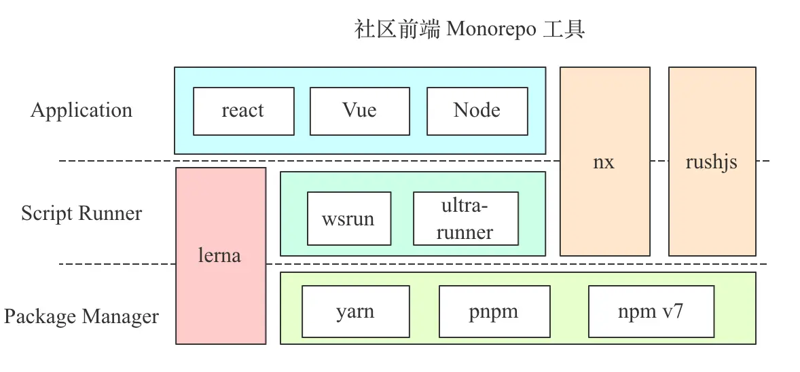
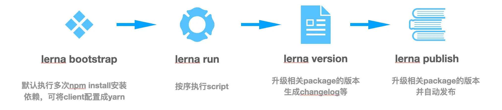

# 浅析 Eden Monorepo 工程化建设
# 一、前言
Monorepo 即代码的单仓库维护方式，已经在 Google、Facebook、微软等公司使用了很多年，该模式的主要特点是将所有代码都集中到一个仓库中管理。与 Monorepo 相对的是 Multirepo（或Polyrepo），该模式下每个模块都有独立的仓库。Monorepo 是目前前端开源项目的趋势之一，Vue3、Yarn2 等知名项目均改用 Monorepo。

而对于业务项目 Monorepo，目前的普及还不太广，而业务型的 Monorepo 其实也能给业务开发带来很大的便利。本文主要介绍业务型 Monorepo，系统介绍了为什么使用 Monorepo，以及 业务型 Monorepo 的工程化建设。

# 二、Monorepo简介
## 1. 什么是Monorepo？
Monorepo是一种代码管理模式，将多个项目组织到一个Repo中。Monorepo具有如下特点：

- 子项目是独立的，可以独立开发、测试、部署
- 子项目类型可以是任意的，可以是 web 项目、server 项目或者 library 项目等
- 子项目间可能有依赖关系，例如一些顶层的项目会依赖于底层项目暴露的 API

对于前端而言，Monorepo 的子项目可以大概分为两类：

- 业务型子项目：子项目是需要部署上线的，例如基于 React 的业务项目，该类型的子项目的特点是不不需要 publish 到 npm registry
- lib 型子项目：通常意义的前端 package，特点是需要 publish 到 npm registry。该类型 Monorepo 在开源项目中非常常见，例如 React、Vue3、npm7、Babel 等。

本文重点关于业务型的 Monorepo，即将多个业务应用（React、Node等）及其依赖（组件库、公用工具库等）集中到一个仓库中管理的模式，如下图：

目前全球知名的互联网公司：Google、Facebook、MicroSoft、twitter等都在使用 Monorepo 管理其源代码，Google 甚至将整个公司的代码都放到一个仓库中，仓库大小可以达到80TB。Monorepo为什么会被广泛采用呢？有哪些优势呢？

## 2.为什么使用Monorepo？
随着业务的不断增长，一个团队往往会同时维护和迭代多个项目，这些项目之间往往需要共享代码（组件库、工具函数等等）、共享基础设施（构建工具、lint等）。而在 MultiRepo 模式中，跨项目的代码共享其实是非常麻烦的，常用的方式是将公共代码提取出来成一个单独的仓库，然后将公用仓库的产物发布到 npm registry——一般复用组件库就是这种形式：

在上图中，每一个顶层的 App 都在一个单独的仓库中，都有自己的一套基础设施、 流程等，这些App 的共用部分被拆分到独立的仓库中，作为 npm 依赖引入。这看起来是个不错的解决方案，但是也会有一些问题：

1. 重复的基础设施：每个项目都需要单独设置流程、配置开发环境，配置部署发布流程。这样的重复可能带来不一致性，使用不一致的构建设施、规范等。将会大大提高多项目的基建维护成本，每个项目的基建都需要专人维护，而且随着时间的推移，项目越来越大，相应的基建维护成本也会越来越高。同时开发多个项目时，也会有比较大的项目切换成本。

2. 割裂的工作流：多个项目组成的工程体系是不连续的，每一个仓库都有自己的一套工作流程。当进行多项目协作开发的时候，整体的工作流是割裂的：假如需要修改公共库的一个函数，首先需要修改/调试公共库的仓库（跨项目的调试就很困难），然后跑工具库的 CI 流程，然后升级需要使用该函数 App 的依赖，然后调试、App，这一套流程非常的繁琐并且不连续。
3. 复杂的版本管理：仓库之间的依赖关系随着时间管理会变得复杂，最开始版本都是1.0.0，但是随着版本迭代，项目1升级到了v2，其他依赖的项目可能升级了，也可能没有升级。时间越长，版本依赖关系就越混乱。混乱的版本会降低项目的可维护性，并且导致一些玄学问题，例如明明相同的配置，A项目work，B项目报错，一般都是依赖版本导致的。

采用 Monorepo 的形式管理代码可以很好解决这些问题：

1. **统一的基建：** 一套工具、规范落地所有项目，无需重复切换开发环境，极大减轻多项目协作开发的成本。只需要为 Monorepo 配置好基础设施，后续所有新建的项目都可以复用已有的基建，只需要 1-2 个同学维护所有项目的基建，基建成本大大降低。
2. **一致的工作流：** 当工具库升级以后，顶层应用可以同时感知到其依赖的升级，能够非常方便的调试工具库的修改，并开发完成后自动触发相关项目的测试发布流程，极大简化多项目的管理并且实现自动化。
3. **简化的依赖管理：** 所有的项目都使用HEAD上的代码，项目间的依赖关系是直接而清晰的。当然这在更改公共代码的时候要更加注意break change，以及需要更加完备的。
4. **代码共享和团队协作能力：** 在Monorepo中能非常方便的复用代码，同时能够方便的检索到各项目的源码，能够降低团队成员间的沟通协作成本。

总而言之，**Monorepo 能够将多个独立，各自为战的项目，变成一个统一的工程整体**，多项目具有高度一致性以及更高的复用和抽象能力：

# 三、社区 Monorepo 工具调研
目前前端 Monorepo 有许多的开源工具，这些工具的大概分为三层：  

上层的工具依赖下层工具提供的能力：

- 最底层是 Package Manager，例如 npm、yarn、pnpm，提供 Monorepo 下的依赖管理、依赖安装能力；
- 再上层是 Script Runner，例如 lerna、wsrun，提供在 Monorepo 中以某种顺序调用子项目的 script 或者在子项目下执行某个命令的能力
- 最上层是 Application，例如 nx、rushstack，集成了 react、node server 等脚手架，为 Monorepo 子项目的开发、构建、测试等工程能力提供了支持

## 1. Package Manager
> 在各 Package Manager 中，Monorepo 中的子项目称为一个 workspace，多个 
> workspace 构成 workspaces

支持 workspaces 特性的 package manager，一般用于 Monorepo 中的依赖安装。目前前端最常用的Package Manager有npm、yarn、pnpm，对workspaces特性都有一定的支持：

- npm：npm从 v7 开始支持 workspaces，从node 15开始内置npm 7
- yarn：已经稳定支持 workspaces
- pnpm：已经稳定支持 workspaces

在 workspaces 模式下，package manager 会分析整个 Monorepo 下的所有 workspace，对所有 workspace 统一安装外部依赖，并且 link 依赖的本地 workspace 到 node_modules下。 Package Manager 的 workspaces 特性适合作为 Monorepo 的依赖管理方案，但是依赖管理是非常底层的能力，对于业务型的 Monorepo 而言，子项目的初始化、构建、部署都需要一整套工具链的支持。

## 2. Lerna
lerna是目前使用最为广泛的 Monorepo 工具之一，提供了依赖安装、自动升级多个项目的版本号并发布、批量在多个项目中按序执行特定命令的能力，lerna 的常用命令如下图： 

lerna的能力即 Package Manager 和 Script Runner 的整合，在面向库的 Monorepo 中使用非常广泛，被开源项目和内部的工具库项目广泛采用。但是对于面向业务的 Monorepo，Lerna 缺乏构建、测试相应工具链的支撑。而且当 Monorepo 持续增大以后，lerna 不支持增量构建、测试，缺乏 scale 能力。

## 3. 集成的 monorepo 工具
集成的 monorepo 工具基于上述 Package Manager，在其基础上集成了Script runner、构建工具、测试工具等，常用的工具有 rushstack、nx 等。rushstack 是基于 rushjs 的一套 Monorepo 解决方案，相较于 lerna 等工具，其提供了 webpack、jest 等常用工具的封装，并提供了增量构建的能力。nx 的建设相较于 rush 更加的顶层，提供了 React、React Native、Next 等技术栈的工程化支持。

rushstack 和 nx 这类集成的 Monorepo 工具，相较于底层的工具提供了较为全面的工程化能力的支持，适合支持业务型 Monorepo 的研发。

## 4. 小结
对于较底层的工具，比如 yarn、pnpm、lerna 等，这些工具仅仅用于依赖安装，或者按序调用 script，难以支撑起整个 Monorepo 的研发，缺乏整体工程化能力 和 scale 的能力。对于顶层的工具，比如 rushstack、nx 等，提供了较全的工程化能力，有一套完整的 Monorepo 工程设施，这类工具比较适用于业务型 Monorepo 的研发，不过集成工具必然有自己的生态体系和技术栈，与现有的基础设施可能冲突。

# 四、 Monorepo 工程化方案简介
Monorepo 并不是简简单单将多个项目杂糅在一个仓库里面，而是将多个项目作为一个工程整体，收敛到一个仓库中管理。Monorepo 需要一套完整的工程化体系来支撑多项目的初始化、开发、构建、CI/CD 等，并且 Monorepo 对多项目研发效率、性能和质量有更高的要求。

Eden Monorepo 的目标是提供一整套 Monorepo 的工程化解决方案，基于 Eden 生态建设，覆盖 web、、跨端（、RN） 等一系列场景，在复用 Monorepo 优势的基础上，通过工程化的手段解决 Monorepo 的效率、性能、质量问题。

1. Eden Monorepo 方案总览
Eden 的 Monorepo 方案覆盖了 Monorepo 子项目的全部研发流程，并且提供了相应的工具支撑和规范体系，为 Monorepo 赋予强大的工程化能力：

