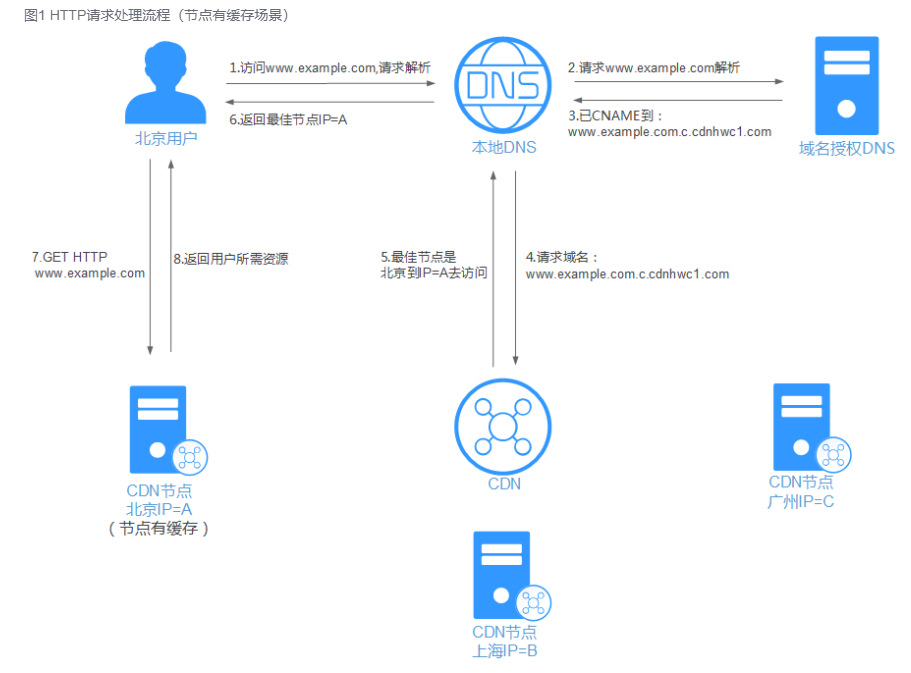
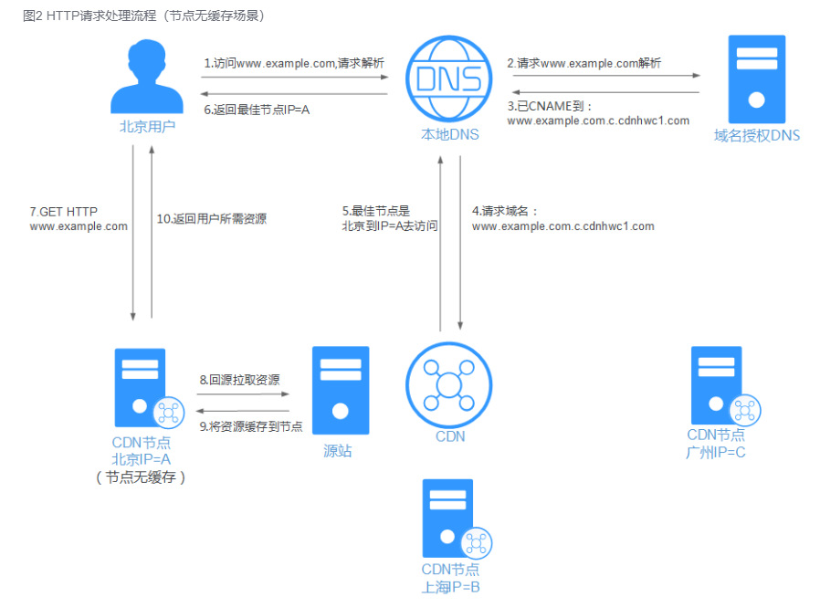

# DNS
什么是DNS？
DNS，英文全称为：Domain Name System，中文译名：域名系统。
本质上，是存储域名和IP地址映射关系的分布式服务。
它将人类可读的域名，转换成数字IP地址，供计算机之间相互连接。

DNS的工作原理

# CDN 
**什么是 CDN？**

CDN，英文全名：Content Delivery Network，即内容分发网络。
它是构建在现有互联网基础上的一层智能虚拟网络。
通过现实世界，部署在各个地区的物理实体节点服务器，提供内容给用户就近访问。
CDN服务器的本质，是存储源服务器分发的资源，也即资源副本，供用户就近访问，缩短用户查看内容的访问延迟。
比如，Leon公司，源服务器部署在英国，并在中国和英国都部署有CDN服务器。则中国的用户，只需要访问中国CDN服务器即可，不需要通过路由多层转发，访问英国的源服务器。依此，提高网络资源的访问速度。

**CDN的好处**
CDN服务器，可以解决 网络带宽小、用户访问量大、网点分布不均匀等问题，并提高用户访问网站的响应速度，增强网站的可用性。

**CDN怎么工作？**
**CDN加速原理**
浏览器发起HTTP请求到本地DNS服务器，本地DNS服务器使用CNAME的方式，将资源域名重定向到CDN服务，依靠CDN的策略，查找到最佳CDN节点IP。浏览器访问该节点，用最短访问时延，下载所需的资源。

## CNAME记录/CNAME域名
CNAME（Canonical Name）记录，指域名解析中的别名记录，用来把一个域名解析到另一个域名（CNAME域名），再由CNAME域名来解析到需要访问的服务器IP地址。

--- 
以下是 阿里云 的使用文档~ 

CNAME域名，是CDN生成的，当您在阿里云CDN控制台添加加速域名后，系统会为加速域名分配一个*.*kunlun*.com形式的CNAME域名。

> 说明
> 阿里云CDN产品通过分布广泛的CDN节点来为最终用户提供加速服务，不同区域或者不同运营商的用户访问到的CDN节点IP地址是不同的，因此加速域名就无法通过DNS的A记录> 解析的方式唯一解析到某个IP地址，这个时候就引入了CNAME域名。

添加加速域名后，您需要在您的DNS解析服务商处，添加一条CNAME记录，将加速域名唯一解析到CNAME域名，记录生效后域名解析就正式转向CDN服务，该域名所有的请求都将转向CDN的节点，达到加速效果。CNAME域名将会解析到具体哪个CDN节点IP地址，将由CDN的调度系统来综合区域、运营商、节点资源水位等多个条件来决定。

---

**CDN加速原理**
浏览器发起HTTP请求到本地DNS服务器，本地DNS服务器使用CNAME的方式，将资源域名重定向到CDN服务，依靠CDN的策略，查找到最佳CDN节点IP。浏览器访问该节点，用最短访问时延，下载所需的资源。

**工作流程**
- CDN节点有缓存

- CDN 无缓存

参考文档：
- https://www.cnblogs.com/walls/p/16256635.html
- [阿里云-基本概念](https://www.alibabacloud.com/help/zh/cdn/product-overview/terms?spm=a2c63.p38356.0.i2)

