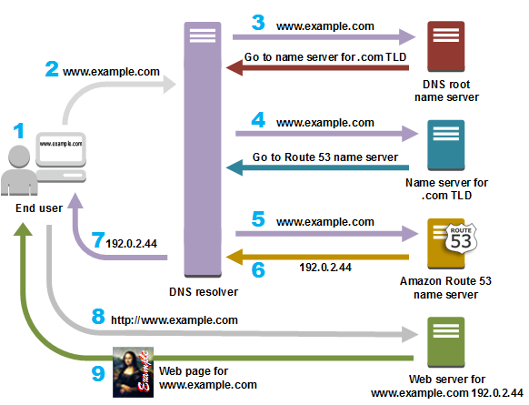

# DNS
什么是DNS？
DNS，英文全称为：Domain Name System，中文译名：域名系统。
本质上，是存储域名和IP地址映射关系的分布式服务。
它将人类可读的域名，转换成数字IP地址，供计算机之间相互连接。

## DNS的工作原理

# CDN 

## 什么是 CDN？

CDN，英文全名：Content Delivery Network，即内容分发网络。
它是构建在现有互联网基础上的一层智能虚拟网络。
通过现实世界，部署在各个地区的物理实体节点服务器，提供内容给用户就近访问。
CDN服务器的本质，是存储源服务器分发的资源，也即资源副本，供用户就近访问，缩短用户查看内容的访问延迟。
比如，Leon公司，源服务器部署在英国，并在中国和英国都部署有CDN服务器。则中国的用户，只需要访问中国CDN服务器即可，不需要通过路由多层转发，访问英国的源服务器。依此，提高网络资源的访问速度。

## CDN的好处

CDN服务器，可以解决 网络带宽小、用户访问量大、网点分布不均匀等问题，并提高用户访问网站的响应速度，增强网站的可用性。

