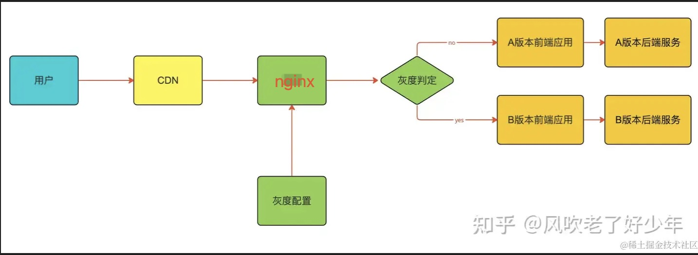

## 当前灰度方案

## 访问前端资源，不经过网关，直接访问 CDN

其中涉及几个问题？

1. 如何实现 API 接口的调用？

第一种情况，domain 与 API 二级域名不同，所以 DNS 后，会找到 服务 ip。
如果域名相同的话，经过 DNS 解析，会解析到 CDN ip，经查阅，CDN 是有转发的能力的

2. 如何实现版本迭代呢？

- 方式一：目前我们 cdn 缓存时间，我们设置了 s-maxage=300，即：缓存 5 min。5 min 后会从回源，从而会实现资源的刷新
- 方式二：我们可以强制刷新 CDN，公司内部的基建平台 - CDN 模块，提供强制刷新的能力
