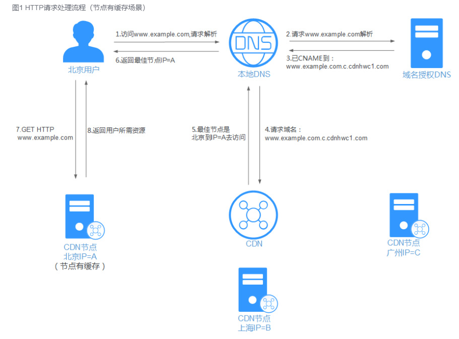
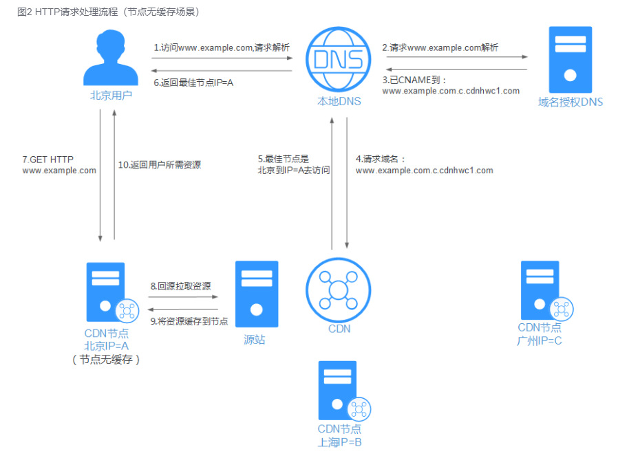

# 访问前端资源，不经过网关，直接访问 CDN

# **CDN怎么工作？**

浏览器发起HTTP请求到本地DNS服务器，本地DNS服务器使用CNAME的方式，将资源域名重定向到CDN服务，依靠CDN的策略，查找到最佳CDN节点IP。浏览器访问该节点，用最短访问时延，下载所需的资源。

### CNAME记录/CNAME域名
CNAME（Canonical Name）记录，指域名解析中的别名记录，用来把一个域名解析到另一个域名（CNAME域名），再由CNAME 域名来解析到需要访问的服务器IP地址。

--- 
以下是 阿里云 的使用文档~ 

CNAME域名，是CDN生成的，当您在阿里云CDN控制台添加加速域名后，系统会为加速域名分配一个*.*kunlun*.com形式的CNAME域名。

> 说明
> 阿里云CDN产品通过分布广泛的CDN节点来为最终用户提供加速服务，不同区域或者不同运营商的用户访问到的CDN节点IP地址是不同的，因此加速域名就无法通过DNS的A记录> 解析的方式唯一解析到某个IP地址，这个时候就引入了CNAME域名。

添加加速域名后，您需要在您的DNS解析服务商处，添加一条CNAME记录，将加速域名唯一解析到CNAME域名，记录生效后域名解析就正式转向CDN服务，该域名所有的请求都将转向CDN的节点，达到加速效果。CNAME域名将会解析到具体哪个CDN节点IP地址，将由CDN的调度系统来综合区域、运营商、节点资源水位等多个条件来决定。

---

## **工作流程**
### CDN节点有缓存

1. 用户在浏览器输入网站域名www.example.com，浏览器向本地DNS服务器发起域名解析请求
域名解析请求，被本地DNS服务器转发到域名授权DNS服务
2. 域名授权DNS查找到，域名通过CNAME，映射到www.example.com.c.cdnhwc1.com，返回给本地DNS服务器
本地DNS服务器，访问www.example.com.c.cdnhwc1.com对应的CDN服务器
3. CDN服务器对域名进行解析，使用CDN策略，查找出最佳的CDN节点的IP地址，返回给本地DNS服务器
4. 本地DNS服务器返回CDN节点IP地址给浏览器
5. 浏览器得到域名www.example.com对应的IP地址后，向该IP地址（CDN节点）发出请求
6. CDN节点将用户请求的资源进行返回

### CDN 无缓存

前7步的流程，和CDN节点有缓存的情况一致。

区别是：访问的CDN节点，没有资源副本，需要先向源服务器拉取资源，缓存到CDN节点后，再返回给浏览器。

增加的步骤解析：
7. 浏览器的请求到达CDN节点，CDN节点在本地缓存查找不到资源
8. CDN节点请求源服务器（ps: 也可以是上级缓存服务器），拉取用户所需的资源
9. CDN节点将拉取的资源缓存到本地
10. CDN节点将用户请求的资源进行返回

参考文档：
- https://www.cnblogs.com/walls/p/16256635.html
- [阿里云-基本概念](https://www.alibabacloud.com/help/zh/cdn/product-overview/terms?spm=a2c63.p38356.0.i2)

## QA

其中涉及几个问题？

### 1. 如何实现 API 接口的调用？

第一种情况，domain 与 API 二级域名不同，所以 DNS 后，会找到 服务 ip。
如果域名相同的话，经过 DNS 解析，会解析到 CDN ip，经查阅，CDN 是有转发的能力的

### 2. 如何实现版本迭代呢？

- 方式一：目前我们 cdn 缓存时间，我们设置了 s-maxage=300，即：缓存 5 min。5 min 后会从回源，从而会实现资源的刷新
- 方式二：我们可以强制刷新 CDN，公司内部的基建平台 - CDN 模块，提供强制刷新的能力
