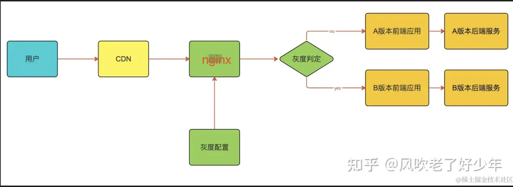

# 我们的方案
目前我们的灰度方案：

目前的思路是让 CDN 完全不做缓存（即所有请求透传至源站）

原因：举例来说，当我们需要部署灰度环境时，目前线上运行版本 Version A，CDN 节点已缓存该版本的静态资源（如 JS、CSS、图片等）。此时需部署新版本Version B并进行灰度发布，目标是让部分用户访问时直接命中 Version B。然而，若 CDN 节点仍返回缓存的 Version A 资源，将导致灰度策略失效。

# 其它方案
灰度方案主要分为两类：  

1. 仅前端页面灰度：该场景下需确保后端接口向前兼容，以支持不同版本前端页面的正常调用。  
2. 前后端串联灰度：前端页面与后端接口同步进行灰度发布，实现端到端的版本一致性验证。

## 前端灰度灰度策略：
支持 4 个维度的灰度
- Header
- Cookie
- query
- 系统内置
这个属于定制的一些规则，目前支持 3 种：username、群、pathname

架构本质是通过控制调用不同的 html 文件，html 里调用其对应的 JS、CSS

## 前后端串联灰度
> 本文档仅供参考

- 请求打标：在请求入口（如网关）为特定用户 / 流量添加特殊标识（如 HTTP Header 中的x-canary: true）。
- 标签传递：该标识在微服务调用链中透传
- 路由决策：下游服务根据标签值决定返回新版本或旧版本逻辑

灰度方案整体链路如下：
流量经过 TLB（TouTiao Blance）后，全部打向 AGW（hybird.apigateway.proxy）
AGW 配置了脚本，请求灰度配置，并对流量（Header）进行染色
AGW 集成了ByteMesh 的能力，可以根据上面的染色标记，将流量打入对应的目标服务的不同集群（default | grey ）