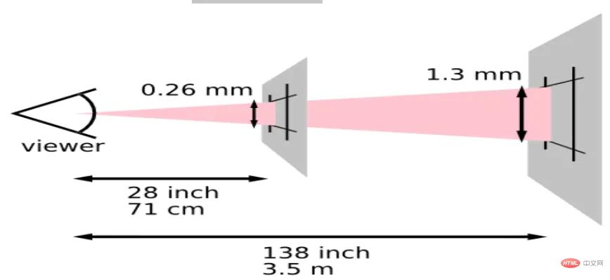

## 1. 分辨率

屏幕的分辨率是物理像素：设备屏幕实际拥有的像素点。购买显示设备或拍摄视频的时候，经常会遇到分辨率的术语

720p: 1280 x 720, 称为 HD（中文译为"高清"）
1080p: 1920 x 1080, 称为 FULL HD（中文称为全高清）
1440p: 2560 x 1440, 称为 QHD 或 Quad HD，即 4 倍的 HD 称为 2k
2160p: 3840 x 2160, 称为 4K
4320p: 7680 x 4320, 称为 8K

## 常见概念

#### Window.devicePixelRatio

Window 接口的 devicePixelRatio 返回当前显示设备的物理像素分辨率与 CSS 像素分辨率之比。

#### PPI

PPI (Pixels Per Inch) refers display resolution, or, how many individual pixels are displayed in one inch of a digital image.

#### DPI

DPI (Dots Per Inch) refers to printer resolution, or, the number of dots of ink on a printed image.

#### Physical Size

The physical size of an image refers to the dimensions in which it would print (ex: 8.5" x 11") or the pixels dimensions of an image displayed on the web (ex: 600 pixels x 800 pixels).

#### Memory Size

The memory size is how much memory an image file takes up on a hard drive. For example, a JPG image saved on a computer may be 2 MB (megabytes), meaning that it will require 2MB of space on a drive to store that image.

#### 分辨率

分辨率说的是虚拟像素，也就是我们前端会用到的像素

#### pixel

像素单位被认为是许多其他单位的测量基础。实际上 px 是一个按角度度量的单位，即像素角度。

像素角度：1 个参考像素即为从一臂之遥看解析度为 96DPI 的设备输出（即 1 英寸 96 点）时，1 点（即 1/96 英寸）的视角。它并不是 1/96 英寸长度，而是从一臂之遥的距离处看解析度为 96DPI 的设备输出一单位（即 1/96 英寸）时视线与水平线的夹角。通常认为常人臂长为 28 英寸，所以它的视角是：(1/96)in / (28in _ 2 _ PI）/ 360deg= 0.0213 度图解如下:

