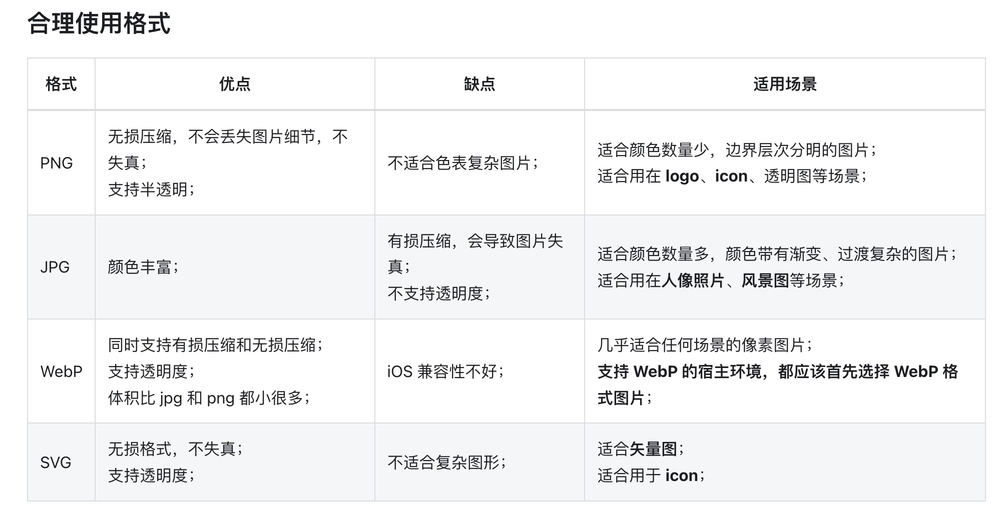

I think the base64 image will be the fastest to load. The advantage of the SVG is that it is scalable so you will never be able to see any pixelation in the image no matter how big you make it. You can apply image optimisations to the PNG file to make the file lighter but I think the best image type for compression is JPG, normally you would reduce the quality to about 60-70% and interlace it to give you a nicer loading effect. The advantage of PNGs is that they are the best for transparency but they are not the best for file size.

### 1. Data URIs

**优势**
1. 减少 Http 请求

**缺点**
1. 增加文件体积 (HTML or CSS, or JS file size)

**适用场景**
1. The image is small and the resulting base64 data URI is well under 1kb or 2kb (set a limit for your own project)