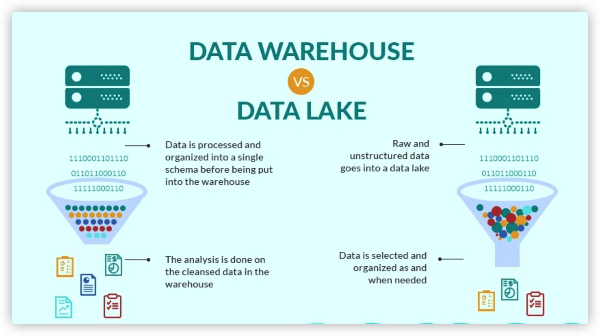

大数据：一种规模大到在获取、存储、管理、分析方面大大超出了传统数据库软件工具能力范围的数据集合，具有海量的数据规模、快速的数据流转、多样的数据类型和价值密度低四大特征。
# Google 三架马车
Google发布的三篇关于大数据套件的论文，包含了大数据的**文件系统、分布式数据库、计算**三个方向的能力。分别对应的是**GFS、BigTable、MapReduce**。
> 论文地址
> - [Google File System](https://static.googleusercontent.com/media/research.google.com/zh-CN//archive/gfs-sosp2003.pdf)
> - [MapReduce](https://static.googleusercontent.com/media/research.google.com/zh-CN//archive/mapreduce-osdi04.pdf)
> [BigTable](https://static.googleusercontent.com/media/research.google.com/zh-CN//archive/bigtable-osdi06.pdf)

## GFS(HDFS)
> HDFS是GFS的开源实现，GFS是Google论文提到的文件存储系统


HDFS是Hadoop分布式文件系统，具有高容错性、高伸缩性，允许用户基于廉价硬件部署，构建分布式存储系统，为分布式计算存储提供了底层支持。上图是HDFS的架构。

**概念**: 
- **数据块**:  抽象块而非整个文件作为存储单元；其默认大小为 64MB，不过在实际应用中，一般设置为 128MB ，备份X3
- **NameNode**:  管理文件系统的命名空间，文件元数据；维护着文件系统的所有文件和目录，文件与数块的映射；记录每个文件中各个块所在数据节点的信息
- **DataNode**: 存储并检索数据块；向NameNode更新所存储块的列表

**特点**
- 普通的成百上千的机器
- 按TB甚至Pb为单位的大量的数据
- 简单编辑的文件获取

**优点**
- 适合大文件存储，支持TB、PB级别的数存储，并有副本策略
- 可以构建在廉价的机器上，并有一定的容错和恢复机制
- 支持流式数据访问，一次写入，多次读取最高效

**缺点**
- 不合适小量小文件存储
- 不适合并发写入，不支持文件随机修改
- 不支持随机读低延时的访问方式

**写流程**

1. 客户端向NameNode发起写请求
2. 分块写入DataNode节点，DataNode自动完成副本备份
3. DataNode向NameNode汇报存储完成，NameNode通知客户端

**读流程**

1. 客户端向NameNode发起读数据请求
2. NameNode找出距离最近的DataNode节点信息
3. 客户端从DataNode分块下载文件

**简单使用**
1. shell脚本
```
常见HDFS Shell命令
- 类linux命令：ls、cat、mkdir、rm、chmod、chown等
- HDFS文件交互：copyFromLocal、copyToLocal、get、put等
帮助命令：./hdfs dfs -help
```

**实践**
1. 概念
- namespace: Basically when we say Namespace we mean a certain location on the hdfs.In Hadoop we refer to a Namespace as a file or directory which is handled by the Name Node
## MapReduce


MapReduce的原理十分简单，就是分而治之，就是算法中的分治法。可以发现现在很多先进的技术都是很早之前就有的技术重新发光发热（例如密码学->区块链、容器技术->k8s、机器学习算法->AI等）
而MapReduce在之前能引起轩然大波的原因也有很大的时代背景：

1. 当时大数据处理的概念已经出现，但不成熟，大家都有自己的一套方式。
2. Google发布的MapReduce相当于给出了一套标准处理方案，同时对整个流程有很好的抽象，适应场景十分多。
3. Google不止给出了MapReduce同时还配合了GFS和BigTable这两个配套的大数据套件。
4. MapReduce让一堆闲置垃圾机器用了用武之地。

MapReduce的几个步骤：**Input, Split, Map, Shuffle, Reduce, Finalize**


整体思想看起来是很简单的，但是MapReduce实际操作起来还是比较复杂的。以至于到现在基本已经淘汰，它主要有以下几个比较致命的缺点：

1. 执行效率慢
   1. 从磁盘读取文件分片计算，所以需要频繁的磁盘读写。
   2. Map和Reduce操作之间的依赖比较深，经常很多个map执行完毕了，还需要等待最后一个Map执行完才能执行Reduce。
2. 代码编写复杂
   1. 一个简单的任务都要编写比较多的Java代码。
   2. 因为执行效率不佳所以他需要通过代码来优化性能，而优化性能的小册子有500多页，Google曾经用5年把一个2小时的MR代码优化到了0.5小时-0-

所谓有缺点才有进步的空间，因为这些问题，后续大数据诞生了非常多耳熟能详的的明星框架来解决问题(Hive、Presto、Spark等）。下面我们会一一提到。

## BigTable（HBase)


实现了数据的分布式存储、行数据的事务性管理和较好的扩展性，从存储WEB页面而生，创造性提出了KEY-VALUE这种MAP数据结构。

高可靠，高性能，面向列，可伸缩，实时读写的”分布式数据库“<br/>
利用HDFS作为其文件存储系统，支持MR程序读取数据<br/>
存储非结构化和半结构化数据

- RowKey：数据唯一标识，按字典排序
- Column Family: 列族，多个列的集合，最多不要超过3个
- TimeStamp时间戳：支持多版本数据同时存在


# Hadoop 1.0
> Hapoop是HDFS的作者加入雅虎后开源的一套大数据开源框架，是基于Google的三个系统的开源实现，并扩展了很多相关能力，成为了当时大数据开发的标配能力。


1.0的构成很简单，就是HDFS存储数据+MapReduce计算数据。在这里MapReduce还承担了资源管理的作用-Job Tracker，跟踪执行计划以及对应资源分配。

而这个架构也存在着一些问题：
- **扩展性差**
JobTracker既要做资源管理，又要做任务监控，job的最大并发数受限制。
- **可用性差**
JobTracker存在单点故障问题
- **资源利用率低**
Map Slot和Reduce Slot的设计无法分享，造成资源浪费
- **无法支持更多计算模型**
只能进行MapReduce计算模型，无法调度流式计算、迭代计算、DAG计算等模型。

# Hadoop 2.0
于是Hadoop2.0就把JobTracker抽出来（抽象分层，计算机通用技巧）重新做了个叫Yarn的框架。由Yarn来负责资源的统一分配，这样一拆一个是能力独立化，另外还有一个重大的意义就是，上层计算框架可以支持扩展了，并不一定要是MapReduce。

Hadoop2.0后，资源管理器，所有的mapReduce程序都需要通过yarn来调度，下面理解下其概念
- ResourceManager: 分配和调度资源；启动并监控ApplicationMaster；监控NodeManager
- ApplicationMaster：为MR类型的程序申请资源，并分配给内部任务；负责数据的切分；监控任务的执行及容错；
- NodeManager: 管理单个节点的资源；处理来着ResourceManager的命令；处理来自ApplicationMaster的命令


可以看出Hapoop2.0的生态变得十分丰富，这时候才算真正的形成了大数据处理套件。这里讲下Hive这个角色，我们如果在公司进行大数据开发，Hive会接触比较多。

**Hive**

Hive严格的说不算是数据库，而是一个数据库管理工具，但他对于整个大数据的发展有着很重要的意义：
- Hive把数据库（一般使用HDFS）的文件映射为传统数据库的库表形式，在上层可以更方便的管理库表的元数据。
- Hive一个大创新是通过类SQL（HSQL）来分析大数据，而避免了写MapReduce程序来分析数据。
  - 这基本奠定了后续各种引擎的计算层实现方式，例如Spark和Flink等也都是用SQL来分析数据。当然他们底层都是有个解释器来把SQL解析成对应的执行编码（Java，Scala）。
  - 特别复杂的语句和数据还是要手写MR实现，后面的Spark、Flink也是类似。
- 基于Hadoop生态的完整性，以及MR的劣势，Hive也支持使用其他引擎（Spark、Presto）来进行对应的数据分析。
- 支持UDF开发。
但是Hadoop2.0发展着便遇到了上述提到的MapReduce的另一个缺点：数据量大了之后越来越慢。所以出现了Presto、Spark。

**HBase**：列式数据库

**Spark**：基于内存分布式计算框架

**Sqoop**: 传统数据库和Hadoop  之间导入导出的工具

**Ambari**：Hadoop集群管理部署框架

# Presto、Spark
## Presto
FaceBook于2013年11月份开源了Presto，一个出内存分布式SQL查询引擎，它被设计为用来专门进行高速、实时的数 据分析。它支持标准的ANSI SQL，包括复杂查询、聚合（aggregation）、连接（join）和窗口函数（window functions)。Presto设计了一个简单的数据存储的抽象层，来满足在不同数据存储系统（包括HBase、HDFS、Scribe等）之上都可 以使用SQL进行查询。

|特点|描述|
| ---- | ---- |
|数据源|支持MySQL/PostgreSQL/Cassandra/Hive/Kafka等|
|SQL支持|完全支持ANSI SQL，提供SQL Shell，也支持JDBC/ODBC|
|扩展性|connector机制，很容易扩展开发自定义connector对接特定数据源|
|混合计算|针对一种类型的connector配置一个或多个catalog，支持混合多个catalog进行join查询计算|
|高性能|充分利用内存，平均性能是Hive的10倍以上，秒级/毫秒级响应|
|流水线|Pipeline设计，数据像自来水管道一样，一旦开始计算，数据就立即产生呈现到终端直到结束|


Presto快的因素在于使用了纯内存的计算方式以及MMP的架构

### MMP架构
Presto采用了跟MR不一样的计算引擎-Multimedia Processor(MMP,海量并行计算架构，基于Shard nothing）。
从上述可以看到MapReduce和MMP的执行很像，都是把任务拆分到不同的机器上去执行，但是MR的Map和Reduce是有依赖关系的，并行的时候，需要去检查Map是否执行完毕才能执行Reduce的任务。
但是MMP不是，他是把所有子任务根据sql的一些对应关系拆分好，分到各个子节点执行，可以所有任务并发执行，最后再由leader节点汇总。
但是任何事情都有两面性，因为基于内存，所以Presto如果内存不够用了会经常OOM（Out Of Memory），而因为任务执行都是并发的，所以稳定性比较差，出了问题也比较难以排查。
## Spark
基于内存计算的分布式计算框架<br/>
抽象出分布式内存存储数据结构 弹性分布式数据集RDD<br/>
基于时间驱动，通过线程池提高性能

1. DAG执行引擎支持循环数据流和内存计算通过内存计算可以比MR程序快100倍，但也支持数据回流到磁盘，不会像Presto那么容易oom。
2. 超过100个高抽象层来处理大规模的数据集使用Java、Scala、Python、R快速的开发应用程序
3. 提供SQL查询、流式计算、机器学习、图计算让开发者使用一套引擎一套代码来进行多种模式的计算
4. Spark可以跑在Yarn、Mesos等多种调度平台，也可以使用standalone模式或者上云。Spark可以访问多种数据源，例如HDFS、Cassandra、Hbase和S3
RDD编程
在Spark中，对数据的所有操作不外乎创建 RDD、转化已有RDD 以及调用 RDD 操作进行求值，RDD是各种数据操作的核心，就像MapReduce中的Map和Reduce。
- 出自2012 Berkley’s AMPLab论文
- 一种容错的内存计算数据抽象
- 不可变，可重复计算
- 分布式对象集合
- 通过多个分区将数据分散在不同节点
- 并行计算
- 分区可以在内存中也可以在硬盘上
- 通过血缘可以知道所有计算的顺序和历史

从上面的定义看起来根本不知道RDD是什么东西，可以理解为
- RDD是一个编程的数据抽象，他的实体存在各个集群里，通过抽象可以对它进行各自操作。
- RDD操作都是高阶函数，这些操作内部都是并发执行
- 包含两种类型的操作: 转换和执行。

## 批式处理 vs 流式处理
|对比项|批式计算|流式计算|
| ---- | ---- | ---- |
|数据时效性|非实时、高延迟|实时、低延迟|
|数据特征|一般是静态数据|数据一般是动态的、没有边界的|
|应用场景|应用在实时性要求不高、离线计算的场景下，数据分析、离线报表等|实时场景，时效性要求比较高的场景，如实时推荐、业务监控等|
|运行方式|一次性完成|任务持续进行（7 * 24）|

批式处理是最开始的大数据处理方式，他的数据是有界的，一批一批过来的，例如我今天拿昨天的所有数据进行海量分析，得出结果。因为时效性的问题，他也叫离线分析。像hapoop、presto、spark基本都支持批式处理。

而现代互联网场景因为推荐系统的发展和AI的层层渗入，对时效性的要求越来越高了，比如我可能百度搜了下电瓶车，淘宝就会马上给我推送个电瓶车的推送。这种数据计算分析的实时性要求就很高，于是诞生了流式处理。
- 流式处理的数据是实时产生的，来一条数据消费一条数据，对数据的传输和处理能力要求很高。
- 流处理系统会对随时进入系统的数据进行计算，流处理方式无需针对整个数据集执行操作，而是对通过系统传输的每个数据项执行操作。
- 因为流式的要求，也诞生了kafka这样的高效消息传输队列和storm、flink、spark streaming这样的流式框架。

## Spark Streaming

Spark Streaming是Spark为了支持流式计算而诞生的，他的本质是是实时数据来一小批，它就处理一小批。所以本质上讲，Spark Streaming 还是批处理，只不过是每一批数据很少，并且处理很及时，从而达到实时计算的目的。我们可以管他叫微批式处理。

# Flink
像Spark和Storm都有各自的一些问题，像吞吐量低，延迟高。最关键的是现在的业务大部分不是说只需要实时计算或者离线计算，一般两者都需要，这两个框架如果需要支持流式处理和批式处理就需要写两套逻辑，部署两套服务，成本较高。于是出现了Flink。

Apache Flink 是一个面向有限流和无限流有状态计算的分布式计算框架，它能够支持流处理和批处理两种应用类型。Flink 不仅能够提供同时支持 高吞吐、低延迟 和 Exactly-Once 语义的实时计算能力，同时 Flink 还提供了基于流式计算引擎处理批量数据的计算能力，真正意义上实现了流批统一。

关于流批一体，这里重点介绍一下：站在 Flink 的角度，Everything is Streams，无边界数据集是一种数据流，一个无边界的数据流可以按时间切段成一个个有边界的数据集，所以有界数据集（批式数据）也是一种数据流。因此，不管是有边界的数据集（批式数据）还是无边界数据集，Flink 都可以天然地支持，这是 Flink 支持流批一体的基础。并且 Flink 在流批一体上，从上面的 API 到底层的处理机制都是统一的，是真正意义上的流批一体（简称牛批），如下图所示：



# OLAP
60年代，关系型数据库之父E.F.Codd提出了关系模型，促进了OLTP（ OnLineTransaction Processing，联机事务处理）模型的发展。

1993年，E.F.Codd提出了OLAP（OnLine Analytical Processing联机分析处理）概念，认为OLTP已不满足终端用户对数据库查询分析的需要，SQL对大型数据库进行的简单查询也不能满足终端用户分析的要求。用户的决策分析需要对关系数据库进行大量计算才能得到结果，而查询的结果并不能满足决策者提出的需求。因此，E.F.Codd提出了多维数据库和多维分析的概念，即OLAP。

|OLTP数据|OLAP数据|
| ---- | ---- |
|原始数据|导出数据|
|细节性数据|综合性和提炼性数据|
|当前值数据|历史数据|
|可更新|不可更新(现在很多都支持更新)，但周期性刷新|
|一次处理的数据量小|一次处理的数据量大|
|面向应用，事务驱动|面向分析，分析驱动|
|面向操作人员，支持日常操作|面向决策人员，支持管理需要|

- OLAP(联机分析处理)是针对特定问题的联机数据访问和分析。通过对信息(维数据)的多种可能的观察形式进行快速、稳定一致和交互性的存取，允许管理决策人员对数据进行深入观察。
- OLAP(联机分析处理) 是使分析人员、管理人员或执行人员能够从多种角度对从原始数据中转化出来的、能够真正为用户所理解的、并真实反映企业维特性的信息进行快速、一致、交互地存取，从而获得对数据的更深入了解的一类软件技术。(OLAP委员会的定义) 。
- 满足决策支持或多维环境特定的查询和报表需求，它的技术核心是“维”这个概念，因此OLAP也可以说是多维数据分析工具的集合。

# 数据湖


数据湖从本质上来讲，是一种企业数据架构方法，物理实现上则是一个数据存储平台，用来集中化存储企业内海量的、多来源，多种类的数据，并支持对数据进行快速加工和分析。从实现方式来看，目前Hadoop是最常用的部署数据湖的技术，但并不意味着数据湖就是指Hadoop集群。为了应对不同业务需求的特点，MPP数据库+Hadoop集群+传统数据仓库这种“混搭”架构的数据湖也越来越多出现在企业信息化建设规划中。
### 核心
- HDFS分布式文件系统：存储是大数据技术的基础
- MapReduce编程模型：分布式计算是大数据应用的解决方案