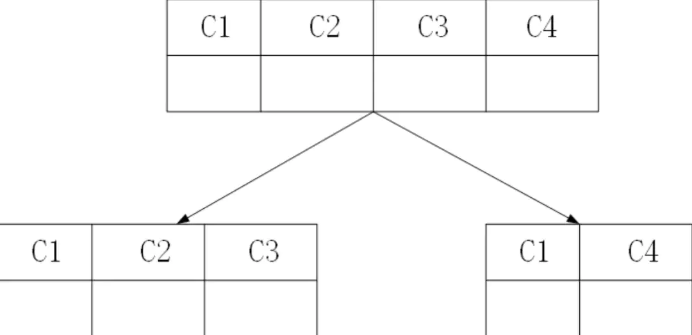

### 随着数据量的增长，MYSQL数据库中有出现了哪些技术？

#### 1. 第一阶段
Linux + MYSQL + Aparch + PHP

#### 2. 第二阶段 - 主从同步
随着数据量增大，增删改查性能都会急剧下降~

主从同步的原理”读写分离“，其中Master负责写操作的负载，也就是说一切写的操作都在Master上进行，而读的操作则分摊到Slave上进行

#### 3. 第三阶段 - 分库分表
若数据量继续增大，比如说：主机存储量为 N T, 当大于数据量大于 N时，则会挂掉

我们一般可以将数据切分，分为两种方式：垂直（纵向）切分和水平（横向）切分

##### 垂直切分常见有 垂直分库 和 垂直分表 两种
- 将应用拆分为客户、存款和贷款三个业务，每个业务使用自己单独的数据库。

- 我们将一张包含4个字段的表拆分为2张表，在业务代码里面，通过字段C1来进行关联

##### 水平切分
当业务难以更细粒度地进行垂直切分，或者切分后单表数据依然过大，存在单库读写、存储性能瓶颈时候，这时候就可以考虑水平切分了。

水平切分又可以分为 库内分表 和 分库分表

【参考】
[数据库数据太多跑不动怎么办？](https://juejin.im/post/6844904057530744846)
