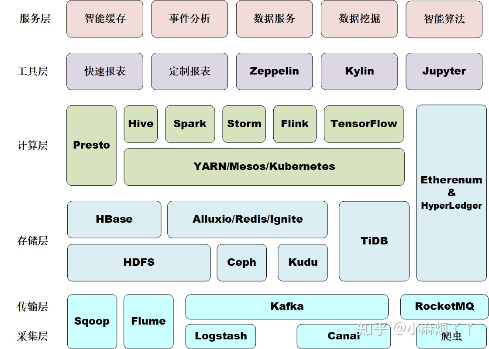

# 大数据整体构成
## 功能结构

## 技术结构

## 大数据套件
|名称|简介|
| ---- | ---- |
|风神|数据平台自研的敏捷BI平台，提供了灵活易用的查询分析服务，报表制作能力。风神的数据内容来源于各业务线，中台部门。丰富多元的内容和灵活强大的平台能力，为业务快速发展，提供了不可或缺的数据支撑|
|TEA|基于用户行为的多维度分析平台。提供事件分析、留存分析、转化分析、用户分群、用户留存等多种分析方式和场景|
|Libra|提供大规模在线实验和统计评估能力的A/B测试平台。覆盖推荐、广告、搜索、UI、产品功能等实验场景，支撑业务在快速迭代的试错之路上，大胆假设、小心求证|
|ByteIO|一站式流量数据服务平台，覆盖定义、采集、加工、治理全链路，为业务提供规范的埋点需求管理流程，经万亿级日流量验证的采集、加工工具，以及行之有效的成本治理手段，帮助业务以规范、稳定、低成本的方式，持续挖掘流量数据价值|
|Gaia|字节跳动数据平台自研的敏捷数据门户建站工具，无需coding，只需通过产品内的点选拖拽即可完成个性化数据门户的建设与上线|
|画像平台|生产构建用户360度画像标签体系，满足各个业务线的标签数据需求；支持基于画像标签进行用户分群、用户洞察等多种分析方式，为精细化运营、精准化营销提供数据&工具支持|
|数据仓库|数据仓库是什么？它在我们的工作中扮演什么样的角色？ 如果大家对数据仓库比较陌生，推荐大家从0到1学习数据仓库的基础知识、实践案例、研发规范，帮助大家理清数据结构，深入数据分析，用真实案例经验为自己的业务助力～|
|数据平台|一站式大数据研发套件，提供数据集成、开发、运维、治理、资产、安全等全链路解决方案|
|数据平台 - 数据研发Dorado|Dorado是集数据集成、数据开发、任务调度、运维管理等功能为一体的大数据研发平台，提供一站式大数据开发解决方案，帮助业务部门简单高效构建自己的数据中心，专注于数据价值的挖掘和探索|
|数据平台 - 数据地图Coral|收集和展示全链路元数据，帮助数据消费者查找、理解、应用数据，提升数据价值|
|数据平台 - 指标平台Nuwa|集成指标管理，指标计算，指标应用，解决指标定义、生产、出口的一致性问题|
|数据平台 - SLA保障Healer|提供SLA在线化申报与签署，并通过多种治理保障措施，协同提高全链路数据质量|
|数据平台 - 数据安全Triton|提供数据权限的控制、风险与审计、数据保护服务，全方位保障大数据资产安全|
|数据平台 - 成本优化Cost|对成本丰富的分析与优化建议，通过资源优化助力节省存储与计算成本|
|数据平台 - 数据质量Manta|通过数据探查、数据监控与数据对比，让用户自助完成数据质量的评估与保障工作|
