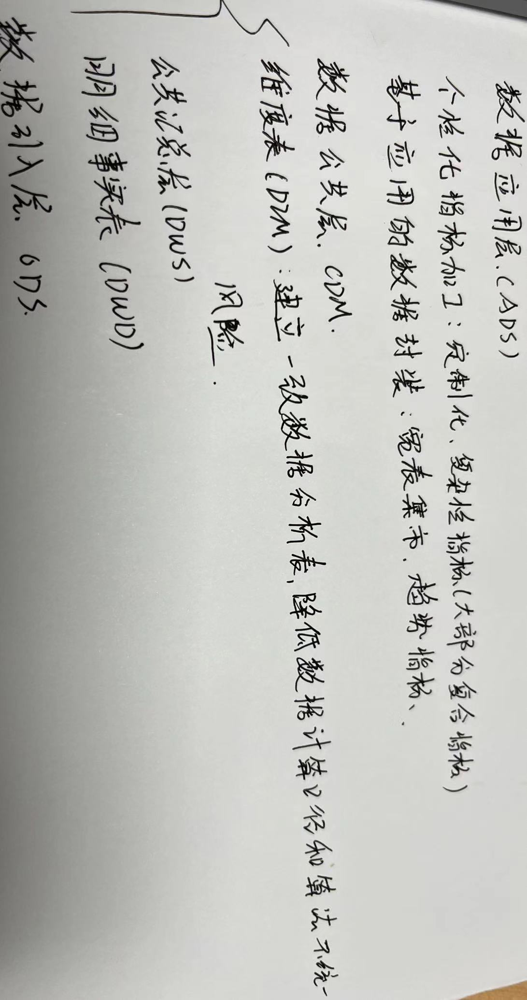
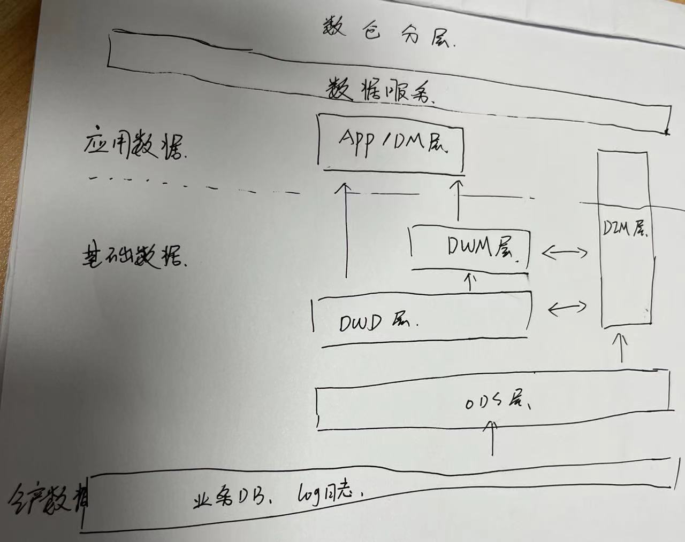

一：数仓介绍
1.1 数仓概念
- 1.1.1 数据仓库（Data Warehouse，也称为企业数据仓库）
是用于报告和数据分析的系统，被认为是商业智能的核心组件。数据仓库是来自一个或多个不同源的集成数据的中央存储库。数据仓库将当前和历史数据存储在一起，用于为整个企业的员工创建分析报告

“数据仓库”与“数据库”的区别
| 数据库 | 数据仓库
| --------| -------|
| 为了记录数据而生 | 为了分析数据而生
| 面向事务的设计的 | 数据仓库是面向主题设计的
| 数据读写效率、一致性为目标 | 数据查询分析效率为目标
| 不强调时间性 | 强调时间性
| 在线数据 | 历史数据
| 可修改的 | 不可修改的（或极少修改的）

- 1.1.2 联机事务处理OLTP（On-Line Transaction Processing） 
也可以称面向交易的处理系统，它是针对具体业务在数据库联机的日常操作，通常对少数记录进行查询、修改。用户较为关心操作的响应时间、数据的安全性、完整性和并发的支持用户数等问题。传统的数据库系统作为数据管理的主要手段，主要用于操作型处理。

- 1.1.3 联机分析处理OLAP（On-Line Analytical Processing）
叫一般针对某些主题历史数据进行分析，支持管理决策。目前市面上主流的开源OLAP引擎包含：Hive、Kylin、Druid、Clickhouse等

- 1.1.4 ETL (Extract-Transform-Load) 
用来描述将数据从来源端经过抽取（extract）、转换（transform）、加载（load）至目的端的过程。主要负责将分布的、异构数据源中的数据抽取到临时中间层后进行清洗、转换、集成，最后加载到数据仓库或数据集市中，成为联机分析处理、数据挖掘的基础。

- 1.1.5 商业智能BI（Business Intelligence）
又称商业智慧或商务智能，指用现代数据仓库技术、线上分析处理技术、数据挖掘和数据展现技术进行数据分析以实现商业价值。目前比较知名的BI工具：Tableau，PowerBI， 帆软， 字节内部自研的风神
> - https://www.tableau.com/
> - https://powerbi.microsoft.com/zh-cn/
> - https://aws.amazon.com/cn/quicksight/
> - https://www.fanruan.com/

1.2 数仓规范

- 1.2.1 数仓分层

| 模型层次 | 英文名 | 中文名 | 层次定义
| ------- | ----- | ---- | ----------
| APP | Application | 应用数据层 | 该层级的主要功能是提供差异化的数据服务、满足业务方的需求；在该层级实现报表（tableau、邮件报表）、自助取数等需求。
| DM | Data Market | 数据集市层 | 该层次主要功能是加工多维度冗余的宽表（解决复杂的查询）、多角度分析的汇总表。
| DWM | Data Warehouse Model | 汇总数据层 | 面向分析主题的、统一的数据访问层，所有的基础数据、业务规则和业务实体的基础指标库以及多维模型都在这里统一计算口径、统一建模，大量基础指标库以及多维模型在该层实现。该层级以分析需求为驱动进行模型设计，实现跨业务主题域数据的关联计算或者轻度汇总计算，因此会有大数据量的多表关联汇总计算。
| DWD | Data Warehouse Detail| 明细数据层 | 该层的主要功能是基于主题域的划分，面向业务主题、以数据为驱动设计模型，完成数据整合，提供统一的基础数据来源。在该层级完成数 据的清洗、重定义、整合分类功能。
| DIM | Dimension | 维度层 | 该层主要存储简单、静态、代码类的维表，包括从OLTP层抽取转换维表、根据业务或分析需求构建的维表以及仓库技术维表如日期维表等。
| ODS | Operational Data Store | 操作数据层 | 该层级主要功能是存储从源系统直接获得的数据（数据从数据结构、数据之间的逻辑关系上都与源系统基本保持一致）。实现某些业务系统字段的数据仓库技术处理、少量的基础的数据清洗（比如脏数据过滤、字符集转换、维值处理）、生成增量数据表。
