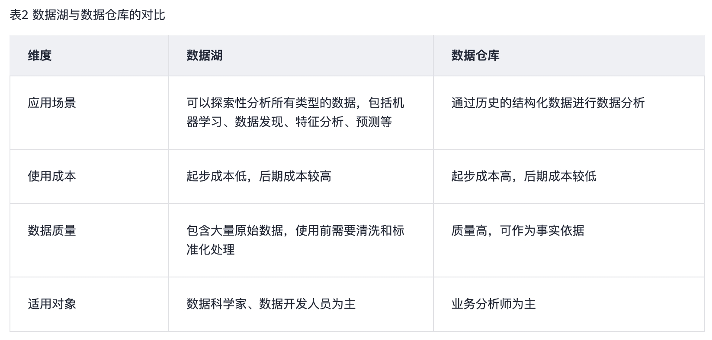

## 数据库
数据库是“按照数据结构来组织、存储和管理数据的仓库”。现在通常所说的数据库指的是关系型数据库。

关系型数据库的主要用于联机事务处理OLTP（On-Line Transaction Processing）主要进行基本的、日常的事务处理，例如银行交易等场景。

## 什么是数据仓库？

随着数据库的大规模应用，使信息行业的数据爆炸式的增长。为了研究数据之间的关系，挖掘数据隐藏的价值，人们越来越多的需要使用联机分析处理OLAP（On-Line Analytical Processing）进行数据分析，探究一些深层次的关系和信息。但是不同的数据库之间很难做到数据共享，数据之间的集成与分析也存在非常大的挑战。

为解决企业的数据集成与分析问题，数据仓库之父比尔·恩门于1990年提出数据仓库（Data Warehouse）。数据仓库主要功能是将OLTP经年累月所累积的大量数据，通过数据仓库特有的数据储存架构进行OLAP，最终帮助决策者能快速有效地从大量数据中，分析出有价值的信息，提供决策支持。自从数据仓库出现之后，信息产业就开始从以关系型数据库为基础的运营式系统慢慢向决策支持系统发展。

数据仓库相比数据库，主要有以下两个特点：

- 数据仓库是面向主题集成的。数据仓库是为了支撑各种业务而建立的，数据来自于分散的操作型数据。因此需要将所需数据从多个异构的数据源中抽取出来，进行加工与集成，按照主题进行重组，最终进入数据仓库。
数据仓库主要用于支撑企业决策分析，所涉及的数据操作主要是数据查询。因此数据仓库通过表结构优化、存储方式优化等方式提高查询速度、降低开销。

## 数据湖

在企业内部，数据是一类重要资产已经成为了共识。随着企业的持续发展，数据不断堆积，企业希望把生产经营中的所有相关数据都完整保存下来，进行有效管理与集中治理，挖掘和探索数据价值。

数据湖就是在这种背景下产生的。数据湖是一个集中存储各类结构化和非结构化数据的大型数据仓库，它可以存储来自多个数据源、多种数据类型的原始数据，数据无需经过结构化处理，就可以进行存取、处理、分析和传输。数据湖能帮助企业快速完成异构数据源的联邦分析、挖掘和探索数据价值。

## 什么是湖仓一体？

虽然数据仓库和数据湖的应用场景和架构不同，但它们并不是对立关系。数据仓库存储结构化的数据，适用于快速的BI和决策支撑，而数据湖可以存储任何格式的数据，往往通过挖掘能够发挥出数据的更大作为，因此在一些场景上二者的并存可以给企业带来更多收益。

湖仓一体，又被称为Lake House，其出发点是通过数据仓库和数据湖的打通和融合，让数据流动起来，减少重复建设。Lake House架构最重要的一点，是实现数据仓库和数据湖的数据/元数据无缝打通和自由流动。湖里的“显性价值”数据可以流到仓里，甚至可以直接被数仓使用；而仓里的“隐性价值”数据，也可以流到湖里，低成本长久保存，供未来的数据挖掘使用。

> **参考**
> https://support.huaweicloud.com/dws_faq/dws_03_2121.html