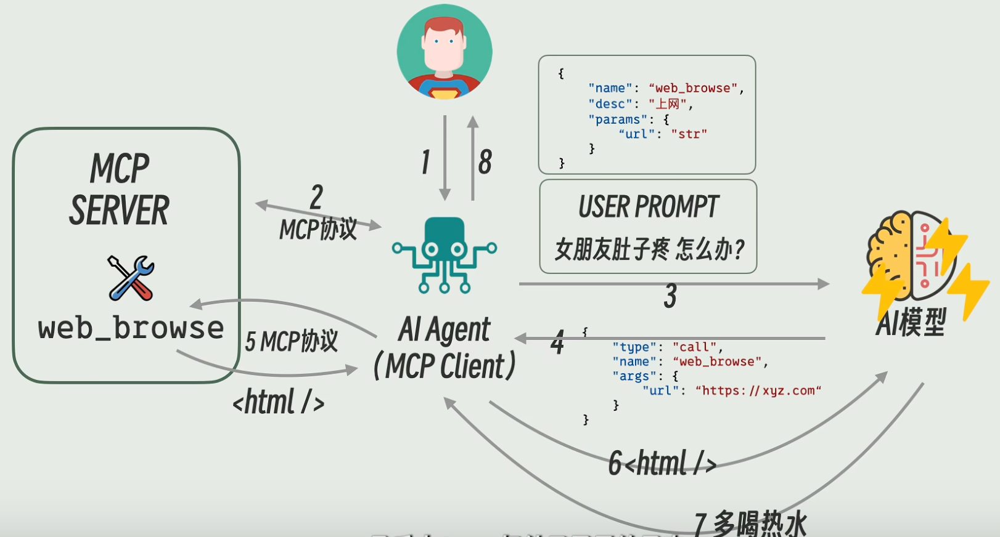
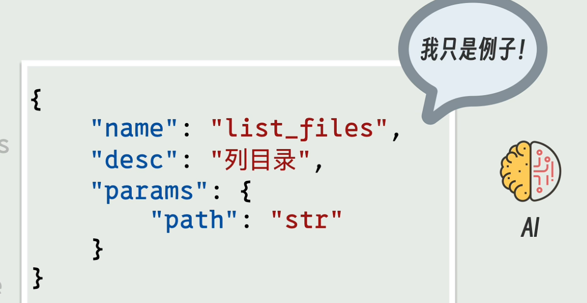
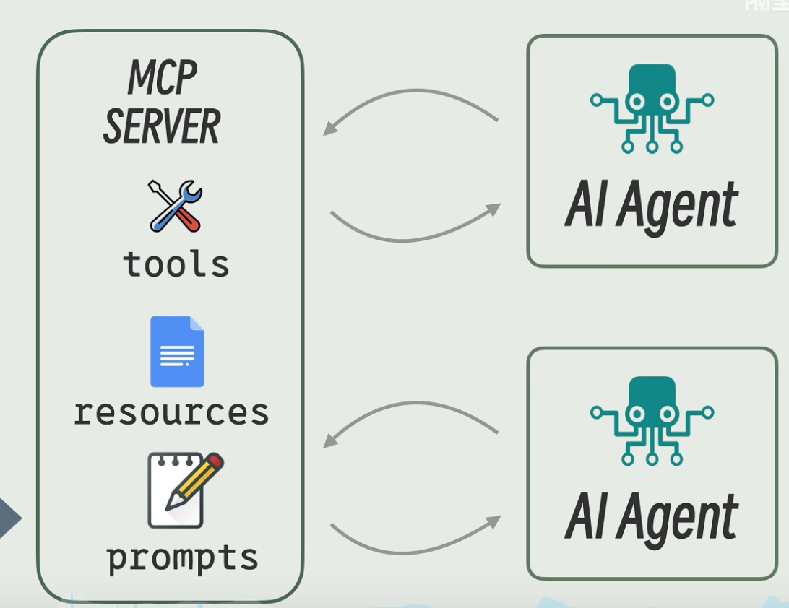

本文将带领你学习大模型的基本概念

# 基本概念
## 概览图

## prompt
- user prompt: 用户自定义的内容
- system prompt: 系统定义的内容，例如：角色、性格、背景知识、语气等，总之不是用户直接说出来的内容都可以放到 system prompt 中

每次系统发送 user prompt 时，会携带 system prompt 给大模型

## Function  Calling
Function Calling 对”大模型用哪些工具以及返回的格式“进行了标准化，比如说：每个 Tool 都用 JSON 对象工具名; 同时也规定了 **大模型** 使用工具时的产物格式

然后这些 JSON 对象也从 system prompt 种剥离出来。

目前存在的问题：没有统一的标准，每家大厂的 API 定义都不一样，而且很多开源模型不支持 Function Calling。因此，System prompt 与 Function Calling 这两种方式是并存的

## MCP
是一个专门用来规范 Agent 与 Tool 之间是怎样交互的，运行 Tool 的服务叫做 MCP server，调用它的 Agent 叫做 Mcp Client。 MCP 规定了 MCP server 与 MCP client 是如何通信的以及 MCP server 要提供哪些接口。

虽然 MCP 是为了 AI 专门定制出来的标准，但是实际上与 AI 模型没有关系, 它并不关心 Agent 用的哪个模型， MCP 只负责帮 Agent 管理工具、资源和提示词