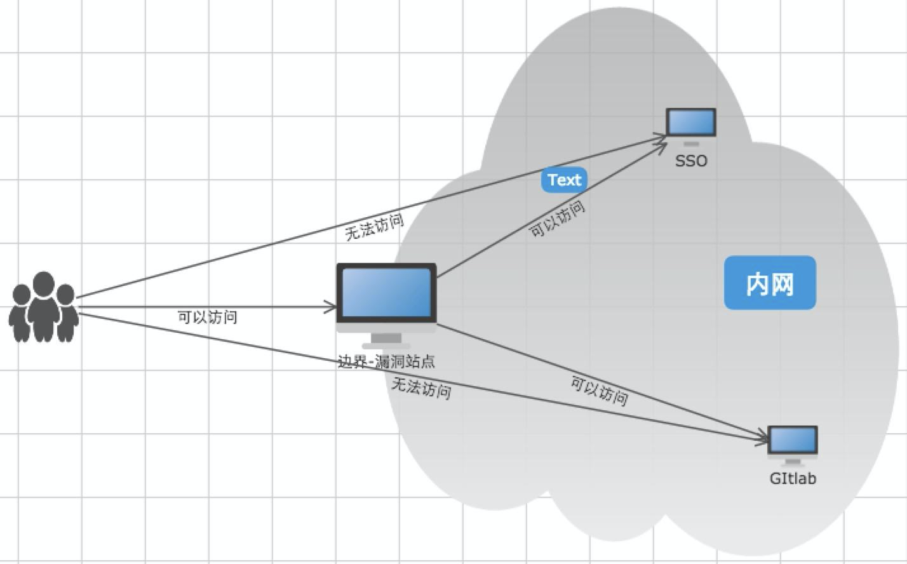
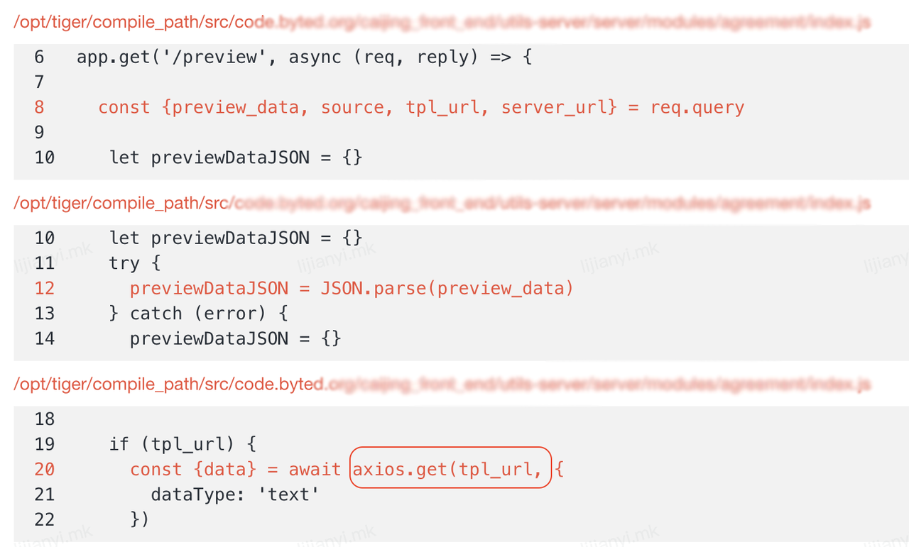

## SQL 注入

SQL注入即应用程序对用户输入未进行合法校验，导致攻击者在应用程序预先写好的SQL语句中添加了额外的SQL语句，造成非授权的任意查询，导致数据库的信息泄漏

用户输入的数据可以操纵要执行的SQL语句的语义，就可以任意操作数据库（增删改查），有些甚至可以获取到服务器的权限。

## 远程命令/代码执行漏洞

远程代码/命令执行，即简称 RCE， 这里也包含远程命令执行，指应用程序未对用户输入进行限制，导致攻击者的输入直接到了命令/代码执行的函数内造成服务器权限被获取。

> 攻击者通过一个HTTP请求就能达到在服务器执行任意代码/命令的目的。

## 服务器端请求伪造漏洞

SSRF全称即服务端请求伪造（Server-Side Request Forgery），由于服务端提供了从其他服务器应用获取数据的功能，且没有对目标地址做过滤与限制，导致攻击者可以利用它攻击外网无法访问的内部系统

> 用户在公网环境下，利用漏洞，就能跨越网络边界，进入到内网环境

node 示例：

解决：
- 若纯内网系统，无所谓~
- 如果系统涉及外网请求，则需要对对待请求的地址进行判断，防止攻击者对内网资源发起请求。

## 任意文件上传
