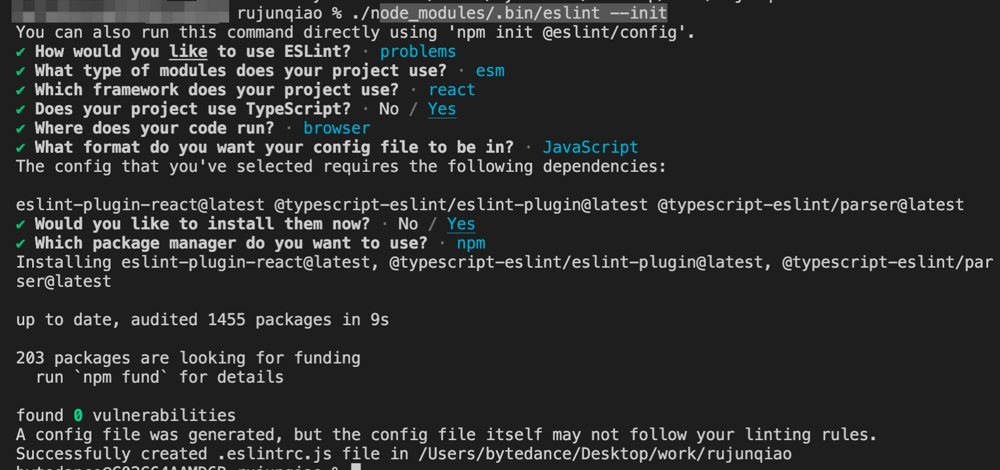
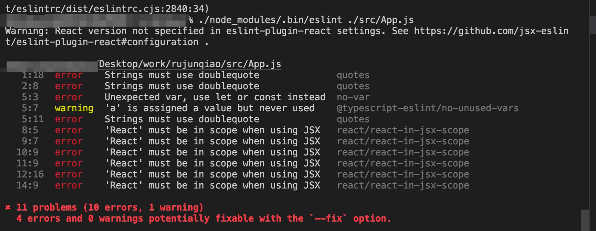
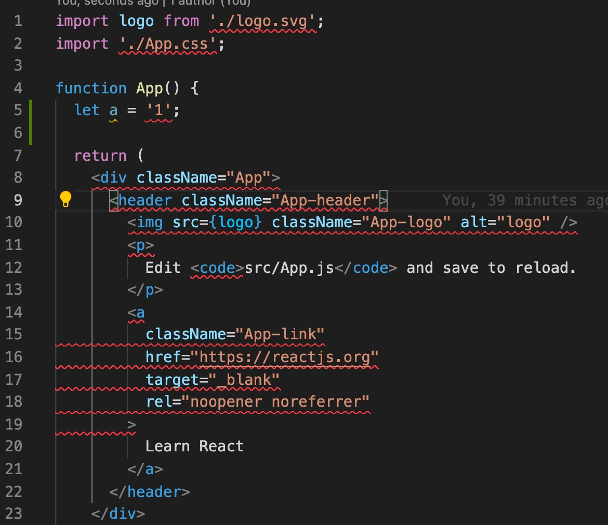

### 什么是代码检查
代码检查主要是用来发现代码错误、统一代码风格。

在 JavaScript 项目中，我们一般使用 ESLint 来进行代码检查，它通过插件化的特性极大的丰富了适用范围，搭配 typescript-eslint 之后，甚至可以用来检查 TypeScript 代码。

### Eslint
#### 1. 安装 Eslint
```
npm install --save-dev eslint
```

#### 2. 紧接着你应该设置一个配置文件：
```
$ ./node_modules/.bin/eslint --init
```


之后生成 .eslintrc.js 文件. 注意因为项目需要 Ts, 所以安装了”typescript-eslint/eslint-plugin“、”@typescript-eslint/parser“

.eslintrc.js
```
module.exports = {
    "env": {
        "browser": true,
        "es2021": true
    },
    "extends": [
        "eslint:recommended",
        "plugin:react/recommended",
        "plugin:@typescript-eslint/recommended"
    ],
    "parser": "@typescript-eslint/parser",
    "parserOptions": {
        "ecmaFeatures": {
            "jsx": true
        },
        "ecmaVersion": "latest",
        "sourceType": "module"
    },
    "plugins": [
        "react",
        "@typescript-eslint"
    ],
    "rules": {
    }
}
```


#### 3. 检查文件
添加规则, 如下
```
  ...
    rules: {
    quotes: ['error', 'double'],
    'no-var': 'error',
  }
  ...
```

之后，你可以在任何文件或目录上运行ESLint如下：
```
$ ./node_modules/.bin/eslint ./src/App.js
```
> 也可以在全局而不是本地安装 ESLint (使用 npm install eslint --global)。但是，你使用的任何插件或可共享配置都必须安装在本地。
提示报错: TODO


但是，如何实现在编辑器里提示错误信息呢?

4. 安装插件
在 vscode 中，安装 eslint 插件


> 如果安装了 eslint 插件，仍不生效。可以尝试在项目里添加 .vscode/setting.json
```
"eslint.validate": [ "javascript", "javascriptreact", "html", "typescriptreact" ],
```

5. prettier

Prettier is an opinionated code formatter which ensures one unified code format. 
建议项目里包含一个 prettier 配置文件。这将能保证你无论用什么IDE ，依然保持代码风格统一。

**Visual Studio Code Settings**

You can use VS Code settings to configure prettier. Settings will be read from (listed by priority):

- Prettier configuration file
- .editorconfig
- Visual Studio Code Settings (Ignored if any other configuration is present)
> NOTE: If any local configuration file is present (i.e. .prettierrc) the VS Code settings will NOT be used.

### TsConfig
2019 年 1 月，TypeScirpt 官方决定全面采用 ESLint 作为代码检查的工具，并创建了一个新项目 typescript-eslint，提供了 TypeScript 文件的解析器 @typescript-eslint/parser 和相关的配置选项 @typescript-eslint/eslint-plugin 等。而之前的两个 lint 解决方案都将弃用：

- typescript-eslint-parser 已停止维护
- TSLint 将提供迁移工具，并在 typescript-eslint 的功能足够完整后停止维护 TSLint（Once we consider ESLint feature-complete w.r.t. TSLint, we will deprecate TSLint and help users migrate to ESLint1）

综上所述，目前以及将来的 TypeScript 的代码检查方案就是 typescript-eslint。


【参考文档】
- [Getting Started with ESLint](https://cn.eslint.org/docs/user-guide/getting-started)