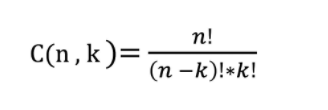

https://zhuanlan.zhihu.com/p/41855459

"排列" 与 "组合" ：决策的顺序对结果有没有影响
## 排列：
例如：共金牌、银牌、铜牌三个奖杯，颁给8个人，共多少种方式？

8*7*6 = 8! / 5!

即：如果要想在 n 个物品中，按顺序的选择 k 个物品，那么选择的方式总共有这么多种：

P(n, k) = n! / (n - k)!

## 组合 
3瓶一样的可乐，给8个人中的3个人，有多少种方式？

如果要想在 n 个物品中，选择 k 个物品出来，选择的顺序无所谓，那么选择的方式总共有这么多种：

