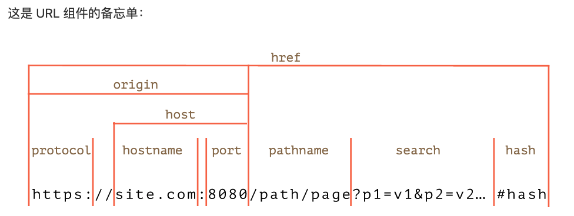

## 1.new URL()
内建的 URL 类提供了用于创建和解析 URL 的便捷接口。

没有任何一个网络方法一定需要使用 URL 对象，字符串就足够了。所以从技术上讲，我们并不是必须使用 URL。但是有些时候 URL 对象真的很有用。

```
let url = new URL('https://javascript.info/profile/admin');
```


我们可以将 URL 对象传递给网络（和大多数其他）方法，而不是字符串

## 2.SearchParams “?…”
它为搜索参数提供了简便的方法：

- append(name, value) —— 按照 name 添加参数，
- delete(name) —— 按照 name 移除参数，
- get(name) —— 按照 name 获取参数，
- getAll(name) —— 获取相同 name 的所有参数（这是可行的，例如 ?user=John&user=Pete），
- has(name) —— 按照 name 检查参数是否存在，
- set(name, value) —— set/replace 参数，
- sort() —— 按 name 对参数进行排序，很少使用，
- ……并且它是可迭代的，类似于 Map。

```
let url = new URL('https://google.com/search');

url.searchParams.set('q', 'test me!'); // 添加带有一个空格和一个 ! 的参数

alert(url); // https://google.com/search?q=test+me%21

url.searchParams.set('tbs', 'qdr:y'); // 添加带有一个冒号 : 的参数

// 参数会被自动编码
alert(url); // https://google.com/search?q=test+me%21&tbs=qdr%3Ay

// 遍历搜索参数（被解码）
for(let [name, value] of url.searchParams) {
  alert(`${name}=${value}`); // q=test me!，然后是 tbs=qdr:y
}
```

## 3. encode
### a. URL 对象
URL 对象会自动处理这些。我们仅需提供未编码的参数，然后将 URL 转换为字符串：
```
// 在此示例中使用一些西里尔字符

let url = new URL('https://ru.wikipedia.org/wiki/Тест');

url.searchParams.set('key', 'ъ');
alert(url); //https://ru.wikipedia.org/wiki/%D0%A2%D0%B5%D1%81%D1%82?key=%D1%8A
```
### b. 编码字符串

- encodeURI —— 编码整个 URL。
- decodeURI —— 解码为编码前的状态。
- encodeURIComponent —— 编码 URL 组件，例如搜索参数，或者 hash，或者 pathname。
- decodeURIComponent —— 解码为编码前的状态。

一个自然的问题：“encodeURIComponent 和 encodeURI 之间有什么区别？

在一个 URL 中：
```
https://site.com:8080/path/page?p1=v1&p2=v2#hash
```
我们发现 :, /, ?, =, & 是允许的

……另一方面，对于 URL 的单个组件，例如一个搜索参数，则必须对这些字符进行编码，以免破坏 URL 的格式。

- encodeURI 仅编码 URL 中完全禁止的字符。
- encodeURIComponent 也编码这类字符，此外，还编码 #，$，&，+，,，/，:，;，=，? 和 @ 字符。

对于 URL 参数，我们应该改用 encodeURIComponent：
```
let music = encodeURIComponent('Rock&Roll');

let url = `https://google.com/search?q=${music}`;
alert(url); // https://google.com/search?q=Rock%26Roll
```
将其与 encodeURI 进行比较：
```
let music = encodeURI('Rock&Roll');

let url = `https://google.com/search?q=${music}`;
alert(url); // https://google.com/search?q=Rock&Roll

```

我们可以看到，encodeURI 没有对 & 进行编码，因为它对于整个 URL 来说是合法的字符。

### c. encodeUrl 与 URL 区别
类 URL 和 URLSearchParams 基于最新的 URL 规范：RFC3986，而 encode* 函数是基于过时的 RFC2396。

它们之间有一些区别，例如对 IPv6 地址的编码方式不同：
```
// IPv6 地址的合法 url
let url = 'http://[2607:f8b0:4005:802::1007]/';

alert(encodeURI(url)); // http://%5B2607:f8b0:4005:802::1007%5D/
alert(new URL(url)); // http://[2607:f8b0:4005:802::1007]/
```

正如我们所看到的，encodeURI 替换了方括号 [...]，这是不正确的，原因是：在 RFC2396 (August 1998) 时代，还不存在 IPv6 url。

这种情况很少见，encode* 函数在大多数情况下都能正常工作。
